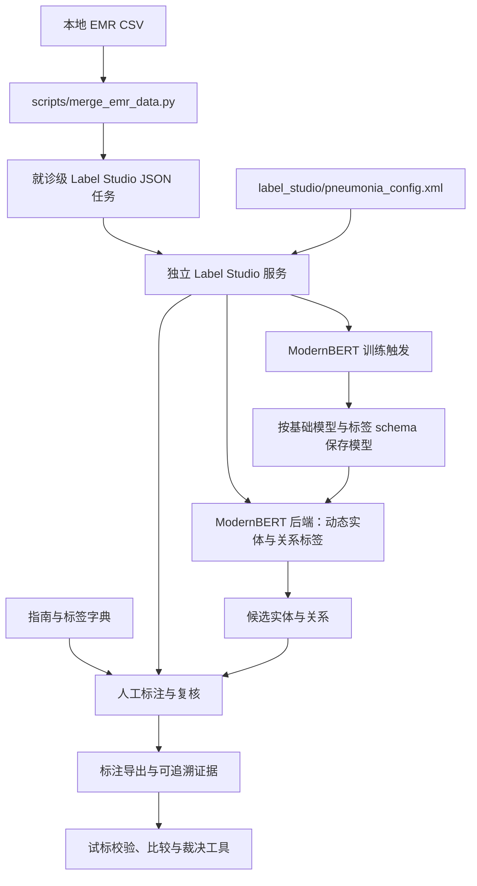

# EMR 结构化标注框架

当前标注资料：[标注指南、标签字典与 HTML 阅读版](documentation/annotation/README.md)。

### —— 基于 Label Studio 的电子病历信息抽取数据集构建体系

---

## 一、项目定位

本项目旨在构建一套面向电子病历（EMR）的**结构化标注与数据集构建框架**，用于支持临床文本信息抽取（Information Extraction）、实体识别（NER）、关系抽取、风险评估建模及知识图谱构建等应用场景。

项目核心目标不是单一标注配置文件，而是建立一个**可扩展、可复用、可规范化的临床标注基础库**。

---

## 二、建设目标

本仓库围绕以下四个核心目标展开：

1. **规范化标注体系构建**
   建立统一的标签体系、定义边界规则和标注逻辑，降低标注歧义。

2. **复杂临床文本问题处理机制**
   构建适用于 EMR 的否定识别、同义归一、时序表达识别等规则框架。

3. **数据资产标准化输出**
   支持标准化 JSON、结构化数据库格式输出，便于模型训练与知识建模。

4. **可扩展的多病种框架设计**
   支持在现有结构上快速扩展至其他疾病或综合症监测场景。

---

## 三、适用场景

本框架适用于以下业务或科研场景：

* 临床自然语言处理（Clinical NLP）
* 监测预警数据集构建
* 病种风险评估模型训练

---

## 四、代码架构与目录

以下按 2026-10-08 当前代码整理。仓库包含数据整理、Label Studio 配置、ModernBERT ML 后端，以及指南试标与质量复核工具；Label Studio 本身是独立服务，不由本仓库启动。模型输出用于辅助预标注，病例判断与公共卫生信号仍需人工复核。

### 1. 当前目录与职责

```text
emr_structured_annotation/
├── scripts/
│   ├── merge_emr_data.py             # EMR 多表合并、就诊级任务、文本与年龄分组
│   └── fetch_who_don_pdf.py          # WHO DON 资料采集，独立辅助工具
├── label_studio/
│   └── pneumonia_config.xml         # 成人与儿童共用页面配置
├── modernbert_ml_backend/           # ModernBERT NER + RE 训练与预测后端
│   ├── _wsgi.py                     # Flask 服务入口，使用同目录导入
│   ├── model.py                     # 联合网络、推理、Label Studio 适配、训练触发
│   ├── train_ner_re.py              # 数据集转换、训练、验证和模型保存
│   ├── config.py                    # 路径、标签映射、训练参数与 tokenizer
│   ├── label_studio_ml/             # 仓库内维护的 ML 服务运行时代码
│   ├── requirements.txt            # 本后端独立依赖
│   └── predict_test.py              # 面向指定服务/项目的联调与压测脚本
├── annotation_agent_workflow/
│   ├── scripts/                     # 试标抽样、脱敏审计、结果校验、比较与裁决
│   ├── templates/                   # 反馈与 Schema 变更提案模板
│   ├── runs/                        # 分轮输入、试标结果、反馈和裁决记录
│   ├── guides/                      # 历史指南、字典、版本清单及修订记录
│   └── validation/                  # 专项规则验证记录
├── documentation/
│   ├── annotation/                  # 当前指南、标签字典、HTML、生成脚本和旧样稿
│   └── …                            # 参考文件与用语汇编
├── skill_src/                       # 医学标注员/指南开发者技能源码
├── tests/test_merge_emr_data.py      # 不加载模型的数据整理单元测试
├── Untitled.ipynb                   # 探索性 notebook
├── pyproject.toml / uv.lock          # 根目录 Python 环境
├── data/                            # 本地原始数据，已配置 Git 忽略
├── output/                          # 任务、报告和训练产物，已配置 Git 忽略
└── tmp/                             # 一次性脚本、截图、导出文件；目前存在已跟踪文件
```

GLiNER 旧技术路线已退出当前代码：删除 `ml_backend/` 的 5 个 Python 文件、根目录 `main.py` 及 `gliner` / `gliner2` 依赖。审计范围、保留项与 Git 恢复方式见 [GLiNER 退役记录](documentation/gliner-retirement.md)。本地 `gliner_backend/` 和 `annotation_guide/` 仅有无代码的残留目录；当前仓库没有 Dockerfile / Compose 部署文件。

### 2. 数据与调用关系



当前保留 ModernBERT 实现，GLiNER 不再作为可选服务入口。试标工具通过文件输入输出运行，未与合并脚本及后端组成自动调度流水线。

当前文本协议：

- 合并脚本输出 `[{"data": {...}}, ...]`，就诊键为 `patient_id + serial_number`。文本保存在 `data.text`，原始一对多记录继续保留。
- XML 的文本控件名为 `chief_complaint_text`，值为 `$text`。**任务字段 `data.text` 与预测结果 `to_name="chief_complaint_text"` 是不同概念**；字符偏移必须对应同一份原文。
- XML 当前包含 49 个实体标签、9 个实体属性字段、5 种关系和 1 个病例四分类控件。ModernBERT 的动态解析、训练和预测目前针对实体与关系，未实现完整的 `Choices` 属性及病例结论预测。
- 合并脚本会保留患者标识、姓名和原始记录，不是脱敏工具。试标脱敏、隐私审计与病例结果校验分别位于 `annotation_agent_workflow/scripts/`，不能用“生成任务成功”代替脱敏审计完成。

### 3. ModernBERT 后端的边界

| 项目 | 当前实现 |
|---|---|
| 标签来源 | 从 Label Studio 配置解析实体、关系标签 |
| 文本读取 | 根据页面配置解析文本字段候选，支持当前 `$text` |
| 预测 | 联合 NER + RE，经 tokenizer offset 转回字符位置 |
| 训练 | `fit()` 拉取标注并同步触发训练，完成后重载模型 |
| 模型产物 | `bert-base-model/{base_model}/`；训练输出为 `output/{base_model}/{schema}/best_model/` |
| 服务运行时 | 脚本启动方式下优先使用本目录 `label_studio_ml/` |
| 当前限制 | 动态 NER/RE 不等于完整页面协议支持；多项目并发状态隔离需验证 |

GLiNER 的固定提示和旧文本协议已随代码移除。历史试标记录、Schema 提案和指南中的历史审查段落保留，用于解释当时的技术问题，不代表仍需实现该路线。

### 4. 目录优化评估与顺序

当前规模不需要引入统一后端基类、插件工厂、任务调度框架或整体 `src/` 重构。优先厘清入口与协议，再进行小范围移动。

| 优先级 | 已核实的问题 | 建议的最小调整 |
|---|---|---|
| 先处理 | 根依赖与 ModernBERT `requirements.txt` 分开维护，后者还包含同名的本地 ML 运行时；`from model/config/train_ner_re` 依赖启动位置 | 先明确两套环境和启动命令；后续改成包内相对导入并验证运行时实际加载路径，再决定是否移动后端目录。暂不删除本地运行时代码 |
| 先处理 | `modernbert_ml_backend/predict_test.py` 混有固定服务地址、项目参数和会话凭据 | 改为环境变量或命令行参数，移至手工联调目录；会话凭据不应保存在受版本控制的测试代码中 |
| 随后处理 | `modernbert_ml_backend/model.py` 约 1170 行，同时承担网络、推理和服务适配；训练模块又从它导入网络类 | 优先拆出联合网络与独立推理代码，训练和服务分别依赖它们；避免为了拆文件建立通用框架 |
| 随后处理 | 字典验证脚本固定读取 v2.1.0 与本机绝对路径，引用的成人/儿童 XML 当前不存在 | 改为显式传入字典与 XML，并验证当前 `Choices` 和关系；历史试验清单继续保留原版本，不改写历史验收结论 |
| 随后处理 | `tmp/` 已跟踪 79 个文件；`main.py`、无名 notebook 与服务联调脚本混在正式入口附近 | 按用途将有复现价值的脚本/证据归档，其余生成产物移出版本控制；保留必要证据后再配置临时目录忽略规则 |
| 可延后 | WHO 资料采集与 EMR 合并共用 `scripts/`；历史进度及模型设计文档存在旧目录描述 | 功能扩展时再分 `scripts/data/` 与 `scripts/research/`；当前先通过职责说明区分，逐份更新过期文档 |

当前只保留一个后端，暂时保留 `modernbert_ml_backend/` 的目录名即可。后续若拆分模块，可采用以下结构；**这是建议，尚未实施**：

```text
modernbert_ml_backend/
    ├── _wsgi.py / config.py
    ├── network.py                   # 联合模型
    ├── inference.py                 # 文本推理与 offset 转换
    ├── model.py                     # Label Studio 适配
    ├── train_ner_re.py
    └── label_studio_ml/             # 明确来源及本地修改后再决定去留
examples/                            # 模型样例和手工联调入口
scripts/                             # 数据准备工具；有实际需要时再分组
annotation_agent_workflow/           # 保留试标与裁决工具及历史记录
label_studio/                        # 页面协议
documentation/                      # 说明资料，当前套件已集中
tests/                              # 不依赖外部服务的自动化检查
```

实际迁移前需要检查导入、启动命令、相对模型路径和历史脚本引用。ModernBERT 使用全局可变 `config`，仅有模型缓存锁不能证明不同项目的标签及训练状态已隔离；移动目录也不能解决此问题。

### 5. 本地入口与验证

在仓库根目录运行：

```sh
# 根环境；保留 notebook 共享依赖，不覆盖 ModernBERT 独立依赖说明
uv sync

# 数据整理；也可直接使用 python，不依赖模型
uv run python scripts/merge_emr_data.py

# 不加载模型的自动化测试与文档链接检查
python -m unittest discover -s tests -v
python documentation/annotation/scripts/check-document-links.py
```

ModernBERT 当前以 `python modernbert_ml_backend/_wsgi.py --port 9090` 作为脚本入口；使用安装了其 `requirements.txt` 的独立环境，并预先准备本地基础模型。当前不要把它改写为 `python -m modernbert_ml_backend._wsgi`：现有顶层导入尚未适配包启动。

`modernbert_ml_backend/predict_test.py` 会访问实际服务，不是上述单元测试的组成部分。根环境显式保留 `torch`、`transformers` 与共享 tokenizer 依赖 `sentencepiece`，避免原来依赖 GLiNER 间接安装这些包的 notebook 失效；没有执行环境同步卸载或清理模型缓存。

本次架构梳理完成静态代码、入口、目录与 XML 协议核对；数据整理 10 项单元测试及 1 项旧路线退役检查通过。未进行模型下载、真实推理、训练或服务部署验证，以上后端能力按代码实现描述，不代表生产验收完成。

## EMR 数据拼合

以 `data/temp_202608_emr_activity_info.csv` 为主表，按
`patient_id + serial_number` 生成 Label Studio 可导入的就诊级 JSON 任务数组：

```powershell
uv run python scripts/merge_emr_data.py
```

脚本仅使用 Python 标准库；如果本机 `uv` 不可用，也可直接运行
`python scripts/merge_emr_data.py`。

默认生成：

- `output/emr_merged_202608.json`：Label Studio 可直接导入的 JSON 任务数组，顶层格式为 `[{"data": {...}}, ...]`。`data.text` 按配置顺序拼合所有指定的非空临床文本，字段标题使用 `【主诉】`、`【现病史】` 等简短中文；已出现过的完全相同内容不会重复拼入。`data.patient_id`、`data.patient_name` 和 `data.text` 分别对应标注配置中的 `$patient_id`、`$patient_name` 和 `$text`。`data.age` 使用身份证出生日期和就诊日期计算，脱敏身份证只能按出生年份估算，此时 `data.age_is_approximate` 为 `true`。`data.age_group` 按年龄小于18岁归为 `儿童组`，否则归为 `成人组`。同一就诊下的活动、文书、医嘱、检验和检查仍以数组保留在 `data` 中。检验、检查和医嘱父记录按 `id` 分组为 `records[]`，其明细放在 `items[]`。
- `output/emr_merged_202608_children.json`：仅包含 `age < 18` 的儿童组。
- `output/emr_merged_202608_adults.json`：仅包含 `age >= 18` 的成人组。
- `output/emr_merge_report_202608.json`：每张表的行数、匹配数、未匹配数及匹配率。

任务文件示例：

```json
[
  {"data":{"patient_id":"p1","patient_name":"患者甲","serial_number":"s1","text":"【主诉】\n发热三天","age":35,"age_group":"成人组","activity_info":[],"patient_info":[],"encounter_data":{}}}
]
```

可通过 `--data-dir`、`--main-file`、`--output` 和 `--report` 指定其他批次或输出位置。运行测试：

```powershell
uv run python -m unittest discover -s tests -v
```

---

## 五、标注体系设计原则

### 1. 结构优先

强调可机器处理结构，而非单纯人工阅读理解。

### 2. 规则可解释

每一个标签类别均需有清晰定义与边界说明。

### 3. 语义分层

支持：

* 实体层
* 属性层
* 关系层
* 时序层

### 4. 可扩展性

标签体系设计采用模块化结构，便于未来扩展至多病种、多系统。
