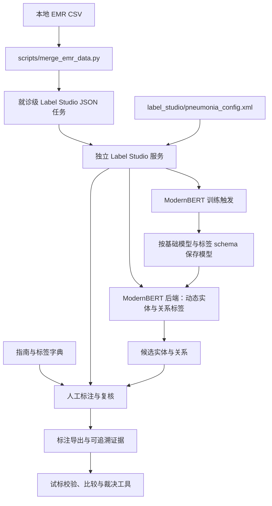

# EMR 结构化标注框架

项目维护入口：[每次新任务规则](AGENTS.md)，[按工作流程划分的代码、文档、数据与输出组织方案](documentation/project-organization.md)。17 份当前技术说明与汇报文档已按工作流程归位；[文档总导航](documentation/README.md)和[迁移记录](documentation/migration-log.md)列出当前入口、旧路径兼容页与迁移哈希。
共享业务已按 6 个工作流程模块迁至 `emr_annotation/`，14 个旧脚本入口继续可用；源码/模板共 15 项移动见[阶段 2 快照](documentation/source-migration.json)。阶段 3 已将模型、推理、服务和训练分开，见[模型迁移快照](documentation/model-migration.json)；实际模型/服务验收未完成，阶段 4 已完成 73 件明确材料的副本归位与保留索引，见[旧资料索引](documentation/legacy-materials.md)；原件保持原位，阶段 5 已完成本轮范围整体验证，当前 144 项离线测试及净源码沙箱 144 项通过。

当前标注资料：[标注指南、标签字典与 HTML 阅读版](documentation/annotation/README.md)。

目录命名：[当前名称、改名映射与后续命名规则](documentation/directory-naming.md)。本轮已重命名 7 个当前维护目录；旧服务导入仍兼容，运行 stage 和历史来源路径保持原值。

数据目录：[按用途、批次与存储版本命名的目录索引](documentation/data-directory-naming.md)。6 个顶层目录已改名，旧名称保留隐藏兼容入口，数据内容与现有 CSV 默认输入保持。

模型实验准备：[正则与训练前后模型逐标签评价](documentation/model_evaluation/model-evaluation.md)，配套[规则、工具与虚构演示结果](documentation/model_evaluation/regex-baseline-comparison.md)（真实模型结果待测）。

数据转换：[完整Label Studio导出到模型训练文件](documentation/training_data_preparation/label-studio-to-training.md)，含20条任务/40份标注的虚构样例及实际转换结果。

最终裁决数据：[ModernBERT 训练与训练前后评估](documentation/model_training/adjudicated-model-training.md)，包含冻结患者分组、严格实体与端到端关系评分、验证选模及最佳权重重载。

### —— 基于 Label Studio 的电子病历信息抽取数据集构建体系

---

## 一、项目定位

本项目旨在构建一套面向电子病历（EMR）的**结构化标注与数据集构建框架**，用于支持临床文本信息抽取（Information Extraction）、实体识别（NER）、关系抽取、风险评估建模及知识图谱构建等应用场景。

项目核心目标不是单一标注配置文件，而是建立一个**可扩展、可复用、可规范化的临床标注基础库**。

---

## 二、建设目标

本仓库围绕以下四个核心目标展开：

1. **规范化标注体系构建**
   建立统一的标签体系、定义边界规则和标注逻辑，降低标注歧义。

2. **复杂临床文本问题处理机制**
   构建适用于 EMR 的否定识别、同义归一、时序表达识别等规则框架。

3. **数据资产标准化输出**
   支持标准化 JSON、结构化数据库格式输出，便于模型训练与知识建模。

4. **可扩展的多病种框架设计**
   支持在现有结构上快速扩展至其他疾病或综合症监测场景。

---

## 三、适用场景

本框架适用于以下业务或科研场景：

* 临床自然语言处理（Clinical NLP）
* 监测预警数据集构建
* 病种风险评估模型训练

---

## 四、代码架构与目录

以下目录仍是现有布局。2026-10-10 的完整流程、入口及目标组织见[项目组织方案](documentation/project-organization.md)，覆盖新增分析、裁决和训练评估工具；下面的简图不穷举文件。Label Studio 本身是独立服务，不由本仓库启动。模型输出用于辅助预标注，病例判断与公共卫生信号仍需人工复核。

### 1. 当前目录与职责

```text
emr_structured_annotation/
├── emr_annotation/                 # 不在导入时加载模型、联网或生成文件
│   ├── data_preparation/            # EMR 多表合并与就诊级任务
│   ├── annotation/schema.py         # 两种 Schema 读取契约与实体标签解析
│   ├── annotation_analysis/         # 导出审计、参考选择与双标差异
│   ├── adjudication/               # 工作台渲染、打包与 templates/ 源码模板
│   ├── training_data/              # 转换、患者分组、冻结与 token 核查
│   └── evaluation/                 # 评分、正则与模型服务测速/比较
├── scripts/                        # 14 个旧业务 CLI/导入兼容入口
│   ├── fetch_who_don_pdf.py          # 独立辅助研究工具
│   └── build_training_smoke_fixture.py # 虚构训练 smoke 材料生成工具
├── label_studio/
│   └── pneumonia_config.xml         # 成人与儿童共用页面配置
├── modernbert_ml_backend/           # ModernBERT NER + RE 训练与预测后端
│   ├── _wsgi.py                     # Flask 服务入口，使用同目录导入
│   ├── modeling/network.py          # 联合网络，训练与服务共同依赖
│   ├── modeling/inference.py        # 文本推理解码与预测器
│   ├── label_studio_backend/        # Label Studio适配、Schema与fit触发
│   │   └── service.py
│   ├── backend/                    # 旧服务导入兼容，实际实现见上一目录
│   ├── training/trainer.py          # 数据集、训练、验证和保存，不依赖服务
│   ├── model.py                     # 原模块兼容别名，供_wsgi.py继续导入
│   ├── train_ner_re.py              # 原训练模块兼容别名和CLI
│   ├── config.py                    # 路径、标签映射、训练参数与 tokenizer
│   ├── label_studio_ml/             # 仓库内维护的 ML 服务运行时代码
│   ├── requirements.txt            # 本后端独立依赖
│   └── predict_test.py              # 面向指定服务/项目的联调与压测脚本
├── annotation_agent_workflow/
│   ├── scripts/                     # 试标抽样、脱敏审计、结果校验、比较与裁决
│   ├── templates/                   # 反馈与 Schema 变更提案模板
│   ├── runs/                        # 分轮输入、试标结果、反馈和裁决记录
│   ├── guides/                      # 历史指南、字典、版本清单及修订记录
│   └── validation/                  # 专项规则验证记录
├── documentation/
│   ├── annotation/                  # 当前指南、标签字典、HTML、生成脚本和旧样稿
│   ├── training_data_preparation/   # 导出转换、参考准备与冻结清单
│   ├── model_training/              # 裁决后训练与训练前后评估说明
│   ├── model_evaluation/            # 评分、基线、服务测速与实验实施方案
│   ├── double_annotation_adjudication/ # 双人裁决方法与工作台说明
│   ├── project_delivery/            # 发布说明与汇报草稿
│   ├── evaluation_examples/         # 已有虚构演示及冻结结果，保留原位置
│   └── README.md / migration-log.md # 总导航与迁移证据；参考 PDF 暂留原位置
├── annotation_skills/              # 医学标注员/指南开发者技能源码
├── tests/test_merge_emr_data.py      # 不加载模型的数据整理单元测试
├── Untitled.ipynb                   # 探索性 notebook
├── pyproject.toml / uv.lock          # 根目录 Python 环境
├── data/                            # 本地原始数据，已配置 Git 忽略
├── output/                          # 任务、报告和训练产物，已配置 Git 忽略
└── tmp/                             # 一次性脚本、截图、导出文件；目前存在已跟踪文件
```

GLiNER 旧技术路线已退出当前代码：删除 `ml_backend/` 的 5 个 Python 文件、根目录 `main.py` 及 `gliner` / `gliner2` 依赖。审计范围、保留项与 Git 恢复方式见 [GLiNER 退役记录](documentation/gliner-retirement.md)。本地 `gliner_backend/` 和 `annotation_guide/` 仅有无代码的残留目录；当前仓库没有 Dockerfile / Compose 部署文件。

### 2. 数据与调用关系



当前保留 ModernBERT 实现，GLiNER 不再作为可选服务入口。试标工具通过文件输入输出运行，未与合并脚本及后端组成自动调度流水线。
共享业务实现位于 `emr_annotation/`；上图和本文命令保留兼容入口，便于既有调用继续运行。新模块不依赖旧 `scripts/` 实现；训练入口直接引用共享转换和评分模块。

当前文本协议：

- 合并脚本输出 `[{"data": {...}}, ...]`，就诊键为 `patient_id + serial_number`。文本保存在 `data.text`，原始一对多记录继续保留。
- XML 的文本控件名为 `chief_complaint_text`，值为 `$text`。**任务字段 `data.text` 与预测结果 `to_name="chief_complaint_text"` 是不同概念**；字符偏移必须对应同一份原文。
- XML 当前包含 49 个实体标签、9 个实体属性字段、5 种关系和 1 个病例四分类控件。ModernBERT 的动态解析、训练和预测目前针对实体与关系，未实现完整的 `Choices` 属性及病例结论预测。
- 合并脚本会保留患者标识、姓名和原始记录，不是脱敏工具。试标脱敏、隐私审计与病例结果校验分别位于 `annotation_agent_workflow/scripts/`，不能用“生成任务成功”代替脱敏审计完成。

### 3. ModernBERT 后端的边界

| 项目 | 当前实现 |
|---|---|
| 标签来源 | 从 Label Studio 配置解析实体、关系标签 |
| 文本读取 | 根据页面配置解析文本字段候选，支持当前 `$text` |
| 预测 | 联合 NER + RE，经 tokenizer offset 转回字符位置 |
| 训练 | `fit()` 拉取标注并同步触发训练，完成后重载模型 |
| 模型产物 | `pretrained_models/{base_model}/`；训练输出为 `output/{base_model}/{schema}/best_model/` |
| 服务运行时 | 脚本启动方式下优先使用本目录 `label_studio_ml/` |
| 当前限制 | 动态 NER/RE 不等于完整页面协议支持；多项目并发状态隔离需验证 |

GLiNER 的固定提示和旧文本协议已随代码移除。历史试标记录、Schema 提案和指南中的历史审查段落保留，用于解释当时的技术问题，不代表仍需实现该路线。

### 4. 目录优化评估与顺序

详细方案统一维护在[项目组织方案与规则](documentation/project-organization.md)，避免在 README 重复维护另一棵目标目录树。按数据准备、标注规范、模型构建、后端服务、标注分析、双人裁决、训练数据准备、训练、评估、交付及研究分块。

维护文档已按 stage 归入 `documentation/`，外部输入归 `data/<batch_id>/`，新运行产物归 `output/<batch_id>/<stage>/<run_id>/`；现有模型路径与冻结历史属于兼容例外。文档归位、共享业务提取及模型源码拆分已完成；明确旧材料的副本归位与保留索引已完成；旧 tmp、冻结记录、原始导出和模型路径有意保留，真实模型/服务验收单独记录。

迁移前检查导入、启动命令、模板/打包路径、相对模型路径及历史来源哈希。ModernBERT 的全局可变 `config` 和多项目状态隔离需要独立验证，目录调整不构成能力验证。

### 5. 本地入口与验证

在仓库根目录运行：

```sh
# 根环境；保留 notebook 共享依赖，不覆盖 ModernBERT 独立依赖说明
uv sync

# 数据整理；也可直接使用 python，不依赖模型
uv run python scripts/merge_emr_data.py

# 不加载模型的自动化测试与文档链接检查
python -m unittest discover -s tests -v
python documentation/annotation/scripts/check-document-links.py
```

ModernBERT 当前以 `python modernbert_ml_backend/_wsgi.py --port 9090` 作为脚本入口；使用安装了其 `requirements.txt` 的独立环境，并预先准备本地基础模型。当前实现使用顶层 `modeling`、`label_studio_backend`、`training` 和同一个 `config` 模块；旧 `backend.service` 与 `model.py` 保留服务别名，`train_ner_re.py` 保留训练别名。不要改写为 `python -m modernbert_ml_backend._wsgi`，顶层导入尚未改为完整包启动契约。

`modernbert_ml_backend/predict_test.py` 会访问实际服务，不是上述单元测试的组成部分。根环境显式保留 `torch`、`transformers` 与共享 tokenizer 依赖 `sentencepiece`，避免原来依赖 GLiNER 间接安装这些包的 notebook 失效；没有执行环境同步卸载或清理模型缓存。

阶段 2 完成时 137 项离线测试通过，其中 9 项迁移专项检查验证旧入口别名、私有符号及 patch 兼容、新旧 CLI、虚构结果等价、真实实现哈希、资源路径和缺病例选择时完整生成核查材料；12 个旧 CLI 与 12 个新模块 CLI 的帮助参数一致。无模型依赖导入检查通过，没有执行真实模型、服务或医学验证。阶段完成快照不因后续维护重写，详细范围见[迁移记录](documentation/migration-log.md)。

阶段 3 核心拆分全量 146 项离线测试通过；模型专项 9 项、补充 receipt 断言后的冻结/裁决/模型相关 28 项通过。16 项定义 AST 对照和 25 份 config/入口/runtime/权重文件哈希保护通过。根 `.venv` 的虚构 tiny forward 尝试因 PyTorch C 扩展导入失败而停止，未执行 forward、解码或训练；`output/2026-10-10-code-migration/evaluation/model-separation-smoke-01/receipt.json`（本地 ignored 回执）保留，未更改依赖。指定 requirements 环境、真实模型/服务及 UI 尚未验收。

## EMR 数据拼合

以 `data/temp_202608_emr_activity_info.csv` 为主表，按
`patient_id + serial_number` 生成 Label Studio 可导入的就诊级 JSON 任务数组：

```powershell
uv run python scripts/merge_emr_data.py
```

脚本仅使用 Python 标准库；如果本机 `uv` 不可用，也可直接运行
`python scripts/merge_emr_data.py`。

默认生成：

- `output/emr_merged_202608.json`：Label Studio 可直接导入的 JSON 任务数组，顶层格式为 `[{"data": {...}}, ...]`。`data.text` 按配置顺序拼合所有指定的非空临床文本，字段标题使用 `【主诉】`、`【现病史】` 等简短中文；已出现过的完全相同内容不会重复拼入。`data.patient_id`、`data.patient_name` 和 `data.text` 分别对应标注配置中的 `$patient_id`、`$patient_name` 和 `$text`。`data.age` 使用身份证出生日期和就诊日期计算，脱敏身份证只能按出生年份估算，此时 `data.age_is_approximate` 为 `true`。`data.age_group` 按年龄小于18岁归为 `儿童组`，否则归为 `成人组`。同一就诊下的活动、文书、医嘱、检验和检查仍以数组保留在 `data` 中。检验、检查和医嘱父记录按 `id` 分组为 `records[]`，其明细放在 `items[]`。
- `output/emr_merged_202608_children.json`：仅包含 `age < 18` 的儿童组。
- `output/emr_merged_202608_adults.json`：仅包含 `age >= 18` 的成人组。
- `output/emr_merge_report_202608.json`：每张表的行数、匹配数、未匹配数及匹配率。

任务文件示例：

```json
[
  {"data":{"patient_id":"p1","patient_name":"患者甲","serial_number":"s1","text":"【主诉】\n发热三天","age":35,"age_group":"成人组","activity_info":[],"patient_info":[],"encounter_data":{}}}
]
```

可通过 `--data-dir`、`--main-file`、`--output` 和 `--report` 指定其他批次或输出位置。运行测试：

```powershell
uv run python -m unittest discover -s tests -v
```

---

## 五、标注体系设计原则

### 1. 结构优先

强调可机器处理结构，而非单纯人工阅读理解。

### 2. 规则可解释

每一个标签类别均需有清晰定义与边界说明。

### 3. 语义分层

支持：

* 实体层
* 属性层
* 关系层
* 时序层

### 4. 可扩展性

标签体系设计采用模块化结构，便于未来扩展至多病种、多系统。

本轮迁移最终验证：当前工作区和不含 data/output/权重/环境/tmp 的净源码沙箱，离线测试各 144 项通过；annotation 文件/HTML 锚点及当前文档文件链接检查通过。阶段 3 核心拆分的 146 项是当时快照，两项一次性源码/本机文件审计已移出永久测试，证据保留在模型快照的历史记录与 followup_validation。旧资料清单和运行回执属于本地 ignored 材料，其他 clone 可能缺失，需随资料备份。
