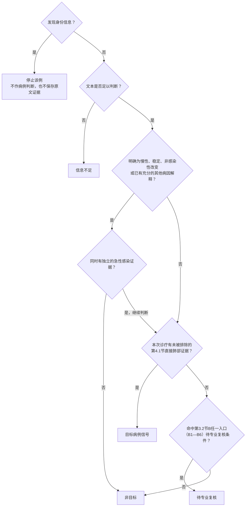
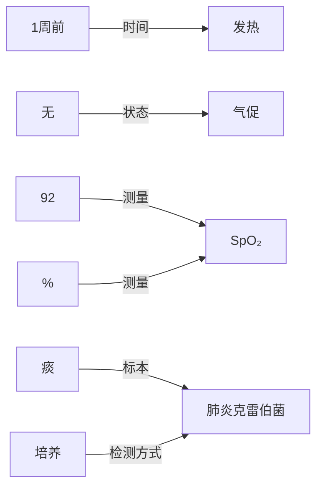
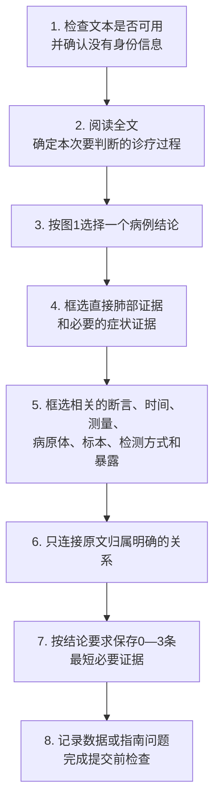
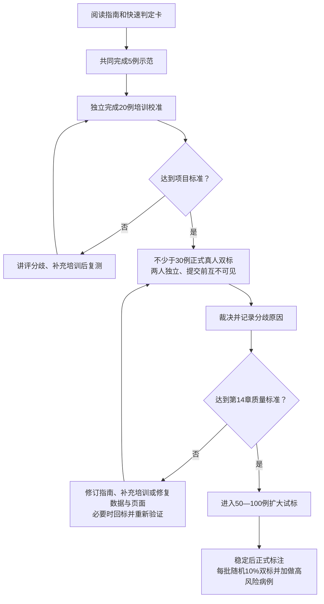

# 肺炎相关电子病历公共卫生信号标注指南

版本：v2.1.1  
发布日期：2026-08-28  
状态：供真人试标使用；病例分类规则、可用标签和数值标准未变；正式标注前须完成第15章真人一致性试验  
适用对象：具有医学背景、但缺少文本标注经验的标注人员  
适用平台：Label Studio  
任务性质：病例发现和早期预警，不是临床诊断

## 开始标注前，请先记住

> [!IMPORTANT]
> **开始每例标注前，请确认以下四点：**
>
> 1. 本任务不是诊断肺炎，而是从电子病历中找出可能存在传播风险、需要公共卫生人员进一步查看的病例。
> 2. 每份记录先选一个病例结论，再标出支持这个结论的原文证据。
> 3. 只使用标注页面上已经提供的按钮。页面上没有的标签，不要自行增加或用相近标签代替。
> 4. 如果看到姓名、证件号、电话、详细地址等可识别个人身份的信息，立即停止该例并报告隐私问题。

## 文件使用说明

| 项目 | 内容 |
|---|---|
| 标注单位 | 一份就诊记录、住院记录或合并后的单病例文本 |
| 每例需要完成 | 选择一个病例结论；标出支持结论的词句及其关系；记录发现的数据问题 |
| 可用标签 | 以当前标注页面实际显示的按钮为准；成人和儿童任务的按钮可能不同 |
| 配套字典 | `label_dictionary_v2.1.1.md`；不清楚某个标签怎么用时，查对应标签卡 |
| 指南维护 | 所有修改必须带版本、反馈编号、裁决理由和是否需回标；原始双标不得覆盖 |
| 隐私要求 | 仅使用去标识化文本；反馈只保留最小必要片段 |
| 规则冲突时 | 先按本指南正文判断，再查标签字典；示例和速查表只用于帮助理解，不产生新规则 |

### 本指南引用的项目文件

本表只列本指南实际使用的本地项目文件。网页和外部项目资料见文末“参考框架与外部项目”。

#### 标注时需要使用

| 文件 | 用途 | 谁需要查看 |
|---|---|---|
| [`label_dictionary_v2.1.1.md`](label_dictionary_v2.1.1.md) | 解释每个标签何时使用、框选多长、可以连接什么 | 成人和儿童标注员均需使用 |
| [`pnemonia_adult_config.xml`](</Users/sepmein/x/projects/emr_structured_annotation/label_studio/pnemonia_adult_config.xml>) | 决定成人任务页面实际显示的标签和关系；文件名按项目现状保留 | 成人任务使用；标注员不编辑此文件 |
| [`pneumonia_children_config.xml`](</Users/sepmein/x/projects/emr_structured_annotation/label_studio/pneumonia_children_config.xml>) | 决定儿童任务页面实际显示的标签和关系 | 儿童任务使用；标注员不编辑此文件 |

#### 项目管理和结果追溯时使用

| 文件 | 用途 | 使用说明 |
|---|---|---|
| [`schema_manifest_v2.1.0.json`](schema_manifest_v2.1.0.json) | 记录最近一次锁定的指南、字典、成人/儿童页面配置及文件校验值 | 当前清单锁定的是v2.1.0文件；以v2.1.1开始新一批真人试标前，应由项目负责人更新清单 |
| [`validation_report_v2.0.0.md`](validation_report_v2.0.0.md) | 记录100例双智能体压力测试的方法、结果和限制 | 对应第14.5节，不作为真人一致性或临床效度证明 |
| [`adjudication_review.md`](../runs/round-03/adjudication/adjudication_review.md) | 汇总新增200例的分歧、重复文本口径和裁决结论 | 对应第14.6节 |
| [`feedback_resolution_v2.1.1.json`](../runs/round-03/developer/feedback_resolution_v2.1.1.json) | 逐条记录v2.1.1审阅意见、处理理由及是否需要回标 | 供指南维护和审计，不是标注操作规则 |

### 文中几个常用词

- **电子病历（EMR）**：本项目使用的门诊、急诊、住院或复诊记录。EMR是英文 *Electronic Medical Record* 的缩写。
- **Label Studio**：本项目使用的标注工具。标注员只需按页面上显示的按钮操作。
- **世界卫生组织（WHO）**：本指南参考其文件的组织方式，但病例规则仍由本项目确定。
- **标注界面配置**：决定页面上有哪些标签和按钮的技术文件。技术人员有时称它为“Schema”或“XML配置”；标注员不需要编辑这些文件。
- **实体**：需要在原文中框选的医学词语或短语，例如“发热”“右肺炎症”。
- **关系**：两个已框选内容之间的明确归属，例如“无”修饰“发热”、“1周前”修饰“咳嗽”。
- **索引临床事件**：本次门急诊、当前住院，或能够确认属于同一疾病过程的连续诊疗。第3.1节给出具体判断方法。本指南和标签字典统一使用这个全称，不设简称。
- **目标病例信号**：四类病例结论之一，表示本次诊疗中存在值得公共卫生复核的肺部证据；行文中可简称“目标病例”。
- **待专业复核**：四类病例结论之一，表示命中一项明确的复核条件；行文中可简称“待复核”。它的六个触发入口编号为B1—B6，见第3.2节B。
- **直接肺部证据**：可以直接支持“目标病例信号”的肺部原文，具体范围见第4.1节。
- **英文缩写**：文中缩写第一次出现时给出中文含义；完整对照表见标签字典第1.4节。

## 目录

1. 项目背景、目的与任务边界
2. 每份病例需要完成什么
3. 病例级判断框架
4. 哪些证据会影响病例结论
5. 原文框选通则
6. 实体标签模块
7. 时间模块
8. 断言模块
9. 关系模块
10. 数据与隐私检查
11. 标准标注流程
12. 完整案例
13. 复核、上报与升级处理
14. 质量控制与评价
15. 培训、双标与裁决机制
16. 文档维护与版本管理
附录A：快速判定卡
附录B：标签与关系速查表
参考框架与外部项目

---

## 1. 项目背景、目的与任务边界

### 1.1 背景与公共卫生问题

本项目从电子病历中识别肺炎相关公共卫生信号，为后续专业复核提供结构化、可追溯的原文证据。项目需要解决的问题不是在临床上辅助诊断肺炎，而是识别一些潜在存在传播风险、需要公共卫生人员进一步复核的肺炎相关病例。

系统输出的是病例级公共卫生信号，而不是肺炎临床诊断。该输出不得替代医生判断、实验室检测或疾控调查结论。

### 1.2 指南目的与预期用途

本指南告诉标注员如何选择病例结论、框选原文证据、处理数据问题，以及在不确定时怎样提交复核。只标与以下任务直接有关的信息：

1. 判断病例是否进入肺炎相关复核队列；
2. 排除明显无关、纯既往或证据不足的病例；
3. 对复核优先级进行排序；
4. 说明系统为何给出该病例级判断。

如果一项医学信息不会影响上述四项任务，本项目不要求标注。

### 1.3 适用范围与非适用范围

本指南适用于已经去除身份信息的肺炎相关电子病历。标注员需要完成病例分类，并在原文中标出支持分类的证据。实际可用标签以标注页面为准。

下列事项不属于本指南规定的人工标注范围：

- 不标病例之间的空间聚集、14天内聚集或传播链；这些信息由地理信息系统（GIS）等程序另行处理。
- 不根据医学常识补造原文没有写出的肺炎、病原或因果。
- 不评价治疗是否正确。
- 不穷举全部症状、疾病和用药。
- 不标注病历中所有事件的完整先后顺序。
- 不把“病原体阳性”自动等同于“肺炎”。

### 1.4 总体原则

1. **原文优先**：只标文本明确表达的内容。
2. **病例目标优先**：先判断该信息是否会改变病例纳入、排除、优先级或解释。
3. **不确定时保守**：不确定的实体不补造，不确定的关系不连；记录问题并交裁决。

---

## 2. 每份病例需要完成什么

每份记录需要完成两件事：先选择一个病例结论，再标出支持这个结论的原文证据。单独一个症状、病原体名称、时间词或测量值，通常不能决定病例结论；必须按第3章规定的证据组合来判断。

### 2.1 总体框架

| 查看内容 | 需要回答的问题 | 标注结果 | 用途 |
|---|---|---|---|
| 数据与隐私检查 | 文本能否安全、可靠地标注 | 继续、停止或报告数据问题 | 决定该例能否继续 |
| 病例级判断 | 当前记录属于哪一类公共卫生信号 | 四分类结论及最小证据 | 形成主要病例输出 |
| 原文中的医学事实 | 原文明写了哪些相关内容 | 肺部证据、症状、暴露、病原等 | 支持纳入、排除、复核和解释 |
| 断言与主体 | 事实是否存在、是否确定、是否属于患者 | 否定、可疑、计划、条件、他人等 | 防止把否定、计划或他人事实误作患者当前事实 |
| 时间与病程 | 事实属于何时、是否属于索引临床事件 | 时间表达、当前、既往、持续、加重 | 确定证据能否计入当前病例判断 |
| 测量、标本与检测 | 数值和检验结果属于哪个对象 | 测量、标本、检测方式及关系 | 保留检验语境并防止错误配对 |
| 关系 | 修饰语和证据如何归属 | 五类关系 | 形成可解释的结构化证据链 |

证据多不等于结论更确定。只有满足第3章规定的组合和边界，证据才会改变病例结论。

### 2.2 第一步：选择病例结论

确认文本可以安全标注后，阅读全文，并且只选择一个结论：

- 目标病例信号
- 待专业复核
- 非目标
- 信息不足

选择“目标病例信号”“待专业复核”或“非目标”时，同时保存1—3条最能说明结论的原文片段。选择“信息不足”时，可以保存0—3条；如果仍有可用内容，就保留最短的必要片段。若发现身份信息，立即停止，不选择病例结论，也不复制任何原文证据。

### 2.3 第二步：框选证据并连接关系

使用页面上已有的按钮，框选与病例判断有关的医学事实、否定或可疑词、时间、测量、标本和检测方式，并按第9章连接关系。不需要把全文所有医学概念都标出来。

### 2.4 页面上已有和暂未提供的功能

| 内容 | 当前页面 | 现在怎么做 |
|---|---|---|
| 病例级四分类 | 页面内可能没有统一按钮 | 按项目提供的病例表单记录 |
| 数据问题 | 页面内可能没有统一按钮 | 按项目提供的数据问题表单记录 |
| 咳嗽、咳痰、气促 | 当前页面没有专门标签 | 可引用为病例结论的原文证据，但不要改用其他标签 |
| 具体日期、相对时间和时长 | 当前页面没有通用标签 | 保留在病例证据中；标准日期由程序处理 |
| 当前、既往、持续、进行性加重 | 当前页面已有 | 按第7章使用 |
| 好转、稳定、频率 | 当前页面没有专门标签 | 必要时保留在病例证据中 |
| 状态、时间、测量、标本、检测方式 | 当前页面已有 | 按相应章节使用 |
| 因果和完整事件先后关系 | 当前页面没有 | 本项目不标 |

### 2.5 本任务中“病例”的操作含义

“目标病例信号”不是临床确诊。它表示当前记录中有值得公共卫生人员回看、可能反映感染性肺实质病变的证据。以下内容不能只看名称就选为目标病例：

- 慢性、稳定或明确非感染性的间质性肺病；
- 非呼吸主诉中偶然出现的少许慢性炎症；
- 已被影像或临床明确解释为肿瘤、心衰等非感染病因的肺部异常；
- 支气管扩张伴感染，但未明确累及肺实质。

这些情况按第3章和第4章判断为待专业复核或非目标，不新增疾病亚型标签。

---

## 3. 病例级判断框架

本章说明怎样为一份记录选择唯一的病例结论。请先确认本次要判断的是哪次就诊或住院，再按顺序查看肺部证据、待复核条件、排除情况和文本是否完整。不要先凭总体印象选类别，再回头找证据。

### 3.1 “索引临床事件”

索引临床事件指当前文本所描述的本次门急诊、当前住院或同一次连续诊疗过程。判断“当前或近期”时，以是否属于索引临床事件为准，不用固定天数代替临床语境。

- 同次住院早期有明确肺炎、出院时已好转：仍属于索引临床事件。
- 仅在既往史中提到多年前肺炎、与本次无关：不属于索引临床事件。
- 连续治疗或复诊记录只有同时满足以下四项，才把既往证据并入索引临床事件：当前文书明确引用；写明继续治疗、复查或病程延续；能确认同一患者同一疾病过程；该旧证据仍被当前诊疗作为判断依据。具体操作见第7.3节。
- 仅由系统拼接进来的旧检查、无当前医生引用或来源不清：不自动并入；若时间归属会改变结论，进入待专业复核并上报时间问题。
- 多个互不相干记录疑似错拼，且归属会反转结论：不是待专业复核，而是信息不足并退回数据修复。

### 3.2 四种结论怎么选

#### A. 目标病例信号

> **一句话判断：** 本次诊疗中存在有效、未被排除的直接肺部证据。

选择“目标病例信号”前，依次确认以下四点：

1. 本次就诊、当前住院或同一连续诊疗过程中，原文明写了肺炎、肺实质感染、活动性肺部炎症或实变等直接肺部证据；
2. 这项事实属于患者本人，而不是家属、接触者或其他人；
3. 这项事实已经发生或当前存在，不是被否定的内容，也不只是计划、假设或待发生事项；
4. 原文没有把它明确说明为慢性、稳定或非感染性改变，也没有用肿瘤、心衰等其他病因作出充分解释。

四点都符合时，选择“目标病例信号”。直接肺部证据的具体范围见第4.1节。同一次住院内的肺炎即使已经好转、正在治疗或准备出院，仍可保留为目标病例信号；“好转”只影响当前活动性和复核优先级。

#### B. 待专业复核

> **一句话判断：** 尚不能判为目标病例，但已经命中一项明确的专业复核条件。

没有达到“目标病例信号”的条件，但出现下列任一入口时，选择“待专业复核”。六个入口编号为B1—B6，供本指南的流程图、案例、附录和标签字典引用：

1. **B1** 急性发热，加至少一项呼吸证据：咳嗽、咳痰、气促/呼吸困难、低氧、异常肺部体征；
2. **B2** 文本写“疑似肺炎、考虑肺炎、不除外肺炎、待排肺炎”；
3. **B3** 本次记录有性质或活动性不明的肺部、胸部异常；或者当前咳嗽、咳痰等呼吸症状同时伴有双肺湿啰音等客观听诊异常。这种情况不要求同时有发热。只有湿啰音、只有呼吸音粗，或者异常已经有明确的非感染性解释时，不因这一条进入待复核；
4. **B4** 呼吸道标本中检出本项目关注的呼吸道病原体，但没有足够肺炎直接证据；
5. **B5** 患者有支气管扩张等结构性肺病，并且同时符合两点：一是原文明写本次咳嗽、咳痰或气促比以前加重；二是同时出现发热、低氧或湿啰音中的至少一项。仅写“今年加重多次”“仍有症状”“未改善”“更换抗生素”，或者只有一个低氧数值，都不满足这一条；
6. **B6** 慢性或非感染性解释不确定，同时存在新发/加重呼吸症状或新的肺部异常；

如果没有命中以上任何一条，不要因为“感觉不放心”就选择待专业复核。文本足够完整时选“非目标”；文本缺失、错位或错拼，导致无法判断时选“信息不足”。若遇到规则没有覆盖的新情况，按第13章上报。

#### C. 非目标

> **一句话判断：** 文本足以判断，但没有未解释的直接肺部证据，也没有命中待专业复核条件。

满足以下任一情况，且没有未解释的直接肺部证据：

1. 明确是其他疾病或无关复诊；
2. 孤立轻症，如单独短期咳嗽、鼻塞流涕、咽痛；
3. 长期稳定的慢性呼吸症状，无急性改变；
4. 所有相关证据均被明确否定；
5. 仅有筛查、暴露史或计划检查，且无急性呼吸证据；
6. 仅有纯既往肺炎，与索引临床事件无关；
7. 慢性、稳定或明确非感染性的间质性肺病，无急性感染证据；
8. 非呼吸主诉中偶见少许慢性肺部炎症，且急性呼吸证据均被否定；
9. 肺部异常被报告明确或高度解释为肿瘤、心功能不全等非感染病因，且没有独立感染证据；
10. 支气管扩张伴感染稳定复诊，或只有持续/未改善、换药、年度加重次数而没有本次明确症状加重加客观急性证据。

#### D. 信息不足

> **一句话判断：** 不是医学上的阴性，而是文本本身不足以支持可靠分类。

当文本本身不足以支持前三类中的任何一类时，选择“信息不足”。常见情况包括：文本为空、内容严重截断、字段错位，或者只有无法确定归属的项目和数值。若记录只写“病情稳定”“继续治疗”“病史同前”“前症复诊”“检查如前”，但被引用的疾病或证据没有提供，而且缺失内容可能改变分类，也选择信息不足。单独出现一项与本次无关的旧检查，不能补足当前病种。

“看不懂但明显与肺炎无关”不是信息不足，应判非目标。短文本若已明确给出无关索引行为或计划，例如“建议电子喉镜”，且无肺炎触发证据，仍判非目标；不能仅按字符长度判信息不足。

### 3.3 标准判定顺序

按下图从上到下判断。只要已经得到病例结论，就停止向下判断；只有图中写明“继续”的情况才进入下一步。

#### 图1：四分类判断流程

### 3.4 证据记录要求

病例级证据只保留足以解释结论的最短原文片段。“目标病例信号”“待专业复核”和“非目标”保存1—3条；“信息不足”保存0—3条。发现身份信息时不要保存证据，也不要作病例判断。不要复制整段病历。按以下顺序选择证据：

1. 直接肺部证据；
2. 急性时间和核心症状；
3. 否定、计划、他人或既往等排除信息；
4. 病原、暴露或严重程度证据。

---

## 4. 哪些证据会影响病例结论

本章把证据分成两类：一类可以直接支持“目标病例信号”，另一类必须与其他证据合并判断，或只能触发“待专业复核”。最终结论仍按第3章判断。

### 先看证据在判断中起什么作用

| 证据作用 | 常见内容 | 单独出现时可能得到的结论 | 还要检查什么 |
|---|---|---|---|
| 直接肺部证据 | 肺炎、肺实质感染、活动性肺部炎症或实变 | 可支持目标病例信号 | 是否属于本次诊疗；是否被否定、仅为计划或属于他人；是否为慢性改变或已有其他病因解释 |
| 待复核触发证据 | 疑似肺炎、急性发热加呼吸证据、呼吸症状加湿啰音、性质不明的肺胸异常等 | 待专业复核 | 是否确实命中第3.2节B的一项完整入口条件（B1—B6） |
| 辅助证据 | 单个症状、炎症指标、病原体阳性、用药、暴露史 | 通常不能单独决定病例结论 | 是否与其他证据组成明确的待复核条件 |
| 排除或降级证据 | 否定、纯既往、长期稳定、明确非感染性解释 | 无独立急性感染证据时通常为非目标 | 是否仍有未被解释的直接肺部证据或新的急性证据 |
| 数据不足 | 空文本、严重截断、错位、错拼、缺少“同前”所指内容 | 信息不足 | 问题是否会影响四分类；能否回源补齐或修复 |

同一份记录可能同时出现几类证据。应先按图1处理排除语境，再判断直接肺部证据和待复核条件，不能简单按证据数量投票。

### 4.1 可以直接支持目标病例的肺部证据

下列原文可以直接支持“目标病例信号”。但它们必须属于本次就诊、当前住院或同一连续诊疗过程，而且不能是明确的慢性、非感染性改变，也不能已经有充分的其他病因解释：

- 明确感染性诊断：肺炎、支气管肺炎、大叶性肺炎、病毒性/感染性间质性肺炎等；
- 明确感染：肺部感染、两肺感染、下呼吸道感染且上下文明确指肺实质；
- 明确炎症/实变：右肺炎症、两肺炎症、感染性病变、肺实变或影像明确提示肺炎。

必须保留原文语义。不能因为词中含“肺炎”就标肺炎诊断，例如：肺炎支原体、肺炎克雷伯菌、肺炎链球菌。

“间质性肺炎”不能脱离语境机械纳入：明确为慢性间质性肺病、稳定复诊或非感染性病因时判非目标；性质不明且有新发/加重呼吸证据时判待专业复核；明确急性感染性间质性肺炎时才判目标。

### 4.2 单独出现时不能判为目标病例的证据

以下内容单独出现时不判目标病例信号：

- 胸水/胸腔积液、气胸、胸膜增厚、脓胸、支气管胸膜瘘；
- 条索影、小斑片影、结节、肿块、纤维化、陈旧性结核、肺不张；
- 双肺呼吸音粗、啰音、胸痛；
- C反应蛋白（CRP）、降钙素原（PCT）、白细胞等炎症指标升高；
- 发热、咳嗽、咳痰、气促；
- 病原体阳性；
- “抗感染治疗”或抗菌药物使用。
- “支气管扩张伴感染/支扩伴感染”，除非另有明确肺实质感染、炎症、实变或肺炎证据；
- “少许慢性炎症”“慢性间质性肺炎稳定复诊”；
- 已明确归因于心衰的两肺渗出，或高度考虑肿瘤的肺占位。

这些证据与其他内容组合后，可能达到“待专业复核”的条件。

### 4.3 容易出现分歧的情况

#### 慢性/非感染性肺部改变

- 慢性、稳定、非感染性语境明确，且无急性呼吸证据：非目标。
- 性质不明，同时有新发或加重呼吸症状：待专业复核。
- 明确急性感染性肺实质病变：目标病例信号。

#### 明确替代解释

- 影像或医生明确/高度解释为肿瘤、心衰、肺栓塞等，且没有独立感染证据：非目标。
- 替代解释不确定，并有急性呼吸证据或未解释的新肺部异常：待专业复核。
- 不能仅因出现“占位、渗出、模糊影”就判目标。

#### 支气管扩张伴感染

- 该固定短语不等于“肺部感染”实体，不直接判目标。
- 稳定复诊、配药、体温正常且无近期恶化：非目标。
- “未改善、仍有、继续抗感染、更换抗生素”表示持续或治疗调整，不等于加重，也不是客观急性证据。
- “今年加重6次”等年度次数不等于本次加重；“近期”不设机械天数，但必须由原文锚定到本次就诊、当前连续疗程或明确复诊原因。
- 本次咳嗽/咳痰/气促明确加重，并伴发热、低氧、湿啰音等至少一项客观证据：待专业复核。
- 另有明确肺炎、肺实质感染、炎症或实变：目标病例信号。

#### 纯检验和无关临床记录

- 空文本或仅有无法归属的检验项目、数值：信息不足，并交项目组处理数据问题。
- 完整的非呼吸索引记录，附带明确阴性病原结果：非目标。
- 项目与结果展平错位、无法唯一配对：不连关系、不作阳性触发；若影响病例结论则信息不足并退回修复。

### 4.4 项目组如何进行初步筛查

本节供项目管理和数据处理人员参考，标注员不需要执行程序筛查。项目先进行自动粗筛，再按第3章完成人工四分类。

#### 第一步：数据检查

程序先排除空字符串、纯空格、只有分隔符、无法解析的记录，并记录排除原因。不要让医学标注员手工清理大量空任务。

#### 第二步：尽量不漏病例的粗筛

只要命中以下任一条件就保留给病例级模型或人工：

- 直接肺部证据词；
- 急性发热加呼吸证据；
- 疑似/待排肺炎；
- 性质不明的当前肺/胸异常；
- 呼吸道标本中关注病原体阳性。

这一阶段允许多保留一些记录，但不直接把它们当作目标病例。

#### 第三步：四分类判断

按第3章规则区分目标、待复核、非目标和信息不足。

#### 防止漏筛

- 从阶段1排除的记录中随机抽取5%—10%复核；
- 对含“肺、胸、呼吸、CT、影像、感染、发热”等宽词但被排除的记录加大抽样；
- 分别报告目标/待复核合并后的漏筛数，不能只看总体准确率；
- 一旦发现规则性漏筛，补充规则并回溯同批数据。

#### 防止过筛

- 单独鼻塞、流涕、咽痛、孤立咳嗽不进入待复核；
- 暴露史单独出现不进入待复核，只用于已有呼吸证据病例的优先级；
- 病原体名称或计划检测不等于阳性结果；
- 非特异影像不直接判目标。
- “慢性炎症、间质性肺炎、支气管扩张伴感染”必须结合急性/感染性语境，不能只按关键词直纳目标。

---

## 5. 原文框选通则

“实体”就是需要在原文中框选的医学词语或短语。本章说明框选多长、哪些词要分开标。某个标签的具体用法见配套操作字典；不要因为本章的通用规则而自行增加标签。

### 5.1 框选最短但完整的词语

选择能表达完整医学概念的最短原文，不带否定词、时间词、提示词或标点。

- “CT提示右肺炎症” → 标 `[右肺炎症]`，不含“CT提示”。
- “无发热” → 实体标 `[发热]`，状态标 `[无]`，再连状态关系。
- “今仍有发热” → 实体 `[发热]`；时间/病程修饰分别标 `[今]`、`[仍有]`。

### 5.2 保留会改变含义的限定词

侧别、解剖部位或能改变概念的限定词应包含在实体跨度中，如“右肺炎症”“两肺感染”。纯程度词通常不并入实体，除非它属于固定结果词，如“弱阳性”作为完整状态跨度。

### 5.3 否定、计划和他人信息要分开框选

“未见、否认、拟、建议、家属”等另标断言并连接，不与临床实体合并。

### 5.4 不拆词内误标

- `[肺炎支原体]`只标病原体，不在其中再标“肺炎诊断”。
- `[肺炎克雷伯菌]`只标病原体。
- “抗肺炎治疗”若不是明确诊断，不因“肺炎”二字自动标诊断。

### 5.5 重复和并列

- 原文每个明确、独立出现的相关实体都标。
- 同一事实在复制粘贴段落中完全重复时，仍按页面文字标注，同时记录“文本重复”（表单代码为 `duplicate_text`）。
- 空文本先记录“空文本”（表单代码为 `empty_text`），不要因为多个空任务相同再记录“文本重复”。
- 同一批中的全文精确重复任务保留审计映射，但病例分布和一致性主分析只保留每个唯一文本的一个确定性代表；同时报告原始任务口径和唯一文本口径。
- 近重复只标记并抽查，不能在没有患者、就诊、时间和来源证据时自动删除。
- 并列实体分别标，例如“肺炎支原体、肺炎衣原体IgM阴性”应标两个病原体。

### 5.6 不要分段框选一个实体

当前任务不把相隔的两段文字合成一个实体。修饰语和医学事实分开出现时，分别框选，再用关系连接。

---

## 6. 实体标签模块

本章介绍主要标签。实际框选或连线前，请查阅 `label_dictionary_v2.1.1.md` 中的对应标签卡。标签卡里的医学解释只帮助理解，不表示可以根据医学常识补出原文没有写的内容。

### 先确认当前任务是成人还是儿童

成人和儿童任务使用不同的标注页面。两类页面的大部分标签相同，但各自还有少量专用标签。**只使用当前任务页面实际提供的按钮，不要把另一类页面的专用标签带入本任务。**

| 标签范围 | 成人页面 | 儿童页面 | 标注员怎么做 |
|---|---|---|---|
| 两类页面共用 | 62个标签；包括核心肺部证据、发热和严重程度、时间、断言、大部分测量、共同暴露、标本、检测方式和病原体 | 同左 | 按本章和标签字典的共同规则标注 |
| 成人页面专用 | 体温；医务人员；禽、畜类从业人员；农牧民等野外作业人员；病原微生物实验室检测人员 | 无这些按钮 | 只在成人任务中使用 |
| 儿童页面专用 | 无这些按钮 | 鼻翼煽动；三凹征；喘鸣喘息；意识障碍；惊厥；拒食或喂养困难；脱水征 | 只在儿童任务中使用，原文明确出现才标 |
| 两类页面均未提供 | 咳嗽、咳痰、气促/呼吸困难、通用时间表达 | 同左 | 可作为病例结论的原文证据；页面更新前不要自行增加按钮或改用相近标签 |
| 关系 | 状态、时间、测量、标本、检测方式 | 与成人页面相同 | 两类任务均按第9章连接 |

> [!NOTE]
> **“发热”和“体温”不是同一个标签。** 成人和儿童页面都能标“发热”症状，但只有成人页面提供“体温”测量标签。儿童病历只有体温数值、没有写“发热、低热、高热”等症状时，不要把数值自动改标成“发热”。

当前配置中，成人页面有67个标签，儿童页面有69个标签，其中62个共用；两类页面均使用相同的5种关系。如果实际页面与本节不一致，停止自行扩展标签并向项目负责人报告页面差异。

### 6.1 核心肺部实体

| 标签 | 定义 | 纳入例 | 排除例 | 病例判断作用 |
|---|---|---|---|---|
| 肺炎诊断 | 原文明写感染性或活动性肺炎诊断 | 肺炎、支气管肺炎、病毒性间质性肺炎 | 肺炎支原体；慢性非感染性间质性肺病；待排肺炎需加可疑 | 满足索引和断言条件时直接纳入 |
| 肺部感染 | 明确指向肺实质/两肺的感染 | 肺部感染、两肺感染 | 支气管扩张伴感染；抗感染治疗；CRP升高 | 满足索引和断言条件时直接纳入 |
| 肺部组织炎症 | 影像/病理明确活动性肺实质炎症、感染性病变或实变 | 右肺炎症、两肺炎症 | 少许慢性炎症、胸水、条索影、结节 | 直接纳入或复核 |

### 6.2 症状和严重程度

#### 成人和儿童标注页面均有

- 发热
- 呼吸衰竭
- 休克
- 器官衰竭
- 机械通气

#### 儿童标注页面另有

- 鼻翼煽动
- 三凹征
- 喘鸣喘息
- 意识障碍
- 惊厥
- 拒食或喂养困难
- 脱水征

#### 项目建议增加、但当前页面尚未提供

- 咳嗽
- 咳痰
- 气促/呼吸困难

这三个症状只用于与发热、低氧、异常肺部证据等组合判断待专业复核；不新增干咳/湿咳、痰色、频率、程度等子标签。

#### 解释规则

- 发热包括“低热、高热、体温升高”等明确症状表达；单纯数值另标体温测量。
- 呼吸衰竭、休克和器官衰竭提高复核优先级，但不证明病因是肺炎。
- 机械通气是治疗/支持措施，不是症状，也不证明肺炎；保留标签是为了严重程度排序。
- 儿童体征只有原文明确出现才标；“无鼻翼煽动”仍标实体并连接否定。

### 6.3 测量

#### 测量指标

- 成人：体温、呼吸频率、静息状态指氧饱和度（SpO2）、动脉血氧分压（PaO2）、吸入氧浓度（FiO2）
- 儿童：呼吸频率、静息状态指氧饱和度（SpO2）、动脉血氧分压（PaO2）、吸入氧浓度（FiO2）

#### 测量组成

- 数值
- 单位
- 比较符
- 阈值判断

例：“SpO2 < 93%”分别标指标、比较符、数值、单位；每个组成部分都通过“测量”关系连接到SpO2。不根据医学常识自行生成“异常”。

### 6.4 流行病学暴露

#### 成人职业

- 医务人员
- 禽、畜类从业人员
- 农牧民等野外作业人员
- 病原微生物实验室检测人员

#### 成人和儿童共同

- 可疑动物或动物制品接触史
- 可疑环境暴露史
- 外出外来史

暴露史只按原文标。否认暴露时，仍框选暴露内容，并把否定词与它连接。只有暴露史、没有呼吸证据时，不进入肺炎待复核。病例之间的地理聚集不由标注员处理。

### 6.5 病原体

#### 病毒

新冠病毒、流感病毒、呼吸道合胞病毒、腺病毒、人偏肺病毒、副流感病毒、普通冠状病毒、博卡病毒、鼻病毒、肠道病毒。

#### 细菌

A族链球菌、百日咳鲍特菌、肺炎链球菌、流感嗜血杆菌、军团菌、肺炎克雷伯菌。

#### 其他

肺炎支原体、曲霉菌、隐球菌、鹦鹉热衣原体、肺炎衣原体。

只标页面上已有的病原体标签。遇到页面没有、但可能改变病例结论的病原体时，记录问题，不自行增加标签。病原体名称本身不表示检测结果为阳性。

#### 病原阳性对病例级判断的作用

- 呼吸道标本（咽/鼻咽拭子、痰、肺泡灌洗液）中明确检出关注病原体，且记录组归属完整：无直接肺部证据时可触发待专业复核。
- 血清免疫球蛋白M（IgM）或其他抗体阳性，不能等同于从呼吸道标本中检出病原体；它单独出现时不触发待专业复核，必须结合本次诊疗中的急性呼吸证据。
- 血培养、尿抗原、胸水或其他非呼吸道标本结果，只按原文和标本记录，不自动套用“呼吸道标本阳性”入口。
- 只有项目名、无结果，或项目—结果无法唯一配对：不视为阳性。
- 脱离就诊语境的纯检验列表：信息不足；完整无关临床记录中的附带阴性结果：非目标。

### 6.6 标本

- 咽/鼻咽拭子
- 痰
- 肺泡灌洗液
- 血
- 尿
- 胸水

只有在检测语境中才标标本。例如“痰培养”中的“痰”是标本；“咳痰”中的“痰”是症状内容，不标为标本。

### 6.7 检测方式

- 核酸检测
- 宏基因组二代测序（mNGS）
- 抗原快速检测
- 抗体IgM
- 抗体滴度/双份
- 培养

检测方式必须与原文明确的病原检测对应。计划检测加假设性；未完成的计划不当作结果。

---

## 7. 时间模块

### 7.1 为什么要分三类记录时间

时间信息回答三个不同的问题：原文写的是哪一天或多长时间；这件事属于本次诊疗还是既往史；病情是在持续还是逐步加重。三类信息分别处理，不要混在一起。

| 要回答的问题 | 记录什么 | 例子 | 对病例判断的作用 |
|---|---|---|---|
| 原文写的是何时、多久 | 日期、相对时间、时长、病程日序或时间窗口 | 7月15日、1周前、3天、住院第2日、近期 | 保留原文时间；标准化换算由程序完成 |
| 这件事属于本次诊疗还是既往 | 当前、既往，以及较早检查能否并入同一连续诊疗过程 | 本次、目前、曾经、5年前 | 决定这项证据能否计入当前病例结论 |
| 病程处于什么状态 | 持续、进行性加重；好转和稳定保留在病例证据中 | 仍有、无好转、逐渐加重、病情稳定 | 帮助判断活动性和复核优先级，不单独证明肺炎 |

### 7.2 第一类：原文明写的日期、相对时间和时长

当前页面尚无通用的“时间表达”标签。若项目后续增加该标签，按以下范围框选；在此之前，只把必要的时间词保留在病例证据中。

标原文明确出现的时间跨度：

- 绝对日期：`2025-02-16`、`7月15日`
- 相对时间：`今`、`昨日`、`1周前`、`入院前2天`
- 时长：`持续3天`中的`3天`、`反复20年`中的`20年`
- 病程日序：`输液第4天`、`住院第2日`
- 时间窗口：`近7天`、`近期`

标注员只框选原文，不需要换算成标准日期；换算工作由程序完成。

### 7.3 第二类：属于本次诊疗还是既往史

#### 当前

明确表示索引临床事件当前状态的词，如“今、今日、目前、现、本次”。只标原文存在的提示词，不给普通陈述补造“当前”。

#### 既往

明确表示非索引临床事件的过去史，如“既往、曾经、数年前患有”。具体日期不自动等于既往；同次住院早期日期仍属于索引临床事件。

复诊文本引用较早检查时，按以下顺序判断：

1. 当前文书是否明确引用该检查；
2. 是否写明继续治疗、复查、病情进展/好转或同一疗程；
3. 是否能确认属于同一患者、同一疾病连续诊疗；
4. 检查结果是否仍是当前判断的临床依据。

四项均明确时，才可并入索引临床事件；只有系统拼接日期或孤立旧报告时，不自动并入。前三项虽明确、但旧结果已不再被当前诊疗采用，也不并入。无法确认且会改变四分类时判待专业复核；疑似跨患者/跨就诊错拼时判信息不足并退回。

反例：“肺病复诊，继续维持治疗。系统附带两年前CT曾示肺炎；本次医师写明该病灶已消失、当前治疗针对其他慢病。”虽然有当前引用和连续随访，旧肺炎已不再作为当前依据，不并入索引临床事件。

#### 未来/计划

页面没有“未来”标签。“拟、计划、建议、将行”等尚未实施的内容，用“假设性”标签表示。

### 7.4 第三类：病程持续还是加重

#### 持续

提示事件仍存在或治疗后未改善，如“仍有、一直、持续、未愈、无好转、效不佳”。

#### 进行性加重

只有明确逐步恶化时标，如“逐渐加重、进行性恶化、持续加重”。单次“今日加重”表示当前变化，不自动等于进行性。

#### 好转/稳定

不新增人工标签：

- “好转、缓解”保留在病例级证据中，用于降低活动性/优先级；
- “稳定”通常不改变是否存在过肺炎；
- 若索引临床事件中已有明确肺炎，不能仅因出院时好转改判非目标。

### 7.5 时间关系

只有时间词明确修饰某个临床事件时才连“时间”关系。

- “今仍有发热” → 今—时间—发热；仍有—时间—发热。
- “1周前发热，今日咳嗽” → 1周前只连发热；今日只连咳嗽。
- “既往肺炎，本次无发热” → 既往只连肺炎；无只连发热。

不要因为同句出现就把所有时间词连接给所有实体。

### 7.6 标注员不需要做的时间换算

标准日期、是否属于本次诊疗、病情处于活动期还是已经改善，以及病程是否持续或加重，都由程序在导出后整理。标注员只需准确框选原文和连接关系。

### 7.7 这三类时间信息不负责什么

这三类信息已经能够回答本项目需要的时间问题，但不负责：

- 推断没有明写的病程先后；
- 标出所有事件的完整先后顺序；
- 修复跨就诊拼接；
- 仅凭日期间隔决定“近期”。

试标中发现，时间分歧主要来自“是否属于本次诊疗”和“不同记录是否被错误拼接”，而不是缺少更多时间按钮。遇到这类问题，应先核对记录来源并按第13章上报。

---

## 8. 断言模块

“断言”是指原文对一项医学事实的态度：它是肯定存在、被否定、仍属可疑、只是计划，还是属于其他人。断言标错，可能把阴性结果变成阳性结果，因此只按原文中明确出现的提示词框选和连线；原文没有提示词时，不要自行补一个。

### 8.1 标签定义

| 标签 | 提示词/例子 | 解释 |
|---|---|---|
| 肯定 | 阳性、检出、培养见、证实、弱阳性 | 原文明确报告存在；弱阳性保留完整跨度 |
| 否定 | 无、未见、否认、阴性、未检出、不伴 | 明确不存在或检测阴性 |
| 可疑 | 疑似、考虑、不除外、待排、可疑阳性、临界 | 不当作确诊或确定阳性 |
| 条件性 | 若、如出现、必要时 | 条件尚未满足 |
| 假设性 | 拟、计划、建议、将行 | 计划或预期，未证明已发生 |
| 与患者本人无关 | 家属、母亲、接触者、同事 | 事件不属于患者本人 |

### 8.2 默认规则

普通肯定陈述如果没有“阳性、证实、检出”等明确提示词，只标医学事实，不额外补标“肯定”。例如“患者发热”只标“发热”。

### 8.3 病原检测映射

- “阳性、检出、培养见、弱阳性” → 肯定。
- “可疑阳性、临界、不排除污染” → 可疑。
- “阴性、未检出” → 否定。
- 仅出现病原体和检测方式、无结果词 → 不补断言。
- “拟行新冠核酸” → 新冠病毒/核酸检测加假设性，不算已检测。

### 8.4 一个提示词修饰哪些内容

一个提示词明确同时修饰多个医学事实时，要分别连接。

“无咳嗽、发热、气促”中，“无”分别修饰三个症状。若并列结构不清，宁可少连并上报，不能猜测。

### 8.5 文书章节的默认解释

章节名只提供语境，不替代原文断言；以下规则用于处理常见模板：

- 现病史/入院情况：默认属于患者和索引临床事件，除非句内明确写既往、计划、否定或他人。
- 既往史：默认是本次诊疗以前的事实；实体仍按页面上的标签框选，能找到“既往、曾”等提示词时，与相应事实连接。
- 家族史/接触者描述：默认不属于患者；只有原文明确涉及项目关注证据时标实体并连接“与患者本人无关”。
- 治疗计划/建议：未实施内容连接“假设性”；不能当成已发生检测、治疗效果或诊断。
- 出院记录：同次住院早期明确事实仍属于索引临床事件；“好转/已缓解”改变活动性，不删除该次事实。
- 复制模板或“相关后文”：只有来源和索引临床事件归属明确时使用；与当前段矛盾且影响结论时退回数据修复。

句内明确表达优先于章节默认。例如既往史中写“此次再次发热”，仍需核对其实际来源；现病史中写“母亲患肺炎”仍属于他人。

---

## 9. 关系模块

### 9.1 模块目的

实体说明“有哪些证据”，关系说明“修饰语、数值、标本和方法属于哪一条证据”。关系错误可能把阴性变阳性或把一个病原体的标本连给另一个，因此关系必须比实体更保守。

### 9.2 Label Studio中的方向

页面连线时会记录先点哪一项、后点哪一项，但本项目不考核点击顺序。标注员只需选对要连接的两个内容和关系类型。例如连接“阴性”和“肺炎支原体”时，先点哪一个都可以。

> [!WARNING]
> **同句出现不等于存在关系。** 只有原文明写或语法上能够明确判断归属时才连线；不确定时宁可不连并上报。

### 9.3 每种关系可以连接哪些内容

| 关系 | 一端可以是 | 另一端可以是 | 正确例 | 不要这样连 |
|---|---|---|---|---|
| 状态 | 肯定/否定/可疑/条件性/假设性/他人 | 症状、诊断、暴露、病原体或检测 | 阴性—肺炎支原体 | 同句的阴性连到无关病原体 |
| 时间 | 当前/既往/持续/加重/时间表达 | 症状、诊断、暴露或检测事件 | 1周前—发热 | 因同句出现而连全部实体 |
| 测量 | 数值/单位/比较符/阈值判断 | 测量指标 | 38.3—体温 | 38.3连到呼吸频率 |
| 标本 | 标本 | 相应病原体 | 痰—肺炎克雷伯菌 | 胸水连到尿培养病原体 |
| 检测方式 | 检测方式 | 相应病原体 | IgM—肺炎支原体 | 核酸连到仅做抗体的病原体 |

#### 图2：五类关系的连接示例

下图中的每一组都是独立示例。箭头用于说明“谁修饰谁”，标注页面上的实际点击先后不影响评分。

### 9.4 逐关系规则

#### 状态

- 每个被修饰实体各连一条边。
- “不除外肺炎”用可疑，不用否定。
- “肺炎支原体IgM阴性”中阴性连病原体；IgM用检测方式关系连病原体。

#### 时间

- 只连接语义上被修饰的事件。
- 同一时间表达可以连接多个事件，但必须语法作用域明确。
- 不根据常识推断“先发热后肺炎”等未明说关系。
- 跨文书的旧时间只在来源和连续诊疗关系明确时连接；无来源日期不能支配整份拼接文本。

#### 测量

- 指标、数值、单位、比较符分别标，所有组成连接到对应指标。
- 多项生命体征并列时按最近且语义唯一的指标配对。

#### 标本

- 标本必须处于检测语境。
- “痰培养见肺炎克雷伯菌” → 痰—标本—肺炎克雷伯菌。
- “咳痰，肺炎支原体IgM阴性”不能把症状中的“痰”连到支原体。

#### 检测方式

- 每种方法只连其实际检测的病原体。
- 并列清晰时逐项连边。
- 方法被多个病原共享且作用域明确时，可分别连边。

#### 展平检验字段

有些检验表导入后会被拆成连续文字，原来的行列关系不再清楚。遇到这种情况：

- 只有同一检验记录组内的项目、结果、标本和方法才可连接。
- “最近出现”不是充分依据；跨组、错位或相互矛盾时不连。
- 如果原文无法看出某个结果属于哪个检验项目，就不要猜测连接，也不要把它当作病原阳性证据；同时记录数据问题。

### 9.5 不标的关系

- 症状导致诊断
- 暴露导致感染
- 病原体导致肺炎
- 药物治疗疾病
- 所有事件之间完整的先后或重叠关系
- 仅因两个实体在同一句或相邻句出现而产生的关系

### 9.6 关系不确定时

1. 先确认要连接的两个内容是否都标对；
2. 再确认原文是否明确表达归属；
3. 若有两种合理连接，暂不连；
4. 在反馈中写出最小片段、两种解释和对病例判断的影响。

试标中最常见的问题不是关系类型太少，而是把修饰词、标本或检测方法连错了对象。因此本项目只保留这五类关系，不标因果、治疗或完整事件顺序。

---

## 10. 数据与隐私检查

数据问题和医学上的“非目标”不是一回事。空文本、错误拼接或身份信息残留，表示这份记录不能安全、可靠地标注；它们不能当作没有肺炎信号的阴性病例。

> [!CAUTION]
> **发现身份信息时立即停止。** 不选择病例结论，不复制原文证据，也不要把该例标成“非目标”或“信息不足”；按项目隐私流程报告。

### 10.1 项目组在导入前检查什么

本节由项目管理和数据处理人员执行，标注员不需要手工清理大批任务。以下记录应在导入前被拦下并记录原因：

- 没有正文、正文为空或只有分隔符；
- 文件无法读取；
- 相同文本重复导入；
- 仍有姓名、证件号、电话、详细住址、住院号或床位号等身份信息；
- 多次就诊或多份文书被拼在一起，而且无法确定各段的来源和时间；
- 检验项目、标本、方法和结果已经错位，无法恢复正确对应关系。

完整但与肺炎无关的记录不是数据问题，应保留为“非目标”病例。

### 10.2 标注时发现问题怎么办

如果数据问题表单显示英文代码，按下表中的中文含义选择；不要仅凭代码猜测。

| 看到的问题 | 记录方式 | 下一步 |
|---|---|---|
| 空字符串、纯空格、仅分隔符 | 空文本（`empty_text`） | 选“信息不足”，不作医学负例 |
| “同上、如前、前症”等引用内容没有提供 | 缺少上下文（`missing_context`） | 若缺失内容可能改变分类，选“信息不足”并申请补全 |
| 文本被截断，但剩余内容仍足以判断 | 文本截断（`truncated`） | 正常选择病例结论，同时记录问题 |
| 多份记录疑似错误拼接 | 记录拼接错误（`record_splice`） | 若会改变结论，选“信息不足”并退回修复 |
| 检验项目与结果无法对应 | 检验配对错误（`lab_pairing_error`） | 不猜测连线；若会改变结论，选“信息不足” |
| 非空文本完全重复 | 文本重复（`duplicate_text`） | 正常标注该例，同时记录问题 |
| 仍有身份信息 | 隐私问题 | 立即停止该例并按项目隐私流程处理 |
| 只有“病情稳定、继续治疗、同前”等笼统内容 | 缺少上下文（`missing_context`） | 当前病种不明且可能改变分类时，选“信息不足” |
| 完整无关记录附带阴性检验 | 不记录数据问题 | 选“非目标”；不因检验项目名称改判 |

如果上述类型都不合适，才选择“其他”（`other`），并用一句不含身份信息的话说明数据人员需要修复什么。不要把“医学上不确定”写成数据问题。

### 10.3 无关病例的处理

本节供项目组准备训练数据时参考。与肺炎无关但内容完整的病历，是帮助模型学习排除无关记录的“非目标样本”，不应全部在导入前删除。建议：

- 空白、损坏、重复、含身份信息的记录由项目组另行处理；
- 医学内容完整但与肺炎无关的记录保留一部分，作为真实的非目标样本；
- 通过分层抽样控制目标、待复核、容易误判的非目标样本和普通非目标样本比例；
- 不要只用关键词命中的病历训练，否则模型无法学习排除无关内容。

---

## 11. 标准标注流程

每例任务应按固定顺序完成。该顺序用于减少先入为主、证据遗漏和关系错配，不得因文本较短或结论看似明显而跳过数据质量、病例判断或提交前检查。

### 11.1 每例操作顺序

#### 图3：一份记录从打开到提交

如果在第1步发现身份信息，立即停止该例；如果在后续步骤发现文本错拼、缺失或关系无法确定，按第10章或第13章处理，不要猜测补全。

### 11.2 禁止事项

> [!WARNING]
> **下列做法容易造成系统性错误，应在提交前逐项排除：**

- 不因担心漏标而把所有医学词都标出来。
- 不把模型预标注当成正确答案。
- 不自行修改原文、标签名或关系名。
- 不在无法确定关系时随意连最近实体。
- 不用个人临床经验替代指南正文列出的证据规则。

### 11.3 提交前检查

- 病例级只选了一个结论；
- 目标病例信号有直接肺部证据；
- 待复核有明确触发原因；
- 否定、可疑、计划和他人证据没有被当成确定当前事实；
- 每条关系连接的两类内容符合第9.3节；
- 没有把病原体名称中的“肺炎”误标为肺炎诊断；
- 问题反馈不含身份信息。

---

## 12. 完整案例

> [!NOTE]
> 案例用于演示正文规则怎样组合使用。若案例与第3章或第4章冲突，以正文为准并提交指南问题；**案例不能产生新规则。**

| 分组 | 案例 | 主要练习内容 |
|---|---|---|
| 常见病例判断 | 1—4 | 明确肺炎、症状组合、孤立轻症和长期稳定症状 |
| 复杂证据与断言 | 5—10 | 胸腔病变、偶然影像、治疗后改善、纯既往、检验结果和计划检查 |
| 数据质量与高频边界 | 11—18 | 空文本、慢性改变、支气管扩张、替代病因、旧影像和记录错拼 |
| 其他高频边界 | 19—22 | 无发热湿啰音、未改善与加重、短文本和缺少上下文 |

### 12.1 常见病例判断

#### 案例1：明确当前肺炎

> **原文**：“1周前发热伴咳嗽，今仍有发热。CT提示右肺炎症，门诊以‘肺炎’收住院。”

- **病例结论**：目标病例信号。
- **应标内容**：发热、右肺炎症、肺炎；页面提供“咳嗽”标签后再标咳嗽。
- **时间关系**：1周前→发热；今→发热；仍有→发热。
- **判断依据**：有索引临床事件内直接肺部证据。

#### 案例2：急性发热加呼吸证据

> **原文**：“发热1天，偶有咳嗽，双肺呼吸音粗，未行胸部影像。”

- **病例结论**：待专业复核。
- **应标内容**：发热；页面提供“咳嗽”标签后再标咳嗽。
- **不要标**：肺炎诊断、肺部感染、肺部组织炎症。
- **判断依据**：符合急性发热加呼吸证据，但没有直接肺部证据。

#### 案例3：孤立轻症

> **原文**：“咳嗽1天，无发热，无胸闷气促，双肺未及啰音。”

- **病例结论**：非目标。
- **应标内容**：发热并连接否定；页面提供“咳嗽、气促”标签后，再框选相应症状并连接否定。
- **判断依据**：孤立轻症，缺少急性组合和直接证据。

#### 案例4：长期稳定咳嗽

> **原文**：“反复咳嗽咳痰20年，心肺无殊。”

- **病例结论**：非目标。
- **时间表达**：20年。
- **判断依据**：长期稳定症状，无急性改变。

### 12.2 复杂证据与断言

#### 案例5：复杂胸腔感染

> **原文**：“右侧脓胸，支气管胸膜瘘，胸水病原菌测序提示相关病原感染，近期无发热。”

- **病例结论**：待专业复核。
- **可标内容**：胸水、mNGS、病原体、发热及否定。
- **不要标**：肺炎诊断、肺部组织炎症。
- **判断依据**：胸腔感染严重但不等于肺实质肺炎。

#### 案例6：非呼吸主诉中的偶然影像

> **原文**：“因混合痔入院。影像见两肺纤维条索影及小斑片状影。”

- **病例结论**：待专业复核。
- **不要标**：肺部组织炎症，除非报告明确写炎症/感染/实变。
- **判断依据**：性质和活动性不清，不能直接纳入目标。

#### 案例7：住院期间肺炎已改善

> **原文**：“入院胸部CT示两肺炎症。治疗后复查明显改善，现无发热咳嗽，予出院。”

- **病例结论**：目标病例信号。
- **应标内容**：两肺炎症；发热、咳嗽连接否定（如相应标签可用）。
- **病例证据**：治疗后改善。
- **判断依据**：肺炎发生在同一次索引住院内；改善降低活动性，不删除病例信号。

#### 案例8：纯既往肺炎

> **原文**：“5年前曾患肺炎，本次糖尿病复诊，无咳嗽发热。”

- **病例结论**：非目标。
- **应标内容**：肺炎并连接既往；发热连接否定。
- **判断依据**：纯既往、与索引临床事件无关。

#### 案例9：病原体弱阳性

> **原文**：“呼吸道合胞病毒IgM弱阳性，肺炎支原体IgM阴性。”

- **病例结论**：按语境三选一：
    - 脱离就诊语境的纯检验列表 → 信息不足；
    - 附在一份完整、明确无关的临床记录中 → 非目标；
    - 同一索引临床事件另有急性呼吸证据 → 待专业复核。
- **注意**：任何情况下都不能仅凭该结果判目标病例。
- **应标内容**：呼吸道合胞病毒、肺炎支原体、抗体IgM。
- **状态关系**：弱阳性→呼吸道合胞病毒；阴性→肺炎支原体。
- **不要标**：“肺炎支原体”中的肺炎诊断。

#### 案例10：计划排除肺炎

> **原文**：“拟行胸部CT排除肺炎，无发热咳嗽。”

- **病例结论**：非目标。
- **肺炎的标法**：`拟行`标假设性并连接肺炎；`排除`在此表示检查目的，不再额外连接可疑，避免同一实体出现两个冲突断言。若原文写“不除外肺炎/待排肺炎”，才用可疑。
- **判断依据**：只有计划且缺少急性证据。

### 12.3 数据质量与高频边界

#### 案例11：空文本

> **原文**：空。

- **病例结论**：信息不足。
- **实体和关系**：均为空。
- **后续处理**：这类空任务应在导入前由项目组拦下，不交给标注员。

#### 案例12：偶然慢性炎症

> **原文**：“因胸痛就诊。CT示两肺少许慢性炎症；无发热、咳嗽、咳痰和呼吸困难。”

- **病例结论**：非目标。
- **不要标**：不要把“少许慢性炎症”标成活动性感染性肺实质证据。
- **判断依据**：非呼吸索引临床事件、慢性语境明确、急性呼吸证据均被否定。

#### 案例13：支气管扩张急性恶化

> **原文**：“支气管扩张史。3天来咳嗽加剧、咳痰增多；SpO2 92%，双肺可闻湿啰音，无发热。”

- **病例结论**：待专业复核。
- **不要标**：不要直接标“肺部感染”，除非原文另写肺实质感染、炎症、实变或肺炎。
- **判断依据**：无发热不自动排除；结构性肺病急性症状恶化并有低氧/湿啰音。

#### 案例14：支气管扩张稳定配药

> **原文**：“支气管扩张伴感染复诊配药，目前病情稳定，体温正常。”

- **病例结论**：非目标。
- **判断依据**：固定诊断短语不等于当前肺实质感染，且没有近期恶化。

#### 案例15：明确替代解释

> **原文**：“气促、双下肢水肿。影像示两肺渗出，可符合心功能不全表现；无发热及感染证据。”

- **病例结论**：非目标。
- **判断依据**：肺部异常已有明确非感染性解释，没有独立感染证据。

#### 案例16：连续诊疗中引用旧影像

> **原文**：“肺病复诊，继续原疗程。当前医师记录引用上月CT：两肺炎症较前进展，建议继续治疗后复查。”

- **病例结论**：目标病例信号。
- **时间关系**：上月→两肺炎症；不把“上月”机械标成纯既往排除。
- **判断依据**：当前文书明确引用旧证据，并说明同一疾病连续治疗和复查。

#### 案例17：疑似跨记录拼接

> **原文**：“上腹痛入院，无发热咳嗽。检验数值中间无过渡拼入‘病程中发热，支原体阳性，已治疗’。”

- **病例结论**：信息不足。
- **后续处理**：停止该例，由项目组按来源和就诊编号拆分后重新导入。
- **判断依据**：后段归属会反转四分类，医学标注员不能猜测。

#### 案例18：慢性间质性肺病稳定复诊

> **原文**：“间质性肺炎复诊，病情稳定，无发热、咳嗽，活动后气促长期无明显变化。”

- **病例结论**：非目标。
- **判断依据**：慢性稳定且无感染性证据；若明确写急性感染性间质性肺炎，则按目标判断。

### 12.4 其他高频边界

#### 案例19：无发热信息的咳痰加湿啰音

> **原文**：“咳嗽、咳痰3天。两肺可闻及湿啰音。”

- **病例结论**：待专业复核。
- **判断依据**：当前呼吸症状加客观肺部听诊异常命中B3，不要求同时写发热；没有肺炎或肺实质感染，故不判目标。
- **近似反例**：“体检偶闻湿啰音，无咳嗽咳痰，心衰解释明确。”不能机械进入待复核。

#### 案例20：支扩未改善并换药，但没有急性客观证据

> **原文**：“支气管扩张伴感染复诊配药，咳嗽咳痰较前未见好转，根据痰培养更改抗生素；无发热、低氧或湿啰音记录。”

- **病例结论**：非目标。
- **判断依据**：未改善属于持续，不等于明确加重；换药和痰培养不能替代本次症状加重加客观急性证据。

#### 案例21：短而完整的无关计划

> **原文**：“建议电子喉镜。”

- **病例结论**：非目标。
- **判断依据**：内容虽短，但索引行为明确且无肺炎触发证据；不能仅按字符数判信息不足。

#### 案例22：缺失“同前/如前”引用

> **原文**：“慢性病复诊，病史同前。症状好转，维持原治疗。”

- **病例结论**：信息不足。
- **数据问题**：缺少上下文（`missing_context`）。
- **判断依据**：当前病种未给出，被引用内容可能含同一疗程肺炎证据；正常心肺查体或孤立旧无关检查不能补足索引疾病。

---

## 13. 复核、上报与升级处理

如果两种合理解释会得到不同的病例结论，或者当前数据、页面按钮和指南都不足以支持稳定判断，应按本章上报。上报前先按现有规则作保守处理；已有明确规则的情况仍由标注员正常完成，不要一律上交。

### 13.1 必须上报的情形

- 两种解释会改变四分类；
- 指南要求与页面实际按钮不一致；
- 实体边界无法唯一确定；
- 一个修饰词可能连接多个不同实体；
- 原文损坏、截断或仍含身份信息；
- 出现页面没有相应标签、但可能改变病例结论的重要证据。

### 13.2 上报记录要求

1. 任务号；
2. 去标识化的最小必要片段；
3. 问题类别；
4. 两种可能解释；
5. 对纳入、排除、优先级或解释的影响；
6. 本轮保守处理；
7. 希望指南明确回答的问题。

### 13.3 禁止的上报方式

- 只写“不会标”“不确定”；
- 复制整份病历；
- 含姓名、证件号、电话或精确住址；
- 标注员自行宣布新规则或修改标签。

---

## 14. 质量控制与评价

质量评价先看两名标注员能否稳定选出相同的病例结论，再看原文框选、断言、时间和关系是否一致。不能只看一个总分，还要分别检查四类病例和容易出错的边界情况。

### 14.1 先评病例级，再评结构化标签

建议顺序：

1. 病例级四分类一致性；
2. 核心肺部实体和关键症状；
3. 断言与时间；
4. 关系。

如果两名标注员连要框选的内容都不能保持一致，关系分数就没有解释价值。

### 14.2 Cohen's kappa（校正随机一致后的病例分类一致性）

两名标注员对同一批病例各给一个四分类结论。设：

- `Po`：实际一致比例；
- `Pe`：按两人各类别边际比例计算的随机一致概率；
- `kappa = (Po - Pe) / (1 - Pe)`。

例：20例中18例一致，`Po=0.90`。再根据两名标注员各自四类数量计算`Pe`，不能直接把0.90当kappa。

以下是本项目的建议标准，不是国际通用硬标准：

- kappa ≥ 0.80：可进入扩大试标；
- 0.67—0.79：分析分歧、修订指南并复测；
- < 0.67：暂停正式标注，重新培训和裁决。

即使总体kappa较高，也必须逐类报告目标、待复核、非目标和信息不足的混淆，避免类别不平衡掩盖目标病例漏标。

### 14.3 原文框选、属性和关系的一致性（F1）

计算前必须在输出中保存字符起止偏移。

- 严格实体匹配：标签、起点和终点全部相同。
- 重叠实体匹配：标签相同且跨度有重叠，仅用于诊断边界问题。
- 属性F1：实体匹配后比较状态/时间类别。
- 关系F1：关系类型和连接的两个内容都匹配；本项目忽略点击先后，再比较关系是否一致。

分别报告精确率（precision）、召回率（recall）和F1值，不只报一个总分。精确率反映已标结果中有多少是正确的，召回率反映应标内容中有多少被找出；F1综合两者。核心肺部证据、病原结果和病例级判断应单独报告。

### 14.4 完成率和问题门槛

进入正式标注前建议满足：

- 双标病例完成率 ≥ 95%；
- 没有尚未解决、会阻止继续标注的问题；
- 所有会影响主要结论的问题都有裁决结果和复测案例；
- 核心实体严格F1建议 ≥ 0.85；
- 关系F1建议 ≥ 0.80，且没有会反转病原结果的系统错误；
- 阶段1筛查排除样本经人工抽查后，无重复模式的目标病例漏筛。

### 14.5 当前100例双智能体压力测试结果

> [!CAUTION]
> **以下两节是人工智能执行指南的压力测试，不是真人一致性试验，也不是临床效度评价。** 这些数字用于发现指南缺口，不能作为病例患病率或正式标注质量的证明。

两名独立医学标注智能体按v1.0.0完成同一批100例，脱敏修复并独立复标3例后：

- 病例级一致94/100，观察一致率0.94；
- Cohen's kappa = 0.898；
- 6例分歧集中在泛化稳定文本、旧影像归属、纯检验、支气管扩张急性加重和跨记录拼接；
- 另发现4例两名智能体一致、但会导致系统性过筛的边界，v2已修订慢性/非感染性改变和明确替代解释规则；
- v2裁决参考分布：目标病例信号18、待专业复核9、非目标62、信息不足11。

该结果只表明两套独立人工智能（AI）执行流程能够理解大部分规则，并帮助发现规则缺口。它不能证明真人能够稳定执行，也不能证明标注结果具有临床效度。裁决参考不是临床金标准，正式标注前仍须按第15章完成人类双标。

### 14.6 当前新增200例双智能体压力测试结果

两名独立医学标注智能体按v2.0.1完成同一批新增200例，均无隐私阻塞：

- 标注员A分布：目标1、待复核4、非目标136、信息不足59；
- 标注员B分布：目标1、待复核9、非目标130、信息不足60；
- 原始任务口径一致192/200，观察一致率0.960，Cohen's kappa=0.915，8例分歧；
- 去标识化全文精确折叠后为158个唯一文本，一致151/158，观察一致率0.956，Cohen's kappa=0.879，7个唯一文本分歧；
- 裁决参考原始分布：目标1、待复核6、非目标132、信息不足61；唯一文本分布：目标1、待复核6、非目标121、信息不足30；
- 分歧主要集中在结构性肺病是否属于本次急性加重、无发热的咳痰加湿啰音、短而完整的无关记录，以及缺失“同前/如前”上下文；
- 200个任务中只有158份不同文本，说明正式抽样前必须先排除空文本并去除完全重复的文本。

该结果仍是人工智能指南压力测试，不是真人标注者间一致性（IAA）试验，也不能用于判断临床效度或估计病例患病率。样本有意纳入空白和低信息记录，不能把类别分布外推到总体。

### 14.7 指标解释与适用限制

- 观察一致率说明两人有多少例完全相同；kappa还扣除按类别比例随机一致的部分。
- 100例中非目标占比较高，必须同时查看混淆表和所有目标/待复核分歧，不能只看总kappa。
- 空白、隐私问题和跨记录拼接应单独报告为数据质量问题；正式标注的一致性分析应事先规定是否排除这些无法正常标注的样本。
- 实体和关系输出尚未统一保存字符偏移，当前不能报告严格实体F1或关系F1。

---

## 15. 培训、双标与裁决机制

正式开始前需要依次完成培训、独立双标和裁决。培训帮助两名标注员理解同一套规则；双标用于发现分歧；裁决用于判断分歧来自指南、培训、操作、数据还是页面按钮。三者不能相互替代。

#### 图4：从培训到正式标注

### 15.1 标注员培训

1. 阅读本指南和快速判定卡；
2. 由培训者讲解病例级四分类、三类时间信息，以及每种关系可以连接哪些内容；
3. 共同完成5例示范；
4. 独立完成20例培训校准集；该批用于讲评，不作为正式一致性验证集；
5. 讨论分歧，但不覆盖原始答案；
6. 达到项目标准后进入正式标注。

### 15.2 双标设计

| 阶段 | 样本要求 | 双标比例 | 主要目的 |
|---|---|---|---|
| 正式真人验证 | 不少于30例；不得与5例示范和20例培训校准集重叠；覆盖主要病例类型和数据问题 | 100% | 验证真人能否稳定执行指南 |
| 扩大试标 | 50—100例 | 至少20% | 检查规则在更大样本中的稳定性 |
| 稳定开展正式标注后 | 每个正式标注批次 | 随机10%，高风险边界病例额外双标 | 持续监测标注漂移和新分歧 |

正式真人验证样本应覆盖：明确肺炎、疑似肺炎、复杂胸腔病变、孤立轻症、纯既往、慢性间质性肺病、支气管扩张急性/稳定病例、替代病因、病原检测、无关病例和数据损坏。

两名标注员必须独立完成，不能在提交前互看结果。

### 15.3 裁决

裁决员查看原始双份结果、指南版本和最小原文片段，逐项给出：

- 最终答案；
- 使用的规则；
- 分歧原因：指南缺失、培训不足、操作错误、数据问题或页面按钮问题；
- 是否修订指南；
- 是否回标历史数据。

裁决不是简单选A或B，也不能覆盖原始标注文件。所有裁决进入日志。

### 15.4 指南修订门槛

只有满足以下条件之一才增加标签：

1. 会改变病例纳入或排除；
2. 会改变复核优先级；
3. 是解释病例判断不可缺少的证据；
4. 在多例中重复出现，且现有标签无法稳定表达。

新增标签前必须说明定义、纳入、排除、正例、反例、合法关系、复杂度成本和回标需求。

---

## 16. 文档维护与版本管理

本章供项目负责人和指南维护人员使用，普通标注员不需要据此修改文件或页面按钮。

### 16.1 版本号

- 补丁版本（patch）：澄清文字，不改变既有标注答案；
- 次版本（minor）：新增规则或页面标签，部分历史数据需要重新标注；
- 主版本（major）：病例定义或核心任务发生不兼容变化。

### 16.2 变更日志

#### v2.1.1 — 2026-08-28

- 增加成人与儿童标签导读，明确62个共用标签、成人专用标签、儿童专用标签、两类页面均缺少的推荐标签及共同关系；增加本指南实际引用的本地项目文件清单；未修改XML。
- 强化Markdown视觉层级：案例按主题分组，病例原文改为引用块，结论、应标内容、不要标和判断依据使用统一加粗字段；在隐私、关系、禁止事项和AI压力测试处增加醒目提示框；规则未变。
- 在四分类判断、关系连接、每例操作和培训质控部分增加流程图；在证据作用、时间信息和双标设计部分增加对照表，帮助标注员直接看清判断顺序和条件组合；规则未变。
- 根据真人审阅意见，改为从标注员视角说明“要做什么、为什么、遇到问题怎么办”；删除前置章节中的系统字段和开发过程语言。
- 将“Schema”“门禁”“v2推荐实施”等技术说法改为“标注页面配置”“数据与隐私检查”“页面已有和暂未提供的功能”，并为必要缩写补充中文解释。
- 重写病例分类的操作表达和长句；没有改变四分类边界、标签、关系或数值标准。
- 参照WHO马赛克呼吸道监测框架，增加病例级判断与多类证据协同的总体框架，明确各模块的功能和相互关系。
- 参照WHO卫生应急框架，统一目的、适用范围、数据与隐私检查、操作、上报和升级处理的表述。
- 参照《全球疟疾报告》的证据表达方式，明确主要判断、证据、限制和适用含义之间的层次。
- 统一章节标题、章节导语和规范用语。
- 统一“索引临床事件”为唯一称谓；为待专业复核六个入口补充正式编号B1—B6，并在图1流程图、证据作用对照表和标签字典中同步引用。
- 案例9的病例结论改为按语境分支列出；“文中几个常用词”补充目标病例信号、待专业复核、直接肺部证据等常用词及简称约定。
- 核心肺部实体表头由“病例作用”统一为标签字典使用的“病例判断作用”。
- 本次为行文与结构澄清，不改变四分类边界、标签体系、页面可用情况、数值标准或重新标注要求。

#### v2.1.0 — 2026-08-28

- 新增200例双智能体压力测试；并列报告200任务原始口径和158个唯一文本口径，避免重复文本虚高一致性。
- 明确B3包括“当前呼吸症状＋客观肺部听诊异常”；咳嗽/咳痰加双肺湿啰音可在无发热时进入待专业复核，孤立湿啰音不自动触发。
- 明确结构性肺病B5必须是本次明确症状加重加客观急性证据；未改善、换药、年度加重次数和孤立低氧不能替代。
- 区分短而完整的无关记录与缺失“同前/如前”上下文；旧无关检查不能补足当前索引病种。
- 病例表单的数据问题规则增加“空文本”（`empty_text`）、“缺少上下文”（`missing_context`），并要求选择“其他”（`other`）时填写去标识化问题说明（`data_issue_note`）。
- 继续建议成人和儿童页面增加咳嗽、咳痰、气促/呼吸困难；通用肺胸异常实体因概念差异较大而暂缓，正式使用的页面配置未修改。
- 因病例边界和外部数据问题合同发生兼容性变化，版本升为minor；仅对受影响病例和数据问题定向回标。

#### v2.0.1 — 2026-08-28

- 将病例级标签、成人和儿童页面中的全部实体、五类关系和病例表单数据问题扩展为逐标签说明卡。
- 每张卡增加纳入标准、排除标准、最小跨度或表单规则、合法关系/端点、病例判断作用、两个正例、一个近似反例和常见混淆裁决。
- 明确病原名称、阳性检出、致病和肺炎诊断是四个不同层次；补充标本与检测方法的检验医学边界。
- 这是文档澄清版本：病例四分类、第3.2B节六类待复核条件、正式页面配置和重新标注要求均不变。

#### v2.0.0 — 2026-08-28

- 完成100例、两名独立医学标注智能体压力测试；脱敏修复后病例级一致率0.94，Cohen's kappa=0.898。
- 明确慢性、稳定或非感染性间质性肺病不因“肺炎”字样自动进入目标。
- 增加明确替代病因规则：肿瘤、心衰等解释充分且无独立感染证据时判非目标。
- “支气管扩张伴感染”不直接映射肺部感染；按稳定复诊、急性恶化或明确肺实质感染分流。
- 区分纯检验列表的信息不足与完整无关临床记录的非目标。
- 明确连续诊疗引用旧影像的四步判断，以及跨记录错拼的阻塞规则。
- 增加检验记录组边界和隐私字段检查要求；未增加实体或关系类型。
- 因核心病例边界改变，v1相关病例需按v2回标。

#### v1.0.0 — 2026-08-27

- 采用病例级判断与结构化证据两层任务。
- 固定目标、待复核、非目标、信息不足四分类。
- 引入“索引临床事件”，处理住院内已改善肺炎和纯既往肺炎。
- 建立直接肺部证据白名单及非特异肺/胸异常反例。
- 确立一个时间表达加当前/既往、持续/加重的三层轻量时间模型。
- 明确弱阳性、可疑阳性、阴性和计划检测的断言映射。
- 建立五类关系合法端点矩阵，评分忽略Label Studio点击顺序。
- 推荐最小新增咳嗽、咳痰、气促三个症状，不增加程度和频率子标签。
- 增加数据质量检查、两阶段筛查、双标、裁决和一致性标准。

---

## 附录A：快速判定卡

1. 空文本：记录“空文本”（`empty_text`），由项目组拦下；缺少“同前、如前”所引用的内容且可能改变分类：记录“缺少上下文”（`missing_context`），选择信息不足。
2. 先排慢性/非感染性或明确替代病因；无独立感染证据时通常非目标。
3. 本次就诊/住院明确活动性感染性肺炎、肺实质感染、炎症/实变？→ 目标病例信号。
4. 疑似肺炎，急性发热+呼吸证据，呼吸症状+湿啰音，结构性肺病本次明确加重+客观证据，当前肺/胸异常性质不明，或呼吸道标本明确检出关注病原？→ 待专业复核。
5. 孤立轻症、长期稳定、纯既往、全部否定、单纯无关病历？→ 非目标。
6. 病原体名称不等于阳性；阳性不等于肺炎。
7. 胸水、条索影、小斑片影、结节、脓胸不自动等于肺炎。
8. 时间表达标原文，标准日期交给程序。
9. 关系只连明确归属；同句出现不够。
10. 点击先后不计医学方向；端点和关系类型必须正确。
11. 不确定时不猜，写最小片段和问题。

## 附录B：标签与关系速查表

| 模块 | 页面已有 | 项目建议或处理方式 |
|---|---|---|
| 病例判断 | 无 | 目标/待复核/非目标/信息不足 |
| 肺部证据 | 肺部组织炎症、肺炎诊断、肺部感染 | 保留 |
| 症状 | 发热及成人/儿童严重症状 | 增咳嗽、咳痰、气促 |
| 时间位置 | 当前、既往 | 保留 |
| 病程 | 持续、进行性加重 | 保留，不增好转/稳定 |
| 时间原文 | 无 | 增一个时间表达 |
| 断言 | 肯定、否定、可疑、条件性、假设性、他人 | 保留 |
| 测量 | 指标、数值、单位、比较符、阈值 | 保留 |
| 暴露 | 职业、动物、环境、外出外来 | 保留 |
| 检测 | 病原体、标本、方法 | 保留 |
| 关系 | 状态、时间、测量、标本、检测方式 | 保留；点击先后不影响评分 |

---

## 参考框架与外部项目

### A. WHO框架性文件

下列文件用于本指南的总体结构、职责边界、证据表达和实施逻辑。为便于检索，括号中保留部分英文原题；其疾病范围、指标体系和机构职责不直接移植为本项目规则。

1. WHO马赛克呼吸道监测框架（Mosaic Respiratory Surveillance Framework）：用于组织监测目标、互补方法和实施路径。  
   https://www.who.int/initiatives/mosaic-respiratory-surveillance-framework/
2. WHO《卫生应急框架》第2.1版（Emergency Response Framework, Edition 2.1）：用于组织数据检查、分级处理、职责和升级机制。  
   https://www.who.int/publications/i/item/9789240058064
3. WHO《加强全球卫生应急预防、准备、响应和韧性架构》（Strengthening the global architecture for health emergency prevention, preparedness, response and resilience）：用于组织能力模块和跨模块协同。  
   https://www.who.int/publications/m/item/strengthening-the-global-architecture-for-health-emergency-prevention--preparedness--response-and-resilience
4. WHO《全球疟疾报告》（World malaria report）：用于组织主要判断、证据、差距、限制和行动含义。  
   https://www.who.int/teams/global-malaria-programme/reports

### B. 医学自然语言处理（NLP）标注项目与平台文档

以下资料用于实体、断言、关系、时间、双标和评估方法。病例定义和标签取舍仍按本项目公共卫生目标确定：

1. i2b2/VA 2010：把concept、assertion和relation分开，并提供独立指南、格式与评估说明。  
   https://www.i2b2.org/NLP/Relations/Documentation.php
2. i2b2/VA challenge论文：强调任务相关概念，并分别评估实体、断言和关系。  
   https://pmc.ncbi.nlm.nih.gov/articles/PMC3168320/
3. CLEF clinical annotation：采用指南迭代、双标和裁决流程。  
   https://pmc.ncbi.nlm.nih.gov/articles/PMC2655900/
4. THYME：先稳定事件和时间实体，再处理时间关系，并限制依赖推断的关系。  
   https://pmc.ncbi.nlm.nih.gov/articles/PMC5657277/  
   https://clear.colorado.edu/compsem/documents/THYME_guidelines_2014.pdf
5. MOSAIC Annotation Guidelines v1.0：按定义、提取规则、例子、断言、关系、文档排除和变更日志组织指南。  
   https://www.sentinelinitiative.org/sites/default/files/documents/MOSAIC-NLP_AnnotationGuidelines_v1.0_0.pdf
6. Label Studio Relations/Relation官方标签文档：  
   https://labelstud.io/tags/relations  
   https://labelstud.io/tags/relation
