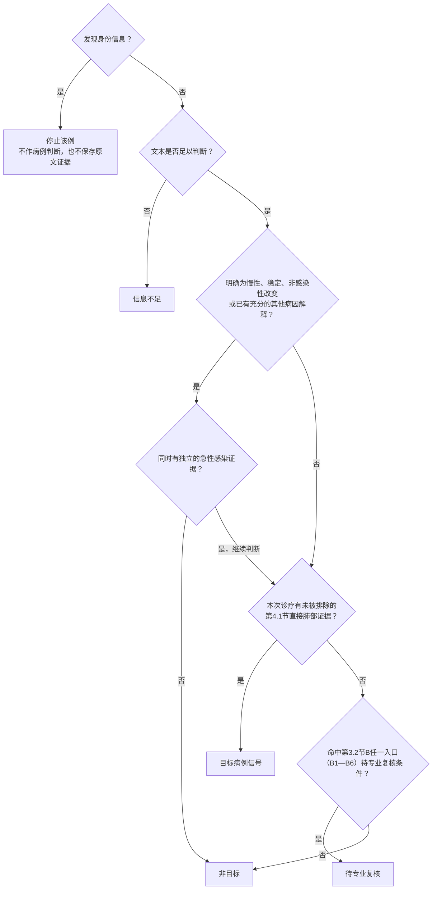
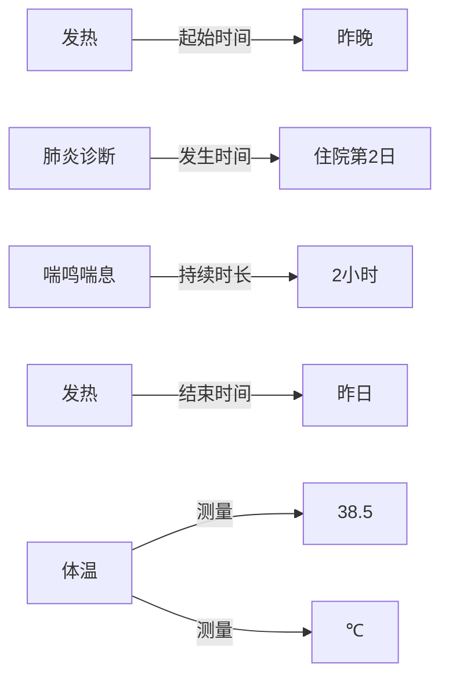
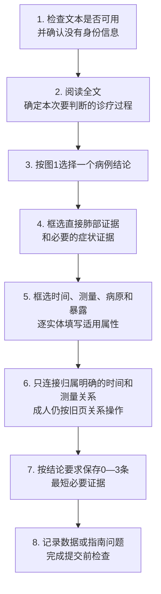
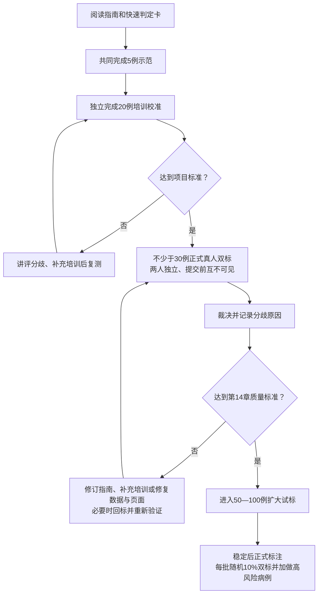

# 肺炎相关电子病历公共卫生信号标注指南

版本：v2.2.0 儿童配置适配草案（按要求原位维护于本文件）  
修订日期：2026-10-06；原v2.1.1发布日期：2026-08-28  
状态：已按当前儿童XML修订操作规则；病例四分类边界未变；尚未完成新版页面验收与真人一致性试验  
适用对象：具有医学背景、但缺少文本标注经验的标注人员  
适用平台：Label Studio  
任务性质：病例发现和早期预警，不是临床诊断

## 开始标注前，请先记住

> [!IMPORTANT]
> **开始每例标注前，请确认以下四点：**
>
> 1. 本任务不是诊断肺炎，而是从电子病历中找出可能存在传播风险、需要公共卫生人员进一步查看的病例。
> 2. 每份记录先选一个病例结论，再标出支持这个结论的原文证据。
> 3. 只使用标注页面上已经提供的按钮。页面上没有的标签，不要自行增加或用相近标签代替。
> 4. 如果看到姓名、证件号、电话、详细地址等可识别个人身份的信息，立即停止该例并报告隐私问题。

## 文件使用说明

| 项目 | 内容 |
|---|---|
| 标注单位 | 一份就诊记录、住院记录或合并后的单病例文本 |
| 每例需要完成 | 选择一个病例结论；框选证据、填写适用实体属性、连接明确关系；记录数据问题 |
| 可用标签 | 以当前标注页面实际显示的按钮为准；成人和儿童任务的按钮可能不同 |
| 配套字典 | `label_dictionary_v2.1.1.md`已同步为v2.2.0儿童适配草案；正文为新版儿童操作，成人旧配置见独立附录 |
| 指南维护 | 所有修改必须带版本、反馈编号、裁决理由和是否需回标；原始双标不得覆盖 |
| 隐私要求 | 仅使用去标识化文本；反馈只保留最小必要片段 |
| 规则冲突时 | 病例结论按第3—4章；按钮和属性范围按本次儿童XML及第5—9章；旧字典冲突需报告，不能自行增改按钮 |

### 本指南引用的项目文件

本轮指南更新后已按后续请求同步标签字典。儿童XML为当前操作事实来源；成人XML未同步迁移。字典已在后续修订中同步；锁定清单和历史反馈不因文档修订而自动更新。

本表只列本指南实际使用的本地项目文件。网页和外部项目资料见文末“参考框架与外部项目”。

#### 标注时需要使用

| 文件 | 用途 | 谁需要查看 |
|---|---|---|
| [`label_dictionary_v2.1.1.md`](label_dictionary_v2.1.1.md) | 解释每个标签何时使用、框选多长、可以连接什么 | 儿童正文与本指南同步；成人旧配置见字典附录 |
| [`pnemonia_adult_config.xml`](</Users/sepmein/x/projects/emr_structured_annotation/label_studio/pnemonia_adult_config.xml>) | 决定成人任务页面实际显示的标签和关系；文件名按项目现状保留 | 成人任务使用；标注员不编辑此文件 |
| [`pneumonia_children_config.xml`](</Users/sepmein/x/projects/emr_structured_annotation/label_studio/pneumonia_children_config.xml>) | 决定儿童任务页面实际显示的标签和关系 | 儿童任务使用；标注员不编辑此文件 |

#### 项目管理和结果追溯时使用

| 文件 | 用途 | 使用说明 |
|---|---|---|
| [`schema_manifest_v2.1.0.json`](schema_manifest_v2.1.0.json) | 记录最近一次锁定的指南、字典、成人/儿童页面配置及文件校验值 | 当前清单锁定的是v2.1.0文件；以本次修订开始新一批真人试标前，应更新指南版本、儿童XML及校验值；旧清单不能锁定新版 |
| [`validation_report_v2.0.0.md`](validation_report_v2.0.0.md) | 记录100例双智能体压力测试的方法、结果和限制 | 对应第14.5节，不作为真人一致性或临床效度证明 |
| [`adjudication_review.md`](../runs/round-03/adjudication/adjudication_review.md) | 汇总新增200例的分歧、重复文本口径和裁决结论 | 对应第14.6节 |
| [`feedback_resolution_v2.1.1.json`](../runs/round-03/developer/feedback_resolution_v2.1.1.json) | 逐条记录v2.1.1审阅意见、处理理由及是否需要回标 | 供指南维护和审计，不是标注操作规则 |

### 文中几个常用词

- **电子病历（EMR）**：本项目使用的门诊、急诊、住院或复诊记录。EMR是英文 *Electronic Medical Record* 的缩写。
- **Label Studio**：本项目使用的标注工具。标注员只需按页面上显示的按钮操作。
- **世界卫生组织（WHO）**：本指南参考其文件的组织方式，但病例规则仍由本项目确定。
- **标注界面配置**：决定页面上有哪些标签和按钮的技术文件。技术人员有时称它为“Schema”或“XML配置”；标注员不需要编辑这些文件。
- **实体**：需要在原文中框选的医学词语或短语，例如“发热”“右肺炎症”。
- **属性**：选中已框选实体后填写的状态，例如“发热”的存在状态为“明确不存在”。儿童页不再单独框选“无”并连状态关系。
- **关系**：两个已框选实体之间的明确归属，例如“发热”连接“3天前”，或“体温”连接“38.5”。
- **索引临床事件**：本次门急诊、当前住院，或能够确认属于同一疾病过程的连续诊疗。第3.1节给出具体判断方法。本指南和标签字典统一使用这个全称，不设简称。
- **目标病例信号**：四类病例结论之一，表示本次诊疗中存在值得公共卫生复核的肺部证据；行文中可简称“目标病例”。
- **待专业复核**：四类病例结论之一，表示命中一项明确的复核条件；行文中可简称“待复核”。它的六个触发入口编号为B1—B6，见第3.2节B。
- **直接肺部证据**：可以直接支持“目标病例信号”的肺部原文，具体范围见第4.1节。
- **英文缩写**：文中缩写第一次出现时给出中文含义；完整对照表见标签字典第1.4节。

## 目录

1. 项目背景、目的与任务边界
2. 每份病例需要完成什么
3. 病例级判断框架
4. 哪些证据会影响病例结论
5. 原文框选通则
6. 实体标签模块
7. 时间模块
8. 实体属性与断言模块
9. 关系模块
10. 数据与隐私检查
11. 标准标注流程
12. 完整案例
13. 复核、上报与升级处理
14. 质量控制与评价
15. 培训、双标与裁决机制
16. 文档维护与版本管理
附录A：快速判定卡
附录B：标签与关系速查表
参考框架与外部项目

---

## 1. 项目背景、目的与任务边界

### 1.1 背景与公共卫生问题

本项目从电子病历中识别肺炎相关公共卫生信号，为后续专业复核提供结构化、可追溯的原文证据。项目需要解决的问题不是在临床上辅助诊断肺炎，而是识别一些潜在存在传播风险、需要公共卫生人员进一步复核的肺炎相关病例。

系统输出的是病例级公共卫生信号，而不是肺炎临床诊断。该输出不得替代医生判断、实验室检测或疾控调查结论。

### 1.2 指南目的与预期用途

本指南告诉标注员如何选择病例结论、框选原文证据、处理数据问题，以及在不确定时怎样提交复核。只标与以下任务直接有关的信息：

1. 判断病例是否进入肺炎相关复核队列；
2. 排除明显无关、纯既往或证据不足的病例；
3. 对复核优先级进行排序；
4. 说明系统为何给出该病例级判断。

如果一项医学信息不会影响上述四项任务，本项目不要求标注。

### 1.3 适用范围与非适用范围

本指南适用于已经去除身份信息的肺炎相关电子病历。标注员需要完成病例分类，并在原文中标出支持分类的证据。实际可用标签以标注页面为准。

下列事项不属于本指南规定的人工标注范围：

- 不标病例之间的空间聚集、14天内聚集或传播链；这些信息由地理信息系统（GIS）等程序另行处理。
- 不根据医学常识补造原文没有写出的肺炎、病原或因果。
- 不评价治疗是否正确。
- 不穷举全部症状、疾病和用药。
- 不标注病历中所有事件的完整先后顺序。
- 不把“病原体阳性”自动等同于“肺炎”。

### 1.4 总体原则

1. **原文优先**：只标文本明确表达的内容。
2. **病例目标优先**：先判断该信息是否会改变病例纳入、排除、优先级或解释。
3. **不确定时保守**：不确定的实体不补造，不确定的关系不连；记录问题并交裁决。

---

## 2. 每份病例需要完成什么

每份记录需要完成两件事：先选择一个病例结论，再标出支持这个结论的原文证据。单独一个症状、病原体名称、时间词或测量值，通常不能决定病例结论；必须按第3章规定的证据组合来判断。

### 2.1 总体框架

| 查看内容 | 儿童页记录方式 | 用途 |
|---|---|---|
| 数据与隐私 | 外部问题表单；隐私残留时立即停止 | 决定能否继续 |
| 病例级判断 | 外部四分类表单及最小证据 | 主要病例输出 |
| 原文明写的事实 | 框选症状、肺炎诊断/影像、暴露、病原和测量 | 保留可追溯证据 |
| 存在状态和主体 | 选中适用实体，填写存在状态、条件性、假设性、主体 | 避免把否定、计划、他人事实当成患者事实 |
| 时间和病程 | 时间属性、可选病程变化、时间表达及四种时间关系 | 区分何时发生、是否仍存在及索引归属 |
| 病原检测 | 病原实体上的检测结果、标本类型、检测方式 | 防止检验错配 |
| 测量 | 指标、数值、单位、比较符及测量关系 | 保存原始数值；不推断阈值 |

证据多不等于结论更确定；仍按第3—4章判断。属性属于被选中的实体，不代表整份记录。

### 2.2 第一步：选择病例结论

确认文本可以安全标注后，阅读全文，只在病例表单中选择“目标病例信号、待专业复核、非目标、信息不足”之一。前三类保存1—3条必要原文证据；信息不足保存0—3条。发现身份信息时停止，不选结论、不复制原文。

### 2.3 第二步：框选、填写属性、连接关系

儿童任务先框选医学实体，再逐个选中实体填写页面显示的属性；最后连接明确的时间和测量关系。否定、可疑、当前、过去、标本和方法不再单独框选为儿童实体。成人旧页仍按其实际按钮执行，不能混用操作。

### 2.4 页面上已有和暂未提供的功能

| 内容 | 新版儿童页面 | 操作 |
|---|---|---|
| 病例四分类、数据问题 | 无统一控件 | 外部表单记录 |
| 咳嗽、咳痰、气促 | 无专门标签 | 保留病例证据，不用喘鸣喘息等替代 |
| 肺部证据 | 肺炎影像、肺炎诊断 | 依第6.1节按证据来源标注 |
| 具体时间 | 时间表达 | 框选原文，连接发生/起始/结束/持续关系 |
| 当前、过去、未来 | 时间属性选项 | 选中实体后填写，不另框选时间状态词 |
| 加重、好转、已缓解 | 可选病程变化 | 仅原文明写时填写；无“持续”“稳定”按钮 |
| 存在状态等 | 实体属性 | 按第8章填写；必填不代表存在默认答案 |
| 病原结果、标本、检测方式 | 病原实体属性 | 不再框选标本/方法或画旧状态关系 |
| 测量 | 含体温；无阈值判断标签 | 标指标、数值、单位、比较符并连线 |
| 因果、完整事件先后 | 无 | 本项目不标 |

---

### 2.5 本任务中“病例”的操作含义

“目标病例信号”不是临床确诊。它表示当前记录中有值得公共卫生人员回看、可能反映感染性肺实质病变的证据。以下内容不能只看名称就选为目标病例：

- 慢性、稳定或明确非感染性的间质性肺病；
- 非呼吸主诉中偶然出现的少许慢性炎症；
- 已被影像或临床明确解释为肿瘤、心衰等非感染病因的肺部异常；
- 支气管扩张伴感染，但未明确累及肺实质。

这些情况按第3章和第4章判断为待专业复核或非目标，不新增疾病亚型标签。

---

## 3. 病例级判断框架

本章说明怎样为一份记录选择唯一的病例结论。请先确认本次要判断的是哪次就诊或住院，再按顺序查看肺部证据、待复核条件、排除情况和文本是否完整。不要先凭总体印象选类别，再回头找证据。

### 3.1 “索引临床事件”

索引临床事件指当前文本所描述的本次门急诊、当前住院或同一次连续诊疗过程。判断“当前或近期”时，以是否属于索引临床事件为准，不用固定天数代替临床语境。

- 同次住院早期有明确肺炎、出院时已好转：仍属于索引临床事件。
- 仅在既往史中提到多年前肺炎、与本次无关：不属于索引临床事件。
- 连续治疗或复诊记录只有同时满足以下四项，才把既往证据并入索引临床事件：当前文书明确引用；写明继续治疗、复查或病程延续；能确认同一患者同一疾病过程；该旧证据仍被当前诊疗作为判断依据。具体操作见第7.3节。
- 仅由系统拼接进来的旧检查、无当前医生引用或来源不清：不自动并入；若时间归属会改变结论，进入待专业复核并上报时间问题。
- 多个互不相干记录疑似错拼，且归属会反转结论：不是待专业复核，而是信息不足并退回数据修复。

### 3.2 四种结论怎么选

#### A. 目标病例信号

> **一句话判断：** 本次诊疗中存在有效、未被排除的直接肺部证据。

选择“目标病例信号”前，依次确认以下四点：

1. 本次就诊、当前住院或同一连续诊疗过程中，原文明写了肺炎、肺实质感染、活动性肺部炎症或实变等直接肺部证据；
2. 这项事实属于患者本人，而不是家属、接触者或其他人；
3. 这项事实已经发生或当前存在，不是被否定的内容，也不只是计划、假设或待发生事项；
4. 原文没有把它明确说明为慢性、稳定或非感染性改变，也没有用肿瘤、心衰等其他病因作出充分解释。

四点都符合时，选择“目标病例信号”。直接肺部证据的具体范围见第4.1节。同一次住院内的肺炎即使已经好转、正在治疗或准备出院，仍可保留为目标病例信号；“好转”只影响当前活动性和复核优先级。

#### B. 待专业复核

> **一句话判断：** 尚不能判为目标病例，但已经命中一项明确的专业复核条件。

没有达到“目标病例信号”的条件，但出现下列任一入口时，选择“待专业复核”。六个入口编号为B1—B6，供本指南的流程图、案例、附录和标签字典引用：

1. **B1** 急性发热，加至少一项呼吸证据：咳嗽、咳痰、气促/呼吸困难、低氧、异常肺部体征；
2. **B2** 文本写“疑似肺炎、考虑肺炎、不除外肺炎、待排肺炎”；
3. **B3** 本次记录有性质或活动性不明的肺部、胸部异常；或者当前咳嗽、咳痰等呼吸症状同时伴有双肺湿啰音等客观听诊异常。这种情况不要求同时有发热。只有湿啰音、只有呼吸音粗，或者异常已经有明确的非感染性解释时，不因这一条进入待复核；
4. **B4** 呼吸道标本中检出本项目关注的呼吸道病原体，但没有足够肺炎直接证据；
5. **B5** 患者有支气管扩张等结构性肺病，并且同时符合两点：一是原文明写本次咳嗽、咳痰或气促比以前加重；二是同时出现发热、低氧或湿啰音中的至少一项。仅写“今年加重多次”“仍有症状”“未改善”“更换抗生素”，或者只有一个低氧数值，都不满足这一条；
6. **B6** 慢性或非感染性解释不确定，同时存在新发/加重呼吸症状或新的肺部异常；

如果没有命中以上任何一条，不要因为“感觉不放心”就选择待专业复核。文本足够完整时选“非目标”；文本缺失、错位或错拼，导致无法判断时选“信息不足”。若遇到规则没有覆盖的新情况，按第13章上报。

#### C. 非目标

> **一句话判断：** 文本足以判断，但没有未解释的直接肺部证据，也没有命中待专业复核条件。

满足以下任一情况，且没有未解释的直接肺部证据：

1. 明确是其他疾病或无关复诊；
2. 孤立轻症，如单独短期咳嗽、鼻塞流涕、咽痛；
3. 长期稳定的慢性呼吸症状，无急性改变；
4. 所有相关证据均被明确否定；
5. 仅有筛查、暴露史或计划检查，且无急性呼吸证据；
6. 仅有纯既往肺炎，与索引临床事件无关；
7. 慢性、稳定或明确非感染性的间质性肺病，无急性感染证据；
8. 非呼吸主诉中偶见少许慢性肺部炎症，且急性呼吸证据均被否定；
9. 肺部异常被报告明确或高度解释为肿瘤、心功能不全等非感染病因，且没有独立感染证据；
10. 支气管扩张伴感染稳定复诊，或只有持续/未改善、换药、年度加重次数而没有本次明确症状加重加客观急性证据。

#### D. 信息不足

> **一句话判断：** 不是医学上的阴性，而是文本本身不足以支持可靠分类。

当文本本身不足以支持前三类中的任何一类时，选择“信息不足”。常见情况包括：文本为空、内容严重截断、字段错位，或者只有无法确定归属的项目和数值。若记录只写“病情稳定”“继续治疗”“病史同前”“前症复诊”“检查如前”，但被引用的疾病或证据没有提供，而且缺失内容可能改变分类，也选择信息不足。单独出现一项与本次无关的旧检查，不能补足当前病种。

“看不懂但明显与肺炎无关”不是信息不足，应判非目标。短文本若已明确给出无关索引行为或计划，例如“建议电子喉镜”，且无肺炎触发证据，仍判非目标；不能仅按字符长度判信息不足。

### 3.3 标准判定顺序

按下图从上到下判断。只要已经得到病例结论，就停止向下判断；只有图中写明“继续”的情况才进入下一步。

#### 图1：四分类判断流程

```mermaid
flowchart TD
    A{"发现身份信息？"} -->|是| P["停止该例<br/>不作病例判断，也不保存原文证据"]
    A -->|否| B{"文本是否足以判断？"}
    B -->|否| I["信息不足"]
    B -->|是| C{"明确为慢性、稳定、非感染性改变<br/>或已有充分的其他病因解释？"}
    C -->|是| C1{"同时有独立的急性感染证据？"}
    C1 -->|否| N["非目标"]
    C1 -->|是，继续判断| D{"本次诊疗有未被排除的<br/>第4.1节直接肺部证据？"}
    C -->|否| D
    D -->|是| T["目标病例信号"]
    D -->|否| R{"命中第3.2节B任一入口<br/>（B1—B6）待专业复核条件？"}
    R -->|是| V["待专业复核"]
    R -->|否| N
```

### 3.4 证据记录要求

病例级证据只保留足以解释结论的最短原文片段。“目标病例信号”“待专业复核”和“非目标”保存1—3条；“信息不足”保存0—3条。发现身份信息时不要保存证据，也不要作病例判断。不要复制整段病历。按以下顺序选择证据：

1. 直接肺部证据；
2. 急性时间和核心症状；
3. 否定、计划、他人或既往等排除信息；
4. 病原、暴露或严重程度证据。

---

## 4. 哪些证据会影响病例结论

本章把证据分成两类：一类可以直接支持“目标病例信号”，另一类必须与其他证据合并判断，或只能触发“待专业复核”。最终结论仍按第3章判断。

### 先看证据在判断中起什么作用

| 证据作用 | 常见内容 | 单独出现时可能得到的结论 | 还要检查什么 |
|---|---|---|---|
| 直接肺部证据 | 肺炎、肺实质感染、活动性肺部炎症或实变 | 可支持目标病例信号 | 是否属于本次诊疗；是否被否定、仅为计划或属于他人；是否为慢性改变或已有其他病因解释 |
| 待复核触发证据 | 疑似肺炎、急性发热加呼吸证据、呼吸症状加湿啰音、性质不明的肺胸异常等 | 待专业复核 | 是否确实命中第3.2节B的一项完整入口条件（B1—B6） |
| 辅助证据 | 单个症状、炎症指标、病原体阳性、用药、暴露史 | 通常不能单独决定病例结论 | 是否与其他证据组成明确的待复核条件 |
| 排除或降级证据 | 否定、纯既往、长期稳定、明确非感染性解释 | 无独立急性感染证据时通常为非目标 | 是否仍有未被解释的直接肺部证据或新的急性证据 |
| 数据不足 | 空文本、严重截断、错位、错拼、缺少“同前”所指内容 | 信息不足 | 问题是否会影响四分类；能否回源补齐或修复 |

同一份记录可能同时出现几类证据。应先按图1处理排除语境，再判断直接肺部证据和待复核条件，不能简单按证据数量投票。

### 4.1 可以直接支持目标病例的肺部证据

下列原文可以直接支持“目标病例信号”。但它们必须属于本次就诊、当前住院或同一连续诊疗过程，而且不能是明确的慢性、非感染性改变，也不能已经有充分的其他病因解释：

- 明确感染性诊断：肺炎、支气管肺炎、大叶性肺炎、病毒性/感染性间质性肺炎等；
- 明确感染：肺部感染、两肺感染、下呼吸道感染且上下文明确指肺实质；
- 明确炎症/实变：右肺炎症、两肺炎症、感染性病变、肺实变或影像明确提示肺炎。

必须保留原文语义。不能因为词中含“肺炎”就标肺炎诊断，例如：肺炎支原体、肺炎克雷伯菌、肺炎链球菌。

“间质性肺炎”不能脱离语境机械纳入：明确为慢性间质性肺病、稳定复诊或非感染性病因时判非目标；性质不明且有新发/加重呼吸证据时判待专业复核；明确急性感染性间质性肺炎时才判目标。

### 4.2 单独出现时不能判为目标病例的证据

以下内容单独出现时不判目标病例信号：

- 胸水/胸腔积液、气胸、胸膜增厚、脓胸、支气管胸膜瘘；
- 条索影、小斑片影、结节、肿块、纤维化、陈旧性结核、肺不张；
- 双肺呼吸音粗、啰音、胸痛；
- C反应蛋白（CRP）、降钙素原（PCT）、白细胞等炎症指标升高；
- 发热、咳嗽、咳痰、气促；
- 病原体阳性；
- “抗感染治疗”或抗菌药物使用。
- “支气管扩张伴感染/支扩伴感染”，除非另有明确肺实质感染、炎症、实变或肺炎证据；
- “少许慢性炎症”“慢性间质性肺炎稳定复诊”；
- 已明确归因于心衰的两肺渗出，或高度考虑肿瘤的肺占位。

这些证据与其他内容组合后，可能达到“待专业复核”的条件。

### 4.3 容易出现分歧的情况

#### 慢性/非感染性肺部改变

- 慢性、稳定、非感染性语境明确，且无急性呼吸证据：非目标。
- 性质不明，同时有新发或加重呼吸症状：待专业复核。
- 明确急性感染性肺实质病变：目标病例信号。

#### 明确替代解释

- 影像或医生明确/高度解释为肿瘤、心衰、肺栓塞等，且没有独立感染证据：非目标。
- 替代解释不确定，并有急性呼吸证据或未解释的新肺部异常：待专业复核。
- 不能仅因出现“占位、渗出、模糊影”就判目标。

#### 支气管扩张伴感染

- 该固定短语不等于“肺部感染”实体，不直接判目标。
- 稳定复诊、配药、体温正常且无近期恶化：非目标。
- “未改善、仍有、继续抗感染、更换抗生素”表示持续或治疗调整，不等于加重，也不是客观急性证据。
- “今年加重6次”等年度次数不等于本次加重；“近期”不设机械天数，但必须由原文锚定到本次就诊、当前连续疗程或明确复诊原因。
- 本次咳嗽/咳痰/气促明确加重，并伴发热、低氧、湿啰音等至少一项客观证据：待专业复核。
- 另有明确肺炎、肺实质感染、炎症或实变：目标病例信号。

#### 纯检验和无关临床记录

- 空文本或仅有无法归属的检验项目、数值：信息不足，并交项目组处理数据问题。
- 完整的非呼吸索引记录，附带明确阴性病原结果：非目标。
- 项目与结果展平错位、无法唯一配对：不连关系、不作阳性触发；若影响病例结论则信息不足并退回修复。

### 4.4 项目组如何进行初步筛查

本节供项目管理和数据处理人员参考，标注员不需要执行程序筛查。项目先进行自动粗筛，再按第3章完成人工四分类。

#### 第一步：数据检查

程序先排除空字符串、纯空格、只有分隔符、无法解析的记录，并记录排除原因。不要让医学标注员手工清理大量空任务。

#### 第二步：尽量不漏病例的粗筛

只要命中以下任一条件就保留给病例级模型或人工：

- 直接肺部证据词；
- 急性发热加呼吸证据；
- 疑似/待排肺炎；
- 性质不明的当前肺/胸异常；
- 呼吸道标本中关注病原体阳性。

这一阶段允许多保留一些记录，但不直接把它们当作目标病例。

#### 第三步：四分类判断

按第3章规则区分目标、待复核、非目标和信息不足。

#### 防止漏筛

- 从阶段1排除的记录中随机抽取5%—10%复核；
- 对含“肺、胸、呼吸、CT、影像、感染、发热”等宽词但被排除的记录加大抽样；
- 分别报告目标/待复核合并后的漏筛数，不能只看总体准确率；
- 一旦发现规则性漏筛，补充规则并回溯同批数据。

#### 防止过筛

- 单独鼻塞、流涕、咽痛、孤立咳嗽不进入待复核；
- 暴露史单独出现不进入待复核，只用于已有呼吸证据病例的优先级；
- 病原体名称或计划检测不等于阳性结果；
- 非特异影像不直接判目标。
- “慢性炎症、间质性肺炎、支气管扩张伴感染”必须结合急性/感染性语境，不能只按关键词直纳目标。

---

## 5. 原文框选通则

### 5.1 框选最短但完整的医学概念

不包含否定词、时间词、检查提示词和句末标点；保留必要部位限定。

- “CT提示右肺炎症”：框选`右肺炎症`，儿童用“肺炎影像”。
- “无发热”：只框选`发热`；选中后填写存在状态“明确不存在”，不框选`无`。
- “今仍有发热”：框选`发热`；时间属性“当前”；可另标`今`为时间表达并连“发生时间”。“仍有”不另标实体，也不自动选“加重”。
- “肺炎支原体IgM阴性”：框选`肺炎支原体`；选中后填写阴性和抗体IgM，不把“肺炎”再标诊断。

成人旧页仍可单独标修饰词；本章上述属性操作专用于新版儿童页。

### 5.2 保留会改变含义的限定词

“右肺炎症”“两肺感染”保留必要部位；普通程度词不扩入实体。弱阳性、可疑阳性等结果限定词保留于最小证据，按第8.3节填属性，不能丢失其不确定性。

### 5.3 用语境填写属性，不扩大跨度

`无、未见、考虑、拟、家属`等用来确定实体属性，不单独框选为儿童断言实体。各属性独立填写：过去不等于已缓解；明确存在不等于属于患者；条件性不等于假设性。

### 5.4 不拆词内误标

`肺炎支原体、肺炎克雷伯菌、肺炎链球菌`只标相应病原；“抗肺炎治疗”不是明确诊断时不标肺炎诊断。药物用途不能替代诊断证据。

### 5.5 重复、并列与多次检测

每个独立提及分别标。完全重复的任务保留审计映射，主分析按唯一文本计数，同时报告原始分母；空文本先报empty_text。近重复不能无来源证据自动删除。

并列病原分别标，例如“肺炎支原体、肺炎衣原体IgM阴性”：在归属明确时分别填写阴性和抗体IgM。不同日期、标本或方法的检测提及不得合并为一个病原实体；属性单选无法表达一个提及对应多次检测时，保留最小证据并上报，不选择“最严重”结果覆盖其余检测。

### 5.6 不把相隔文本合成一个实体

实体跨度必须连续。临床事实与明确时间分别框选并连接；实体与属性靠选中同一实体填写，不靠另造跨度或关系。

---

## 6. 实体标签模块

### 先确认任务配置

本章儿童操作对应当前`pneumonia_children_config.xml`：49个实体标签、9个实体属性字段、5种关系；选项不是实体标签。文本控件为`chief_complaint_text`，显示`$text`。成人仍使用旧配置的67个实体标签及状态/时间/测量/标本/检测方式关系，不迁移为儿童属性规则。配套字典儿童正文已同步；XML仍为按钮事实来源。

儿童实体按以下模块组织：症状及治疗12个、诊断2个、流行病学关联5个、时间表达1个、测量指标5个、测量组成3个、病原21个。不得使用旧儿童页面的肺部感染、肺部组织炎症、阈值判断、独立断言、独立标本/方法按钮。

### 6.1 核心肺部实体

| 标签 | 定义、纳入及最小跨度 | 正例 | 排除与易混淆 | 判断作用与关联 |
|---|---|---|---|---|
| 肺炎诊断 | 临床诊断明确写出的感染性/活动性肺炎或肺实质感染概念，框最短完整诊断 | `支气管肺炎`；诊断栏`肺部感染` | 病原名称、抗感染治疗、支扩伴感染不替代；明确慢性非感染性间质性病不机械纳入 | 状态、时间、主体符合第3章时支持目标；可填临床属性并连时间表达 |
| 肺炎影像 | 影像报告明确提示肺炎、感染性肺实质炎症/实变；框异常描述而非“CT提示” | CT示`右肺炎症`；胸片示`感染性实变` | 孤立条索影、结节、胸水、未明确性质的小斑片影不自动映射；非影像临床诊断用肺炎诊断 | 直接证据或复核解释；可填临床属性并连时间表达 |

这是按来源区分的标签操作，不改变第3—4章证据白名单。影像和诊断独立出现时分别标，不将一个短语凭推断复制成两种来源。遇到病理或明确肺实质炎症原文却无法归入两个按钮时，保留病例证据并上报标签适配问题，不能因此漏掉病例信号或假称影像。

### 6.2 症状和严重程度

以下标签除机械通气外可填写第8章临床属性；均可在语义明确时连时间表达。跨度框选完整症状/体征，不包含“无、拟”等修饰词。

| 标签 | 定义与两个纳入例 | 近似反例/排除 | 病例判断作用 |
|---|---|---|---|
| 发热 | 明确症状；`发热`、`高热` | 单独38.5℃不自动标症状 | 与急性呼吸证据组合触发复核 |
| 鼻翼煽动 | 明确鼻翼呼吸体征；`鼻翼煽动`、`呼吸时鼻翼扇动` | 鼻塞不等同 | 严重程度/复核优先级 |
| 呼吸衰竭 | 明确诊断/状态；`呼吸衰竭`、`Ⅰ型呼吸衰竭` | 低SpO2不自动推断 | 严重程度 |
| 三凹征 | 明确吸气凹陷；`三凹征`、`三凹征阳性`中的三凹征 | 普通胸痛不等同 | 严重程度 |
| 喘鸣喘息 | 明确喘鸣或喘息；`喘鸣`、`喘息` | 咳嗽/气促不自动替代 | 呼吸证据，非肺炎确诊 |
| 意识障碍 | 明确意识异常；`意识障碍`、`意识模糊` | 睡眠差不等同 | 严重程度 |
| 惊厥 | 明确发作；`惊厥`、`抽搐发作` | 寒战不等同 | 严重程度 |
| 拒食或喂养困难 | 明确拒食/喂养困难；`拒食`、`喂养困难` | 普通食欲稍差不自动映射 | 儿童严重程度 |
| 脱水征 | 明确脱水表现/判断；`脱水征`、`脱水貌` | 孤立口渴不推断 | 严重程度 |
| 休克 | 明确休克；`休克`、`感染性休克` | 单独低血压不推断 | 严重程度 |
| 器官衰竭 | 明确衰竭；`多器官衰竭`、`肾衰竭` | 单项实验室异常不推断 | 严重程度 |
| 机械通气 | 明确支持措施；`机械通气`、`有创机械通气` | 普通鼻导管吸氧不等同 | 支持强度；当前XML未给它临床属性控件，计划/否定需保留病例证据并上报，不能视为已实施 |

“无鼻翼煽动”仍框选实体并填明确不存在。原文词义不清时不上升为更重诊断。咳嗽、咳痰、气促仍无专门按钮，可作为病例证据，不新增子标签。

### 6.3 测量

| 标签 | 定义/跨度与两个正例 | 排除与判断作用 |
|---|---|---|
| 体温 | 指标词；`体温`、`T`（明确生命体征语境） | 单独数值不推断发热；辅助解释 |
| 呼吸频率 | 指标词；`呼吸频率`、`呼吸`（明确每分计数语境） | 呼吸困难不是频率；辅助解释 |
| 静息状态指氧饱和度 | 明确静息指氧测量；`SpO2`、`静息指氧饱和度` | 不把运动后血氧或未说明状态强行补为静息；关键语境不足时保留证据上报 |
| 动脉氧分压(PaO2) | 动脉血气指标；`PaO2`、`动脉氧分压` | 静脉氧分压不替代；低氧证据 |
| 吸氧浓度(FiO2) | 吸入氧浓度；`FiO2`、`吸氧浓度` | 氧流量L/min不是浓度；支持氧合解释 |
| 数值 | 原文数字；`38.5`、`92` | 不标推算值 |
| 单位 | 原文单位；`℃`、`%` | 无单位不补造 |
| 比较符 | 原文比较符；`<`、`≥` | 不根据数值生成比较符 |

儿童各组成从指标连向数值/单位/比较符，均选“测量”。如“体温38.5℃”：体温→38.5、体温→℃。XML无“阈值判断”，不框选或计算异常阈值；保持原文数据。无明确指标或唯一配对时不猜最近对象。

### 6.4 流行病学关联

跨度保留能识别事件的最短完整描述；填写存在状态、时间属性、假设性、主体。暴露面板无条件性及病程变化，不要求填写。可连明确时间。

| 标签 | 定义与两个正例 | 排除/混淆及作用 |
|---|---|---|
| 周围聚集性发病现象 | 原文明写周围多人类似发病；`同班多名同学发热`、`家中两人同时出现类似症状` | 单个亲属发病不自动称聚集；不推断传播链；提高复核关注 |
| 高风险职业史 | 原文明写职业暴露语境；`在禽类养殖场工作`、`从事病原微生物实验室检测` | 不凭职业名称补感染；保留实际主体；解释暴露 |
| 可疑动物或动物制品接触史 | 明确接触事件；`接触病死禽`、`处理生禽制品` | 病原名称不等于动物接触；解释暴露 |
| 可疑环境暴露史 | 明确关注环境接触；`清扫鸟粪污染环境`、`进入有禽类污染的场所` | 普通地点名称不自动映射；解释暴露 |
| 境内外旅居史 | 明确旅居事件；`近期赴外省旅行`、`上月境外旅居` | 无旅行行为的地名不标；不做GIS判断 |

患者接触母亲：事件主体通常是患者；母亲从事禽类工作：职业主体是家属。两者不能混同。过去暴露可以仍具公共卫生相关性，不仅凭过去属性排除；仅有暴露而无肺炎复核组合不自动纳入。

### 6.5 病原体

只框完整病原名称。21个按钮为：新冠病毒、流感病毒、呼吸道合胞病毒、腺病毒、人偏肺病毒、副流感病毒、普通冠状病毒、博卡病毒、鼻病毒、肠道病毒；A族链球菌、百日咳鲍特菌、肺炎链球菌、流感嗜血杆菌、军团菌、肺炎克雷伯菌；肺炎支原体、曲霉菌、隐球菌、鹦鹉热衣原体、肺炎衣原体。

上述各标签均适用同一规则：纳入原文明写的完整名称或语境明确的规范缩写，如“肺炎支原体IgM阴性”中的病原名、“痰培养检出肺炎克雷伯菌”中的病原名；排除仅写未能唯一对应的“病毒、支原体、病原菌”。不同标签不可因同属一类互换。不拆名称中的“肺炎”。每个病原提及可填写检测结果、标本类型、检测方式，不提供临床五轴属性；不自行给病原套“当前、家属、假设性”等不存在的按钮。

病原提及不等于检测，更不等于阳性或肺炎。呼吸道标本明确检出关注病原且来源完整，可按B4复核；血清IgM等抗体阳性必须结合急性呼吸证据，不能套呼吸道检出入口。血、尿、胸腔穿刺液按实际标本处理；纯检验列表按信息不足，完整无关临床记录按非目标。计划、历史、他人检测语境仍须保留病例证据供复核。

#### 病原逐标签跨度示例

下表例句仅说明名称框选，不设定各病原的临床检测方案；未写检测方法、标本时不能补造。每行两例均框选病原名，阳性/阴性通过检测结果属性填写；病例作用统一按第6.5节及B4判断，均不单独证明肺炎。合法关联为原文明确的检测时间及三个检验属性。

| 标签 | 正例一（阳性语境） | 正例二（阴性语境） | 近似反例/混淆 |
|---|---|---|---|
| 新冠病毒 | 检验报告“新冠病毒检出” | 检验报告“新冠病毒未检出” | “拟检测新冠病毒”不是已检测；不误标名称中的肺炎，不替代相邻病原 |
| 流感病毒 | 检验报告“流感病毒检出” | 检验报告“流感病毒未检出” | “拟检测流感病毒”不是已检测；不误标名称中的肺炎，不替代相邻病原 |
| 呼吸道合胞病毒 | 检验报告“呼吸道合胞病毒检出” | 检验报告“呼吸道合胞病毒未检出” | “拟检测呼吸道合胞病毒”不是已检测；不误标名称中的肺炎，不替代相邻病原 |
| 腺病毒 | 检验报告“腺病毒检出” | 检验报告“腺病毒未检出” | “拟检测腺病毒”不是已检测；不误标名称中的肺炎，不替代相邻病原 |
| 人偏肺病毒 | 检验报告“人偏肺病毒检出” | 检验报告“人偏肺病毒未检出” | “拟检测人偏肺病毒”不是已检测；不误标名称中的肺炎，不替代相邻病原 |
| 副流感病毒 | 检验报告“副流感病毒检出” | 检验报告“副流感病毒未检出” | “拟检测副流感病毒”不是已检测；不误标名称中的肺炎，不替代相邻病原 |
| 普通冠状病毒 | 检验报告“普通冠状病毒检出” | 检验报告“普通冠状病毒未检出” | “拟检测普通冠状病毒”不是已检测；不误标名称中的肺炎，不替代相邻病原 |
| 博卡病毒 | 检验报告“博卡病毒检出” | 检验报告“博卡病毒未检出” | “拟检测博卡病毒”不是已检测；不误标名称中的肺炎，不替代相邻病原 |
| 鼻病毒 | 检验报告“鼻病毒检出” | 检验报告“鼻病毒未检出” | “拟检测鼻病毒”不是已检测；不误标名称中的肺炎，不替代相邻病原 |
| 肠道病毒 | 检验报告“肠道病毒检出” | 检验报告“肠道病毒未检出” | “拟检测肠道病毒”不是已检测；不误标名称中的肺炎，不替代相邻病原 |
| A族链球菌 | 检验报告“A族链球菌检出” | 检验报告“A族链球菌未检出” | “拟检测A族链球菌”不是已检测；不误标名称中的肺炎，不替代相邻病原 |
| 百日咳鲍特菌 | 检验报告“百日咳鲍特菌检出” | 检验报告“百日咳鲍特菌未检出” | “拟检测百日咳鲍特菌”不是已检测；不误标名称中的肺炎，不替代相邻病原 |
| 肺炎链球菌 | 检验报告“肺炎链球菌检出” | 检验报告“肺炎链球菌未检出” | “拟检测肺炎链球菌”不是已检测；不误标名称中的肺炎，不替代相邻病原 |
| 流感嗜血杆菌 | 检验报告“流感嗜血杆菌检出” | 检验报告“流感嗜血杆菌未检出” | “拟检测流感嗜血杆菌”不是已检测；不误标名称中的肺炎，不替代相邻病原 |
| 军团菌 | 检验报告“军团菌检出” | 检验报告“军团菌未检出” | “拟检测军团菌”不是已检测；不误标名称中的肺炎，不替代相邻病原 |
| 肺炎克雷伯菌 | 检验报告“肺炎克雷伯菌检出” | 检验报告“肺炎克雷伯菌未检出” | “拟检测肺炎克雷伯菌”不是已检测；不误标名称中的肺炎，不替代相邻病原 |
| 肺炎支原体 | 检验报告“肺炎支原体检出” | 检验报告“肺炎支原体未检出” | “拟检测肺炎支原体”不是已检测；不误标名称中的肺炎，不替代相邻病原 |
| 曲霉菌 | 检验报告“曲霉菌检出” | 检验报告“曲霉菌未检出” | “拟检测曲霉菌”不是已检测；不误标名称中的肺炎，不替代相邻病原 |
| 隐球菌 | 检验报告“隐球菌检出” | 检验报告“隐球菌未检出” | “拟检测隐球菌”不是已检测；不误标名称中的肺炎，不替代相邻病原 |
| 鹦鹉热衣原体 | 检验报告“鹦鹉热衣原体检出” | 检验报告“鹦鹉热衣原体未检出” | “拟检测鹦鹉热衣原体”不是已检测；不误标名称中的肺炎，不替代相邻病原 |
| 肺炎衣原体 | 检验报告“肺炎衣原体检出” | 检验报告“肺炎衣原体未检出” | “拟检测肺炎衣原体”不是已检测；不误标名称中的肺炎，不替代相邻病原 |

### 6.6 标本类型：填写属性，不框选实体

选中病原实体后填写：口咽/鼻咽拭子、深部痰液、气管吸取物、肺泡灌洗液、胸腔穿刺液、血液(发病7天急性期样本)、血液(发病间隔2到4周样本)、血液(发病间隔6到8周样本)、血液(未说明采样间隔)、痰、尿、原文未说明。

“咽拭子、鼻咽拭子”映射口咽/鼻咽拭子；“BALF、肺泡灌洗液”映射肺泡灌洗液；“痰”未说明深部时选痰，明确深部痰才选深部痰液。“咳痰”不是检验标本。“血清、血浆、血液”未说明采样间隔时用血液(未说明采样间隔)，不能凭IgM推断急性期或恢复期。胸水仅在明确是检测标本时映射胸腔穿刺液，影像胸水不填写标本。检测记录未说明用原文未说明；明确标本不在选项中则上报，不能伪装成未说明。

### 6.7 检测方式：填写属性，不画方法关系

选项：核酸检测、mNGS、抗原快速检测、抗体IgM、抗体滴度/双份、培养、原文未说明。

同组“PCR/核酸”→核酸检测；明确mNGS/宏基因组测序→mNGS；“IgM”→抗体IgM；“培养”→培养。仅“测序”不能推断为mNGS，普通抗体不能冒充IgM，单次抗体阳性不能冒充双份滴度。检测记录未写方法用原文未说明；明确方法无对应选项则保留证据上报。计划检测不生成已完成结果。

---

## 7. 时间模块

### 7.1 三层时间分别记录

| 问题 | 儿童记录方式 | 例子 |
|---|---|---|
| 描述指向哪一时间段 | 实体的时间属性：当前/过去/未来/无法判断 | 3天前发热→过去 |
| 具体何时、持续多久 | 时间表达实体＋发生/起始/结束/持续关系 | 发热→3天前 |
| 病情发生什么变化 | 可选病程变化：加重/好转/已缓解 | 发热较前好转→好转 |

时间属性以本条原始记录时间为参照。过去不等于已缓解，也不等于与索引临床事件无关；第3章索引判断仍需独立完成。

### 7.2 原文时间表达

框选绝对日期（7月15日、2025-02-16）、相对时间（今日、3天前）、时长（3天、2周）、病程日序（住院第2日）、明确时间窗口（近7天、近期）。最短完整跨度保留“前、后、近”等时间限定，不把整个医学事件并入。

排除未提供具体时点/时长的“好转、加重、未愈”；“既往”主要提供时间属性，不为每个旧时态词强行生成时间表达。时间词若指无按钮的咳嗽等内容，不造实体作连线端点；保留病例证据。

### 7.3 时间属性

- 当前：本条记录描述现时事实或当前仍在发生的事件；如“现有发热、今无发热”。
- 过去：描述早于记录时点的事件；如“3天前发热、5年前患肺炎”。若句子明确持续至今，如“3天前开始发热，现仍有”，当前发热提及选当前，同时连接起始时间。
- 未来：明确尚未发生的计划或未来情境；如“拟行CT排查肺炎”。检查是未来行为不等于被排查疾病已存在。
- 无法判断：原文不足以确定该提及的时间段，不能用它代替漏填。

复诊引用较早检查能否计入索引事件，仍核查当前明确引用、连续治疗、同一患者/疾病过程、旧结果仍作为依据四项。属性可为过去，但该证据仍可能支持同一索引事件；已消失的两年前孤立病灶不自动并入。

### 7.4 病程变化（选填）

明确“较前加重、逐渐恶化”→加重；“较前好转、明显改善”→好转；“已缓解、已消失”→已缓解。只记录原文所述被选中事件的变化。

“持续、仍有、未好转、稳定”不映射加重或好转，留空并保留必要证据；明确不存在时不填病程变化。好转不等于已缓解，不能因出院好转删除同次住院肺炎信号。流行病学、机械通气、病原、测量和时间实体当前无该控件。

### 7.5 时间关系

从医学实体连向时间表达。发生时间用于一般何时发生；起始时间只用于明确开始；结束时间只用于明确结束；持续时长用于明确多久。详见第9章，不沿用旧“时间”关系。

“3天前发热”默认发生时间；“3天前开始发热”用起始时间；“发热持续3天”用持续时长。过去描述不自动结束，持续多久不自动换算出开始日期。

### 7.6 标注员不做的换算

不计算标准日期、发病日期、阈值或推断完整先后。标注员仍须按原文填写时间属性，并依据第3章判断索引归属；不能把所有判断留给程序。

### 7.7 成人旧页与不确定处理

成人仍标当前/既往/持续/进行性加重及旧时间关系，不能套用儿童四种时间关系。拼接文本来源不明、引用上下文缺失，且会改变结论时先按第10章报数据问题；加按钮不能解决错拼。

---

## 8. 实体属性与断言模块

### 8.1 先选中实体，再填写适用属性

儿童属性绑定到同一个已框选实体。页面只在选中适用实体时显示，切换实体后必须核对当前选区。空白表示未标注，不代表“否、当前、患者本人”。普通明确陈述也须填写显示的必填属性，不沿用旧“不补肯定”的操作。

| 字段/选项 | 适用对象 | 要求 |
|---|---|---|
| 存在状态：明确存在/明确不存在/可能存在/无法判断 | 症状与严重体征（不含机械通气）、肺炎影像/诊断、5种流行病学实体 | 必填 |
| 时间属性：当前/过去/未来/无法判断 | 同上 | 必填，见第7章 |
| 病程变化：加重/好转/已缓解 | 上述临床症状与肺炎影像/诊断 | 选填；明确不存在不填 |
| 条件性：是/否 | 上述临床症状与肺炎影像/诊断 | 必填；暴露无此字段 |
| 假设性：是/否 | 临床实体及5种流行病学实体 | 必填 |
| 主体：患者本人/家属/其他人/无法判断 | 临床实体及5种流行病学实体 | 必填；主体是事件主体 |
| 检测结果：阳性/阴性/无法判断 | 21种病原实体 | XML非必填；检测记录按第8.3节填写 |
| 标本类型、检测方式 | 21种病原实体 | XML非必填；检测记录逐项填写，未说明用对应选项 |

机械通气、时间表达、测量指标及其组成无上述临床属性；不能为完成检查而给它们套其他实体的按钮。病原也无临床属性。原文的重要计划/主体语境没有控件承载时保留证据并反馈。

### 8.2 存在状态、条件性、假设性和主体分别判断

- 明确存在：原文明确报告事实，如“发热、CT示肺炎影像”；不表示病因已证实。
- 明确不存在：无、否认、未见。如“无发热”，标发热并填明确不存在。
- 可能存在：考虑、疑似、不除外、待排；不是明确不存在。
- 无法判断：有可标概念，但原文状态含混/冲突，不能确定；缺少概念时不能造实体。
- 条件性：特定条件下实际出现，如“活动后喘息”填是；普通无条件描述填否。尚未发生的“若发热”同时属条件性和假设性。
- 假设性：仅在假设、计划、预期语境出现填是；实际发生或明确否定的现实陈述填否。计划排查肺炎并不证明已患肺炎。
- 主体：按谁发生该事件选择，母亲肺炎填家属，其他同学填其他人；患者接触母亲时，接触事件主体是患者。

例：“若出现发热则复诊”→存在状态无法判断、时间未来、条件性是、假设性是、患者本人。“不除外肺炎”→可能存在，不能因“不”填明确不存在。属性之间不互相替代。

### 8.3 病原检测结果

在项目—结果唯一配对且属于同一检测记录组时：

| 原文 | 检测结果 | 证据处理 |
|---|---|---|
| 阳性、检出、培养见；明确弱阳性 | 阳性 | 弱阳性限定保留于病例证据，不改写成强阳性 |
| 阴性、未检出 | 阴性 | 不作阳性证据 |
| 可疑阳性、临界、结果待回报或含糊 | 无法判断 | 保留不确定原文，不当阳性 |
| 仅检验项目名、拟检测、结果未写或错位 | 无法判断 | 不把检测计划/项目当完成检测；错位另报数据问题 |

非检测语境如“接触新冠病毒感染者”，不凭名称填阳性，不强制伪造标本/方法；可保留空值并记录非检测语境。不要用“无法判断”掩盖已明确写出却不在选项中的方法或标本。

不同检测提及分别标，不能把同一病原多次检验的阳性、阴性压为一个结果。原文只有一个提及却指向多个检测时，当前单选结构不能完整表达，保留必要证据并交裁决，不能用重叠复制实体制造虚假对应。

### 8.4 共享修饰语与检验记录组

“无发热、喘息”分别给两个实体填明确不存在；不标“无”或画状态边。“肺炎支原体、肺炎衣原体IgM阴性”作用域明确时分别填IgM、阴性；不明确则不猜。

标本和方法只取同组信息；相邻不等于配对。“咳痰，支原体IgM阴性”中的咳痰不是该检测的标本；选原文未说明。结果错位、跨组或冲突可能影响病例结论时按第10章反馈。

### 8.5 文书语境与默认解释

现病史的普通现实陈述可按上下文填患者本人、当前、假设性否、条件性否；每项仍需人工确认，XML没有默认选中。句内明确过去、他人或计划优先于章节。既往史通常填过去，不自动选已缓解；家族史按实际主体，接触史区分事件主体与接触对象；出院改善不删除索引事件内已发生事实。

成人旧页仍框选肯定/否定/可疑/条件性/假设性/与患者本人无关并连旧状态关系；新版儿童不沿用这些断言实体。遇到模板冲突、同前缺失或错拼，不用默认属性掩盖问题。

---

## 9. 关系模块

### 9.1 新版儿童只连五种关系

儿童不再连状态、旧时间、标本、检测方式关系。存在状态和检验信息通过属性绑定，时间和测量仍需要两个已框选端点。不能因为属性多就省去明确时间关系。

### 9.2 方向

儿童统一先选医学实体/测量指标作为起点，再指向时间表达/测量组成作为终点；导出须核对from_id、to_id和方向。旧“不考核点击顺序”仅用于成人旧关系与历史压力测试，不适用于新版儿童关系验收。

同句不等于关系；归属不明确时不上最近对象。

### 9.3 合法端点及例子

| 关系 | 起点→终点 | 两个正例 | 反例/作用 |
|---|---|---|---|
| 发生时间 | 医学事件实体→时间表达 | 发热→3天前；肺炎诊断→住院第2日 | “3天前”未写开始，不能改起始时间；解释时点 |
| 起始时间 | 医学事件实体→明确开始时间 | 发热→昨晚（开始发热）；喘息→3天前（起病） | 单独“3天前发热”不推断开始；解释起病 |
| 结束时间 | 医学事件实体→明确结束时间 | 发热→昨日（昨日退热）；喘息→今晨（已于今晨消失） | 过去/好转不自动结束；解释终止 |
| 持续时长 | 医学事件实体→时间表达 | 发热→3天（持续3天）；喘息→2小时 | “3天前”是时点，不是持续3天；解释病程 |
| 测量 | 测量指标→数值/单位/比较符 | 体温→38.5/℃；静息状态指氧饱和度→</93/% | 不跨指标配对，不算阈值；保存原始测量 |

医学事件端点须是页面已有实体；具体病原检测时间只有原文明确指向该检测提及时才连，不能凭检测方法猜日期。没有“咳嗽”实体时，不用发热代替咳嗽连时间。

#### 图2：儿童关系方向示例

```mermaid
flowchart LR
    F["发热"] -->|起始时间| T["昨晚"]
    D["肺炎诊断"] -->|发生时间| W["住院第2日"]
    A["喘鸣喘息"] -->|持续时长| H["2小时"]
    X["发热"] -->|结束时间| Y["昨日"]
    S["体温"] -->|测量| V["38.5"]
    S -->|测量| U["℃"]
```

### 9.4 逐关系操作

先确认两个实体、来源和语法归属，再选关系。明确起始/结束时用具体类型，不再重复加发生时间；同一事件可同时有起始和持续关系，但两项均须明写。“3天前开始发热，现仍有”标起始时间，不补结束时间。共享时间只连作用域明确的实体；不连隐含因果或完整先后。

测量按同组指标配对；一项指标可连接数值、单位、比较符。缺指标、单位或结果时不补造。

### 9.5 成人旧页与禁止关系

成人旧页仍可用状态、时间、测量、标本、检测方式，并按原规则将修饰语/组成与事实配对；历史评分可忽略点击先后。不得将这些旧关系导入儿童新批次。两类任务均不标症状导致诊断、病原导致肺炎、药物治疗疾病、传播链或完整事件先后。

### 9.6 不确定时

确认端点→核对原文明确归属→核对类型和方向；若两种解释均合理，暂不连，反馈最小片段、解释及病例影响。检验归属问题也可能发生在属性填写中；不用强制选择掩盖错位。

---

## 10. 数据与隐私检查

数据问题和医学上的“非目标”不是一回事。空文本、错误拼接或身份信息残留，表示这份记录不能安全、可靠地标注；它们不能当作没有肺炎信号的阴性病例。

> [!CAUTION]
> **发现身份信息时立即停止。** 不选择病例结论，不复制原文证据，也不要把该例标成“非目标”或“信息不足”；按项目隐私流程报告。

### 10.1 项目组在导入前检查什么

本节由项目管理和数据处理人员执行，标注员不需要手工清理大批任务。以下记录应在导入前被拦下并记录原因：

- 没有正文、正文为空或只有分隔符；
- 文件无法读取；
- 相同文本重复导入；
- 仍有姓名、证件号、电话、详细住址、住院号或床位号等身份信息；
- 多次就诊或多份文书被拼在一起，而且无法确定各段的来源和时间；
- 检验项目、标本、方法和结果已经错位，无法恢复正确对应关系。

完整但与肺炎无关的记录不是数据问题，应保留为“非目标”病例。

### 10.2 标注时发现问题怎么办

如果数据问题表单显示英文代码，按下表中的中文含义选择；不要仅凭代码猜测。

| 看到的问题 | 记录方式 | 下一步 |
|---|---|---|
| 空字符串、纯空格、仅分隔符 | 空文本（`empty_text`） | 选“信息不足”，不作医学负例 |
| “同上、如前、前症”等引用内容没有提供 | 缺少上下文（`missing_context`） | 若缺失内容可能改变分类，选“信息不足”并申请补全 |
| 文本被截断，但剩余内容仍足以判断 | 文本截断（`truncated`） | 正常选择病例结论，同时记录问题 |
| 多份记录疑似错误拼接 | 记录拼接错误（`record_splice`） | 若会改变结论，选“信息不足”并退回修复 |
| 检验项目与结果无法对应 | 检验配对错误（`lab_pairing_error`） | 不猜测连线；若会改变结论，选“信息不足” |
| 非空文本完全重复 | 文本重复（`duplicate_text`） | 正常标注该例，同时记录问题 |
| 仍有身份信息 | 隐私问题 | 立即停止该例并按项目隐私流程处理 |
| 只有“病情稳定、继续治疗、同前”等笼统内容 | 缺少上下文（`missing_context`） | 当前病种不明且可能改变分类时，选“信息不足” |
| 完整无关记录附带阴性检验 | 不记录数据问题 | 选“非目标”；不因检验项目名称改判 |

如果上述类型都不合适，才选择“其他”（`other`），并用一句不含身份信息的话说明数据人员需要修复什么。不要把“医学上不确定”写成数据问题。

### 10.3 无关病例的处理

本节供项目组准备训练数据时参考。与肺炎无关但内容完整的病历，是帮助模型学习排除无关记录的“非目标样本”，不应全部在导入前删除。建议：

- 空白、损坏、重复、含身份信息的记录由项目组另行处理；
- 医学内容完整但与肺炎无关的记录保留一部分，作为真实的非目标样本；
- 通过分层抽样控制目标、待复核、容易误判的非目标样本和普通非目标样本比例；
- 不要只用关键词命中的病历训练，否则模型无法学习排除无关内容。

---

## 11. 标准标注流程

每例任务应按固定顺序完成。该顺序用于减少先入为主、证据遗漏和关系错配，不得因文本较短或结论看似明显而跳过数据质量、病例判断或提交前检查。

### 11.1 每例操作顺序

#### 图3：一份记录从打开到提交

```mermaid
flowchart TD
    A["1. 检查文本是否可用<br/>并确认没有身份信息"] --> B["2. 阅读全文<br/>确定本次要判断的诊疗过程"]
    B --> C["3. 按图1选择一个病例结论"]
    C --> D["4. 框选直接肺部证据<br/>和必要的症状证据"]
    D --> E["5. 框选时间、测量、病原和暴露<br/>逐实体填写适用属性"]
    E --> F["6. 只连接归属明确的时间和测量关系<br/>成人仍按旧页关系操作"]
    F --> G["7. 按结论要求保存0—3条<br/>最短必要证据"]
    G --> H["8. 记录数据或指南问题<br/>完成提交前检查"]
```

如果在第1步发现身份信息，立即停止该例；如果在后续步骤发现文本错拼、缺失或关系无法确定，按第10章或第13章处理，不要猜测补全。

### 11.2 禁止事项

> [!WARNING]
> **下列做法容易造成系统性错误，应在提交前逐项排除：**

- 不因担心漏标而把所有医学词都标出来。
- 不把模型预标注当成正确答案。
- 不自行修改原文、标签名或关系名。
- 不在无法确定关系时随意连最近实体。
- 不用个人临床经验替代指南正文列出的证据规则。

### 11.3 提交前检查

- 病例级只选了一个结论；
- 目标病例信号有直接肺部证据；
- 待复核有明确触发原因；
- 否定、可疑、计划和他人证据没有被当成确定当前事实；
- 儿童必填属性已逐实体确认，空白未被当成默认；
- 儿童病原检测记录的结果、标本、方法与同组证据对应，计划未当成结果；
- 每条关系端点、类型及儿童方向符合第9.3节；
- 没有把病原体名称中的“肺炎”误标为肺炎诊断；
- 问题反馈不含身份信息。

---

## 12. 完整案例

> [!NOTE]
> 案例用于演示正文规则怎样组合使用。若案例与第3章或第4章冲突，以正文为准并提交指南问题；**案例不能产生新规则。**

| 分组 | 案例 | 主要练习内容 |
|---|---|---|
| 常见病例判断 | 1—4 | 明确肺炎、症状组合、孤立轻症和长期稳定症状 |
| 复杂证据与断言 | 5—10 | 胸腔病变、偶然影像、治疗后改善、纯既往、检验结果和计划检查 |
| 数据质量与高频边界 | 11—18 | 空文本、慢性改变、支气管扩张、替代病因、旧影像和记录错拼 |
| 其他高频边界 | 19—22 | 无发热湿啰音、未改善与加重、短文本和缺少上下文 |
| 新版儿童专项 | 23—28 | 时间属性与关系、条件/假设、事件主体、检验配对和体温 |

各儿童案例未逐项展开的必填属性仍须按第8章确认；无法确定用该字段可选的无法判断，不能因示例简写就漏填。病例级证据可以包含页面无按钮的症状；不能据此造实体。

### 12.1 常见病例判断

#### 案例1：明确当前肺炎

> **原文**：“1周前发热伴咳嗽，今仍有发热。CT提示右肺炎症，门诊以‘肺炎’收住院。”

- **病例结论**：目标病例信号。
- **应标内容**：发热、右肺炎症、肺炎；页面提供“咳嗽”标签后再标咳嗽。
- **儿童操作**：两处发热分别标；1周前提及选过去，今仍发热选当前，存在状态均明确存在、主体患者本人、条件性否、假设性否。`1周前`和`今`分别标时间表达，由对应发热连发生时间；“仍有”不标病程变化。右肺炎症用肺炎影像，肺炎用肺炎诊断；病例索引归属另按第3章。
- **判断依据**：有索引临床事件内直接肺部证据。

#### 案例2：急性发热加呼吸证据

> **原文**：“发热1天，偶有咳嗽，双肺呼吸音粗，未行胸部影像。”

- **病例结论**：待专业复核。
- **应标内容**：发热；页面提供“咳嗽”标签后再标咳嗽。
- **不要标**：没有直接肺部证据，不标肺炎诊断或肺炎影像；成人旧页也不补肺部感染/肺部组织炎症。
- **判断依据**：符合急性发热加呼吸证据，但没有直接肺部证据。

#### 案例3：孤立轻症

> **原文**：“咳嗽1天，无发热，无胸闷气促，双肺未及啰音。”

- **病例结论**：非目标。
- **儿童操作**：框选发热，填明确不存在、当前、患者本人、条件性否、假设性否，病程变化留空；咳嗽和气促无按钮，保留病例证据。成人旧页才连否定。
- **判断依据**：孤立轻症，缺少急性组合和直接证据。

#### 案例4：长期稳定咳嗽

> **原文**：“反复咳嗽咳痰20年，心肺无殊。”

- **病例结论**：非目标。
- **儿童操作**：咳嗽/咳痰无按钮，保留“反复20年”病例证据；可标20年为时间表达，但不造咳嗽端点，不把该时长连给无关实体。
- **判断依据**：长期稳定症状，无急性改变。

### 12.2 复杂证据与断言

#### 案例5：复杂胸腔感染

> **原文**：“右侧脓胸，支气管胸膜瘘，胸水病原菌测序提示相关病原感染，近期无发热。”

- **病例结论**：待专业复核。
- **儿童操作**：发热填明确不存在、当前等适用属性。原文仅“相关病原”不能唯一对应病原按钮，故不造病原实体；仅“测序”不自动选mNGS；胸水无独立儿童实体按钮，保留病例证据。
- **不要标**：肺炎诊断或肺炎影像；胸腔病变不自动映射肺实质证据。
- **判断依据**：胸腔感染严重但不等于肺实质肺炎。

#### 案例6：非呼吸主诉中的偶然影像

> **原文**：“因混合痔入院。影像见两肺纤维条索影及小斑片状影。”

- **病例结论**：待专业复核。
- **不要标**：儿童肺炎影像，除非报告明确写符合第6.1节的炎症/感染性实变；成人旧页也不把不明斑片影自动标肺部组织炎症。
- **判断依据**：性质和活动性不清，不能直接纳入目标。

#### 案例7：住院期间肺炎已改善

> **原文**：“入院胸部CT示两肺炎症。治疗后复查明显改善，现无发热咳嗽，予出院。”

- **病例结论**：目标病例信号。
- **儿童操作**：两肺炎症标肺炎影像，时间过去、存在明确存在，病程变化好转；发热填明确不存在、当前，病程变化留空。原文未说肺炎消失，不能选已缓解。咳嗽无按钮，保留否定证据。
- **病例证据**：治疗后改善。
- **判断依据**：肺炎发生在同一次索引住院内；改善降低活动性，不删除病例信号。

#### 案例8：纯既往肺炎

> **原文**：“5年前曾患肺炎，本次糖尿病复诊，无咳嗽发热。”

- **病例结论**：非目标。
- **儿童操作**：肺炎标肺炎诊断，明确存在、过去、患者本人；标5年前为时间表达，肺炎→5年前选发生时间，不补结束或已缓解。发热填明确不存在、当前。两实体均填适用条件性/假设性。
- **判断依据**：纯既往、与索引临床事件无关。

#### 案例9：病原体弱阳性

> **原文**：“呼吸道合胞病毒IgM弱阳性，肺炎支原体IgM阴性。”

- **病例结论**：按语境三选一：
    - 脱离就诊语境的纯检验列表 → 信息不足；
    - 附在一份完整、明确无关的临床记录中 → 非目标；
    - 同一索引临床事件另有急性呼吸证据 → 待专业复核。
- **注意**：任何情况下都不能仅凭该结果判目标病例。
- **儿童操作**：标呼吸道合胞病毒、肺炎支原体；结果分别阳性、阴性，方法均抗体IgM，标本均原文未说明，弱阳性限定留在证据中。不推断血液或呼吸道标本，不框IgM/弱阳性，不画状态/方法关系。成人旧页仍用独立方法和状态关系。
- **不要标**：“肺炎支原体”中的肺炎诊断。

#### 案例10：计划排除肺炎

> **原文**：“拟行胸部CT排除肺炎，无发热咳嗽。”

- **病例结论**：非目标。
- **儿童操作**：肺炎用肺炎诊断，存在状态无法判断、时间未来、假设性是、条件性否、主体患者本人；病程变化留空。“排除”是检查目的，不能填明确不存在；也不能把计划检测当阳性。若原文写“不除外肺炎/待排肺炎”，现实诊断可能性填可能存在。成人旧页仍标拟行及假设性关系。
- **判断依据**：只有计划且缺少急性证据。

### 12.3 数据质量与高频边界

#### 案例11：空文本

> **原文**：空。

- **病例结论**：信息不足。
- **实体和关系**：均为空。
- **后续处理**：这类空任务应在导入前由项目组拦下，不交给标注员。

#### 案例12：偶然慢性炎症

> **原文**：“因胸痛就诊。CT示两肺少许慢性炎症；无发热、咳嗽、咳痰和呼吸困难。”

- **病例结论**：非目标。
- **不要标**：不要把“少许慢性炎症”标成活动性感染性肺实质证据。
- **判断依据**：非呼吸索引临床事件、慢性语境明确、急性呼吸证据均被否定。

#### 案例13：支气管扩张急性恶化

> **原文**：“支气管扩张史。3天来咳嗽加剧、咳痰增多；SpO2 92%，双肺可闻湿啰音，无发热。”

- **病例结论**：待专业复核。
- **不要标**：不要把支扩诊断映射为儿童肺炎诊断/影像；若原文另有直接肺实质证据，再按第6.1节标。SpO2必须确认测量状态；不能补静息。
- **判断依据**：无发热不自动排除；结构性肺病急性症状恶化并有低氧/湿啰音。

#### 案例14：支气管扩张稳定配药

> **原文**：“支气管扩张伴感染复诊配药，目前病情稳定，体温正常。”

- **病例结论**：非目标。
- **判断依据**：固定诊断短语不等于当前肺实质感染，且没有近期恶化。

#### 案例15：明确替代解释

> **原文**：“气促、双下肢水肿。影像示两肺渗出，可符合心功能不全表现；无发热及感染证据。”

- **病例结论**：非目标。
- **判断依据**：肺部异常已有明确非感染性解释，没有独立感染证据。

#### 案例16：连续诊疗中引用旧影像

> **原文**：“肺病复诊，继续原疗程。当前医师记录引用上月CT：两肺炎症较前进展，建议继续治疗后复查。”

- **病例结论**：目标病例信号。
- **儿童操作**：两肺炎症用肺炎影像，时间过去、明确存在、病程变化加重；标上月为时间表达，肺炎影像→上月连发生时间。过去属性不排除同一索引事件的旧检查证据。
- **判断依据**：当前文书明确引用旧证据，并说明同一疾病连续治疗和复查。

#### 案例17：疑似跨记录拼接

> **原文**：“上腹痛入院，无发热咳嗽。检验数值中间无过渡拼入‘病程中发热，支原体阳性，已治疗’。”

- **病例结论**：信息不足。
- **后续处理**：停止该例，由项目组按来源和就诊编号拆分后重新导入。
- **判断依据**：后段归属会反转四分类，医学标注员不能猜测。

#### 案例18：慢性间质性肺病稳定复诊

> **原文**：“间质性肺炎复诊，病情稳定，无发热、咳嗽，活动后气促长期无明显变化。”

- **病例结论**：非目标。
- **判断依据**：慢性稳定且无感染性证据；若明确写急性感染性间质性肺炎，则按目标判断。

### 12.4 其他高频边界

#### 案例19：无发热信息的咳痰加湿啰音

> **原文**：“咳嗽、咳痰3天。两肺可闻及湿啰音。”

- **病例结论**：待专业复核。
- **判断依据**：当前呼吸症状加客观肺部听诊异常命中B3，不要求同时写发热；没有肺炎或肺实质感染，故不判目标。
- **近似反例**：“体检偶闻湿啰音，无咳嗽咳痰，心衰解释明确。”不能机械进入待复核。

#### 案例20：支扩未改善并换药，但没有急性客观证据

> **原文**：“支气管扩张伴感染复诊配药，咳嗽咳痰较前未见好转，根据痰培养更改抗生素；无发热、低氧或湿啰音记录。”

- **病例结论**：非目标。
- **判断依据**：未改善属于持续，不等于明确加重；换药和痰培养不能替代本次症状加重加客观急性证据。

#### 案例21：短而完整的无关计划

> **原文**：“建议电子喉镜。”

- **病例结论**：非目标。
- **判断依据**：内容虽短，但索引行为明确且无肺炎触发证据；不能仅按字符数判信息不足。

#### 案例22：缺失“同前/如前”引用

> **原文**：“慢性病复诊，病史同前。症状好转，维持原治疗。”

- **病例结论**：信息不足。
- **数据问题**：缺少上下文（`missing_context`）。
- **判断依据**：当前病种未给出，被引用内容可能含同一疗程肺炎证据；正常心肺查体或孤立旧无关检查不能补足索引疾病。

---

### 12.5 新版儿童属性和关系专项练习

以下是为说明操作而构造的去标识化例句，不是新增真人试标结果。每例仍按第3—4章判断病例；属性只在适用实体上填写。

#### 案例23：过去发热不等于已缓解

> **原文**：“患儿3天前发热，病程其余情况未记载。”

- **病例结论**：信息不足；缺少当前呼吸与肺部语境。
- **儿童操作**：发热填明确存在、过去、患者本人、条件性否、假设性否；病程变化留空。标3天前，发热→3天前连发生时间。
- **不要标**：已缓解、起始时间或持续3天；这些事实原文未给出。

#### 案例24：起始、持续与好转分开记录

> **原文**：“3天前开始发热，现仍低热，较前好转；伴咳嗽。”

- **病例结论**：待专业复核，按急性发热加呼吸证据入口。
- **儿童操作**：开始发热提及指过去；现仍低热提及指当前，病程变化好转，存在状态均明确存在。开始发热→3天前连起始时间；没有明写完整持续时长，不另补持续时长。各提及填写适用主体、条件性、假设性。
- **不要标**：已缓解；咳嗽无实体按钮，不用喘鸣喘息替代。

#### 案例25：条件性与假设性独立

> **原文**：“活动后喘息；若出现发热则复诊。其余资料未提供。”

- **病例结论**：信息不足，不能只靠该句确认急性索引呼吸事件或肺炎。
- **儿童操作**：喘息标喘鸣喘息，明确存在、当前、条件性是、假设性否、患者本人；发热为无法判断、未来、条件性是、假设性是、患者本人。
- **不要标**：把“若发热”当当前发热；两者没有时间表达关系。

#### 案例26：职业主体与接触主体

> **原文**：“母亲在禽类养殖场工作，患儿近期接触病死禽。无呼吸不适，就诊原因是外伤。”

- **病例结论**：非目标；仅暴露不组成肺炎复核入口。
- **儿童操作**：职业描述标高风险职业史，主体家属；接触事件标可疑动物或动物制品接触史，主体患者本人。各填明确存在、当前、假设性否；接触→近期连发生时间。不填不存在的条件性/病程变化字段。
- **不要标**：因职业而推断感染，或把接触对象误填为接触事件主体。

#### 案例27：同病原的两次检测

> **原文**：“患儿发热伴咳嗽。昨日鼻咽拭子新冠病毒核酸阳性，今日鼻咽拭子新冠病毒核酸阴性。”

- **病例结论**：待专业复核；急性发热加呼吸证据；检测结果变化不自动删除原阳性证据。
- **儿童操作**：两次新冠病毒提及分别标，标本均口咽/鼻咽拭子、方法均核酸检测，结果分别阳性、阴性；各连自身检测日期的发生时间。发热填适用临床属性。
- **不要标**：合并两个病原实体或按最近结果覆盖全部检测。仅一个病原提及指向多次检测时按第8.3节上报结构限制。

#### 案例28：体温和检测缺项

> **原文**：“体温38.5℃。肺炎支原体IgM可疑阳性，未记标本与呼吸症状。”

- **病例结论**：信息不足；不能凭数值加可疑抗体结果补造急性呼吸组合。
- **儿童操作**：体温→38.5、体温→℃选测量；病原结果无法判断、方法抗体IgM、标本原文未说明。保留可疑阳性原文。
- **不要标**：凭数值造发热实体，或凭IgM造血液采样阶段。

---

## 13. 复核、上报与升级处理

如果两种合理解释会得到不同的病例结论，或者当前数据、页面按钮和指南都不足以支持稳定判断，应按本章上报。上报前先按现有规则作保守处理；已有明确规则的情况仍由标注员正常完成，不要一律上交。

### 13.1 必须上报的情形

- 两种解释会改变四分类；
- 指南要求与页面实际按钮不一致；
- 实体边界无法唯一确定；
- 一个修饰词可能连接多个不同实体；
- 原文损坏、截断或仍含身份信息；
- 出现页面没有相应标签、但可能改变病例结论的重要证据。

### 13.2 上报记录要求

1. 任务号；
2. 去标识化的最小必要片段；
3. 问题类别；
4. 两种可能解释；
5. 对纳入、排除、优先级或解释的影响；
6. 本轮保守处理；
7. 希望指南明确回答的问题。

### 13.3 禁止的上报方式

- 只写“不会标”“不确定”；
- 复制整份病历；
- 含姓名、证件号、电话或精确住址；
- 标注员自行宣布新规则或修改标签。

---

## 14. 质量控制与评价

质量评价先看两名标注员能否稳定选出相同的病例结论，再看原文框选、断言、时间和关系是否一致。不能只看一个总分，还要分别检查四类病例和容易出错的边界情况。

### 14.1 先评病例级，再评结构化标签

建议顺序：

1. 病例级四分类一致性；
2. 核心肺部实体和关键症状；
3. 断言与时间；
4. 关系。

如果两名标注员连要框选的内容都不能保持一致，关系分数就没有解释价值。

### 14.2 Cohen's kappa（校正随机一致后的病例分类一致性）

两名标注员对同一批病例各给一个四分类结论。设：

- `Po`：实际一致比例；
- `Pe`：按两人各类别边际比例计算的随机一致概率；
- `kappa = (Po - Pe) / (1 - Pe)`。

例：20例中18例一致，`Po=0.90`。再根据两名标注员各自四类数量计算`Pe`，不能直接把0.90当kappa。

以下是本项目的建议标准，不是国际通用硬标准：

- kappa ≥ 0.80：可进入扩大试标；
- 0.67—0.79：分析分歧、修订指南并复测；
- < 0.67：暂停正式标注，重新培训和裁决。

即使总体kappa较高，也必须逐类报告目标、待复核、非目标和信息不足的混淆，避免类别不平衡掩盖目标病例漏标。

### 14.3 原文框选、属性和关系的一致性（F1）

计算前保存字符起止偏移、实体ID、属性所属实体、关系端点和方向。成人旧页与新版儿童页分开评价。

- 严格实体匹配：标签、起点和终点全部相同。
- 重叠实体匹配：标签相同且跨度有重叠，仅用于诊断边界问题。
- 儿童属性：实体匹配后逐字段比较存在状态、时间属性、病程变化、条件性、假设性、主体、检测结果、标本类型和检测方式。分别报告适用数、缺失数和一致率/F1；选填留空、原文未说明、无法判断及不适用不可混为一类。
- 儿童关系F1：类型、起点与终点均匹配；方向按第9章核验。成人旧页及历史评分仍按原规则忽略点击先后，不能将旧分数套到新儿童结构。

分别报告精确率（precision）、召回率（recall）和F1值，不只报一个总分。精确率反映已标结果中有多少是正确的，召回率反映应标内容中有多少被找出；F1综合两者。核心肺部证据、病原结果和病例级判断应单独报告。

### 14.4 完成率和问题门槛

进入正式标注前建议满足：

- 双标病例完成率 ≥ 95%；
- 没有尚未解决、会阻止继续标注的问题；
- 所有会影响主要结论的问题都有裁决结果和复测案例；
- 核心实体严格F1建议 ≥ 0.85；
- 关系F1建议 ≥ 0.80，且没有会反转病原结果的系统错误；
- 阶段1筛查排除样本经人工抽查后，无重复模式的目标病例漏筛。

### 14.5 当前100例双智能体压力测试结果

> [!CAUTION]
> **以下两节是旧指南和旧配置下人工智能执行指南的压力测试，不是真人一致性试验，也不是临床效度评价；没有验证新版儿童属性、时间关系和检验选择项。** 这些数字用于发现指南缺口，不能作为病例患病率或正式标注质量的证明。

两名独立医学标注智能体按v1.0.0完成同一批100例，脱敏修复并独立复标3例后：

- 病例级一致94/100，观察一致率0.94；
- Cohen's kappa = 0.898；
- 6例分歧集中在泛化稳定文本、旧影像归属、纯检验、支气管扩张急性加重和跨记录拼接；
- 另发现4例两名智能体一致、但会导致系统性过筛的边界，v2已修订慢性/非感染性改变和明确替代解释规则；
- v2裁决参考分布：目标病例信号18、待专业复核9、非目标62、信息不足11。

该结果只表明两套独立人工智能（AI）执行流程能够理解大部分规则，并帮助发现规则缺口。它不能证明真人能够稳定执行，也不能证明标注结果具有临床效度。裁决参考不是临床金标准，正式标注前仍须按第15章完成人类双标。

### 14.6 当前新增200例双智能体压力测试结果

两名独立医学标注智能体按v2.0.1完成同一批新增200例，均无隐私阻塞：

- 标注员A分布：目标1、待复核4、非目标136、信息不足59；
- 标注员B分布：目标1、待复核9、非目标130、信息不足60；
- 原始任务口径一致192/200，观察一致率0.960，Cohen's kappa=0.915，8例分歧；
- 去标识化全文精确折叠后为158个唯一文本，一致151/158，观察一致率0.956，Cohen's kappa=0.879，7个唯一文本分歧；
- 裁决参考原始分布：目标1、待复核6、非目标132、信息不足61；唯一文本分布：目标1、待复核6、非目标121、信息不足30；
- 分歧主要集中在结构性肺病是否属于本次急性加重、无发热的咳痰加湿啰音、短而完整的无关记录，以及缺失“同前/如前”上下文；
- 200个任务中只有158份不同文本，说明正式抽样前必须先排除空文本并去除完全重复的文本。

该结果仍是人工智能指南压力测试，不是真人标注者间一致性（IAA）试验，也不能用于判断临床效度或估计病例患病率。样本有意纳入空白和低信息记录，不能把类别分布外推到总体。

### 14.7 指标解释与适用限制

- 观察一致率说明两人有多少例完全相同；kappa还扣除按类别比例随机一致的部分。
- 100例中非目标占比较高，必须同时查看混淆表和所有目标/待复核分歧，不能只看总kappa。
- 空白、隐私问题和跨记录拼接应单独报告为数据质量问题；正式标注的一致性分析应事先规定是否排除这些无法正常标注的样本。
- 上述历史压力测试输出未统一保存字符偏移，不能据此报告严格实体F1或关系F1。新版人工输出须记录偏移与属性归属，按第14.3节独立评价。

---

## 15. 培训、双标与裁决机制

正式开始前先验证新版儿童页面：适用实体选中后面板显示、必填项阻止漏填、切换实体不串属性、病原多提及不合并、导出保留实体ID与属性及关系方向。随后完成培训、独立双标和裁决。字典已同步；锁定清单及后端属性合同须同步或明确禁用不兼容预标注；未完成前不得宣称正式发布。培训帮助两名标注员理解同一套规则；双标用于发现分歧；裁决用于判断分歧来自指南、培训、操作、数据还是页面按钮。三者不能相互替代。

#### 图4：从培训到正式标注

```mermaid
flowchart TD
    A["阅读指南和快速判定卡"] --> B["共同完成5例示范"]
    B --> C["独立完成20例培训校准"]
    C --> D{"达到项目标准？"}
    D -->|否| E["讲评分歧、补充培训后复测"]
    E --> C
    D -->|是| F["不少于30例正式真人双标<br/>两人独立、提交前互不可见"]
    F --> G["裁决并记录分歧原因"]
    G --> H{"达到第14章质量标准？"}
    H -->|否| I["修订指南、补充培训或修复数据与页面<br/>必要时回标并重新验证"]
    I --> F
    H -->|是| J["进入50—100例扩大试标"]
    J --> K["稳定后正式标注<br/>每批随机10%双标并加做高风险病例"]
```

### 15.1 标注员培训

1. 阅读本指南和快速判定卡；
2. 由培训者讲解病例级四分类、三类时间信息，以及每种关系可以连接哪些内容；
3. 共同完成5例示范；
4. 独立完成20例培训校准集；该批用于讲评，不作为正式一致性验证集；
5. 讨论分歧，但不覆盖原始答案；
6. 达到项目标准后进入正式标注。

### 15.2 双标设计

| 阶段 | 样本要求 | 双标比例 | 主要目的 |
|---|---|---|---|
| 正式真人验证 | 不少于30例；不得与5例示范和20例培训校准集重叠；覆盖主要病例类型和数据问题 | 100% | 验证真人能否稳定执行指南 |
| 扩大试标 | 50—100例 | 至少20% | 检查规则在更大样本中的稳定性 |
| 稳定开展正式标注后 | 每个正式标注批次 | 随机10%，高风险边界病例额外双标 | 持续监测标注漂移和新分歧 |

正式真人验证样本应覆盖：明确肺炎、疑似肺炎、复杂胸腔病变、孤立轻症、纯既往、慢性间质性肺病、支气管扩张急性/稳定病例、替代病因、病原检测、无关病例和数据损坏。

两名标注员必须独立完成，不能在提交前互看结果。

### 15.3 裁决

裁决员查看原始双份结果、指南版本和最小原文片段，逐项给出：

- 最终答案；
- 使用的规则；
- 分歧原因：指南缺失、培训不足、操作错误、数据问题或页面按钮问题；
- 是否修订指南；
- 是否回标历史数据。

裁决不是简单选A或B，也不能覆盖原始标注文件。所有裁决进入日志。

### 15.4 指南修订门槛

只有满足以下条件之一才增加标签：

1. 会改变病例纳入或排除；
2. 会改变复核优先级；
3. 是解释病例判断不可缺少的证据；
4. 在多例中重复出现，且现有标签无法稳定表达。

新增标签前必须说明定义、纳入、排除、正例、反例、合法关系、复杂度成本和回标需求。

---

## 16. 文档维护与版本管理

本章供项目负责人和指南维护人员使用，普通标注员不需要据此修改文件或页面按钮。

### 16.1 版本号

- 补丁版本（patch）：澄清文字，不改变既有标注答案；
- 次版本（minor）：新增规则或页面标签，部分历史数据需要重新标注；
- 主版本（major）：病例定义或核心任务发生不兼容变化。

### 16.2 变更日志

#### v2.2.0 儿童配置适配草案 — 2026-10-06

- 按用户要求原位更新本文件，文件名保留v2.1.1作为稳定入口；正文标记次版本草案，正式锁定前不能仅用文件名判断规则版本。
- 新版儿童49个实体、9个属性字段及5种关系逐章对齐；成人旧页操作明确分开。病例四分类边界和数值标准未改，历史日志保持原记录。
- 临床断言、主体、时间状态改为实体属性；检验结果、标本、方法绑定病原；时间表达连接四种明确关系，测量从指标连向组成。删除儿童旧按钮操作和旧方向忽略规则。
- 更新原22例操作，新增6个专项构造案例；它们不是新试标结果。
- 历史结构化儿童标注不能直接复用：须按原文定向迁移/回标状态、时间、检验属性和新关系，不能用默认值批量补齐；病例结论仅在重核发现证据变化时调整。
- 发布阻塞：标签字典已后续同步；锁定清单、固定GLiNER提示尚未同步；ModernBERT缺少属性解析与输出；新版Label Studio显示/必填/导出与真人双标未验收。未修改XML、模型、既有标注或历史反馈；标签字典已在后续请求中同步。
- 本次修订分析、决策和下一轮试标计划保存在`revisions/2026-10-06-child-xml/`。

> 以下为历史版本日志，描述当时的配置，不作为新版儿童操作规则。

#### v2.1.1 — 2026-08-28

- 增加成人与儿童标签导读，明确62个共用标签、成人专用标签、儿童专用标签、两类页面均缺少的推荐标签及共同关系；增加本指南实际引用的本地项目文件清单；未修改XML。
- 强化Markdown视觉层级：案例按主题分组，病例原文改为引用块，结论、应标内容、不要标和判断依据使用统一加粗字段；在隐私、关系、禁止事项和AI压力测试处增加醒目提示框；规则未变。
- 在四分类判断、关系连接、每例操作和培训质控部分增加流程图；在证据作用、时间信息和双标设计部分增加对照表，帮助标注员直接看清判断顺序和条件组合；规则未变。
- 根据真人审阅意见，改为从标注员视角说明“要做什么、为什么、遇到问题怎么办”；删除前置章节中的系统字段和开发过程语言。
- 将“Schema”“门禁”“v2推荐实施”等技术说法改为“标注页面配置”“数据与隐私检查”“页面已有和暂未提供的功能”，并为必要缩写补充中文解释。
- 重写病例分类的操作表达和长句；没有改变四分类边界、标签、关系或数值标准。
- 参照WHO马赛克呼吸道监测框架，增加病例级判断与多类证据协同的总体框架，明确各模块的功能和相互关系。
- 参照WHO卫生应急框架，统一目的、适用范围、数据与隐私检查、操作、上报和升级处理的表述。
- 参照《全球疟疾报告》的证据表达方式，明确主要判断、证据、限制和适用含义之间的层次。
- 统一章节标题、章节导语和规范用语。
- 统一“索引临床事件”为唯一称谓；为待专业复核六个入口补充正式编号B1—B6，并在图1流程图、证据作用对照表和标签字典中同步引用。
- 案例9的病例结论改为按语境分支列出；“文中几个常用词”补充目标病例信号、待专业复核、直接肺部证据等常用词及简称约定。
- 核心肺部实体表头由“病例作用”统一为标签字典使用的“病例判断作用”。
- 本次为行文与结构澄清，不改变四分类边界、标签体系、页面可用情况、数值标准或重新标注要求。

#### v2.1.0 — 2026-08-28

- 新增200例双智能体压力测试；并列报告200任务原始口径和158个唯一文本口径，避免重复文本虚高一致性。
- 明确B3包括“当前呼吸症状＋客观肺部听诊异常”；咳嗽/咳痰加双肺湿啰音可在无发热时进入待专业复核，孤立湿啰音不自动触发。
- 明确结构性肺病B5必须是本次明确症状加重加客观急性证据；未改善、换药、年度加重次数和孤立低氧不能替代。
- 区分短而完整的无关记录与缺失“同前/如前”上下文；旧无关检查不能补足当前索引病种。
- 病例表单的数据问题规则增加“空文本”（`empty_text`）、“缺少上下文”（`missing_context`），并要求选择“其他”（`other`）时填写去标识化问题说明（`data_issue_note`）。
- 继续建议成人和儿童页面增加咳嗽、咳痰、气促/呼吸困难；通用肺胸异常实体因概念差异较大而暂缓，正式使用的页面配置未修改。
- 因病例边界和外部数据问题合同发生兼容性变化，版本升为minor；仅对受影响病例和数据问题定向回标。

#### v2.0.1 — 2026-08-28

- 将病例级标签、成人和儿童页面中的全部实体、五类关系和病例表单数据问题扩展为逐标签说明卡。
- 每张卡增加纳入标准、排除标准、最小跨度或表单规则、合法关系/端点、病例判断作用、两个正例、一个近似反例和常见混淆裁决。
- 明确病原名称、阳性检出、致病和肺炎诊断是四个不同层次；补充标本与检测方法的检验医学边界。
- 这是文档澄清版本：病例四分类、第3.2B节六类待复核条件、正式页面配置和重新标注要求均不变。

#### v2.0.0 — 2026-08-28

- 完成100例、两名独立医学标注智能体压力测试；脱敏修复后病例级一致率0.94，Cohen's kappa=0.898。
- 明确慢性、稳定或非感染性间质性肺病不因“肺炎”字样自动进入目标。
- 增加明确替代病因规则：肿瘤、心衰等解释充分且无独立感染证据时判非目标。
- “支气管扩张伴感染”不直接映射肺部感染；按稳定复诊、急性恶化或明确肺实质感染分流。
- 区分纯检验列表的信息不足与完整无关临床记录的非目标。
- 明确连续诊疗引用旧影像的四步判断，以及跨记录错拼的阻塞规则。
- 增加检验记录组边界和隐私字段检查要求；未增加实体或关系类型。
- 因核心病例边界改变，v1相关病例需按v2回标。

#### v1.0.0 — 2026-08-27

- 采用病例级判断与结构化证据两层任务。
- 固定目标、待复核、非目标、信息不足四分类。
- 引入“索引临床事件”，处理住院内已改善肺炎和纯既往肺炎。
- 建立直接肺部证据白名单及非特异肺/胸异常反例。
- 确立一个时间表达加当前/既往、持续/加重的三层轻量时间模型。
- 明确弱阳性、可疑阳性、阴性和计划检测的断言映射。
- 建立五类关系合法端点矩阵，评分忽略Label Studio点击顺序。
- 推荐最小新增咳嗽、咳痰、气促三个症状，不增加程度和频率子标签。
- 增加数据质量检查、两阶段筛查、双标、裁决和一致性标准。

---

## 附录A：快速判定卡

1. 空文本：记录“空文本”（`empty_text`），由项目组拦下；缺少“同前、如前”所引用的内容且可能改变分类：记录“缺少上下文”（`missing_context`），选择信息不足。
2. 先排慢性/非感染性或明确替代病因；无独立感染证据时通常非目标。
3. 本次就诊/住院明确活动性感染性肺炎、肺实质感染、炎症/实变？→ 目标病例信号。
4. 疑似肺炎，急性发热+呼吸证据，呼吸症状+湿啰音，结构性肺病本次明确加重+客观证据，当前肺/胸异常性质不明，或呼吸道标本明确检出关注病原？→ 待专业复核。
5. 孤立轻症、长期稳定、纯既往、全部否定、单纯无关病历？→ 非目标。
6. 病原体名称不等于阳性；阳性不等于肺炎。
7. 胸水、条索影、小斑片影、结节、脓胸不自动等于肺炎。
8. 时间表达标原文，标准日期交给程序。
9. 关系只连明确归属；同句出现不够。
10. 儿童从医学实体/指标连向时间表达/测量组成；核对类型及方向，成人旧页仍按旧规则。
11. 不确定时不猜，写最小片段和问题。

## 附录B：新版儿童标签、属性与关系速查表

| 模块 | 当前儿童页面 | 要点 |
|---|---|---|
| 病例判断与数据问题 | 外部表单 | 四分类、0—3条必要证据及问题 |
| 肺部证据 | 肺炎影像、肺炎诊断 | 按来源与证据边界，不自动扩大纳入 |
| 症状/治疗 | 第6.2节12个标签 | 机械通气没有临床属性；咳嗽/咳痰/气促无按钮 |
| 临床属性 | 存在状态、时间属性、条件性、假设性、主体；可选病程变化 | 逐实体填写；暴露无条件性/病程变化 |
| 时间 | 时间表达 | 日期、相对时间、时长；不推算 |
| 测量 | 体温、呼吸频率、静息状态指氧饱和度、动脉氧分压(PaO2)、吸氧浓度(FiO2)；数值、单位、比较符 | 无阈值判断按钮 |
| 流行病学 | 周围聚集性发病现象、高风险职业史、动物/环境接触、境内外旅居史 | 原文已有才标；不推断GIS聚集/传播链 |
| 病原检测 | 21种病原＋检测结果、标本类型、检测方式属性 | 名称不等于阳性；缺项、不适用、含糊分开 |
| 时间关系 | 发生时间、起始时间、结束时间、持续时长 | 医学实体→时间表达 |
| 测量关系 | 测量 | 指标→数值/单位/比较符 |
| 成人任务 | 原成人XML及旧字典 | 独立状态/时间/标本/方法及旧五类关系；不混入儿童批次 |

---

## 参考框架与外部项目

### A. WHO框架性文件

下列文件用于本指南的总体结构、职责边界、证据表达和实施逻辑。为便于检索，括号中保留部分英文原题；其疾病范围、指标体系和机构职责不直接移植为本项目规则。

1. WHO马赛克呼吸道监测框架（Mosaic Respiratory Surveillance Framework）：用于组织监测目标、互补方法和实施路径。  
   https://www.who.int/initiatives/mosaic-respiratory-surveillance-framework/
2. WHO《卫生应急框架》第2.1版（Emergency Response Framework, Edition 2.1）：用于组织数据检查、分级处理、职责和升级机制。  
   https://www.who.int/publications/i/item/9789240058064
3. WHO《加强全球卫生应急预防、准备、响应和韧性架构》（Strengthening the global architecture for health emergency prevention, preparedness, response and resilience）：用于组织能力模块和跨模块协同。  
   https://www.who.int/publications/m/item/strengthening-the-global-architecture-for-health-emergency-prevention--preparedness--response-and-resilience
4. WHO《全球疟疾报告》（World malaria report）：用于组织主要判断、证据、差距、限制和行动含义。  
   https://www.who.int/teams/global-malaria-programme/reports

### B. 医学自然语言处理（NLP）标注项目与平台文档

以下资料用于实体、断言、关系、时间、双标和评估方法。病例定义和标签取舍仍按本项目公共卫生目标确定：

1. i2b2/VA 2010：把concept、assertion和relation分开，并提供独立指南、格式与评估说明。  
   https://www.i2b2.org/NLP/Relations/Documentation.php
2. i2b2/VA challenge论文：强调任务相关概念，并分别评估实体、断言和关系。  
   https://pmc.ncbi.nlm.nih.gov/articles/PMC3168320/
3. CLEF clinical annotation：采用指南迭代、双标和裁决流程。  
   https://pmc.ncbi.nlm.nih.gov/articles/PMC2655900/
4. THYME：先稳定事件和时间实体，再处理时间关系，并限制依赖推断的关系。  
   https://pmc.ncbi.nlm.nih.gov/articles/PMC5657277/  
   https://clear.colorado.edu/compsem/documents/THYME_guidelines_2014.pdf
5. MOSAIC Annotation Guidelines v1.0：按定义、提取规则、例子、断言、关系、文档排除和变更日志组织指南。  
   https://www.sentinelinitiative.org/sites/default/files/documents/MOSAIC-NLP_AnnotationGuidelines_v1.0_0.pdf
6. Label Studio Relations/Relation官方标签文档：  
   https://labelstud.io/tags/relations  
   https://labelstud.io/tags/relation
