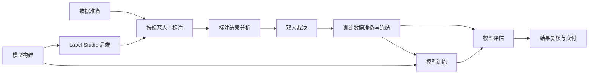

# 项目组织方案与规则

梳理日期：2026-10-10。按当前工作区代码和文档检查，包含已有未提交的新工具。

**状态：阶段 1 文档归位、阶段 2 共享业务提取、阶段 3 模型源码拆分及离线验证已完成；阶段 4 明确材料副本归位/保留索引已完成，阶段 5 本轮范围整体验证已完成（当前离线 144 项，净源码沙箱 144 项）。指定环境真实模型/服务验收尚未完成。**
当前文档见 [总导航](README.md)；原路径、新路径及迁移前后内容哈希见 [迁移记录](migration-log.md)。
阶段 2 的 15 项源码/模板移动、兼容入口与完成时校验值见 [源码移动快照](source-migration.json)。哈希清单记录阶段完成时内容，后续维护另记，不回写成新的历史来源。
阶段 3 四个模型实现模块、旧入口、后续消费者哈希与受保护文件见 [模型迁移快照](model-migration.json)。两份源码快照各自记录阶段完成时版本；训练消费者后续更新不回写阶段 2 原哈希。
根目录 [AGENTS.md](../AGENTS.md) 是后续任务必须参照的规则入口。本文件提供工作流程映射、统一存放位置、兼容例外及可分次执行的整理方案。新任务先找现有入口；不要按下面的目标树直接修改运行命令。

后续命名调整：7 个当前维护目录已按用途重命名，见[目录命名规范](directory-naming.md)及[调整记录](directory-renaming.json)。文档目录采用完整用途名称，运行清单中的 stage 保持原值；历史快照仍表示完成时路径。

data 后续调整：用户指定的 6 个顶层目录已按用途、批次日期和存储版本重命名，见[数据目录规则与索引](data-directory-naming.md)。65 件文件及内部冻结名称保持，旧路径使用隐藏 Junction 访问同一数据；根 CSV 和既有 output 批次继续保留。新批次沿用本方案内容布局，批次名称增加明确用途与 `vNNN`，运行清单记录精确版本；清点跳过兼容联接。

## 1. 按工作流程分块

| 模块 / stage | 职责 | 当前实现入口 | 输入 → 输出 |
|---|---|---|---|
| 数据准备 `data_preparation` | 多表合并、就诊文本、年龄分组、试标抽样与去标识化审计 | `emr_annotation/data_preparation/merge_emr_data.py`，旧 `scripts/merge_emr_data.py` 兼容；workflow 历史抽样/审计脚本保留 | 原始表 → 任务、抽样与审计记录；合并本身不脱敏 |
| 标注规范 `annotation` | 标签、属性、关系、病例判断规则和标注操作 | `label_studio/`；`documentation/annotation/`；`annotation_skills/`；`emr_annotation/annotation/schema.py` 共享 Schema 读取 | 项目配置与指南 → Schema 快照、人工标注；历史版本留存 |
| 模型构建 `modeling` | 联合网络、分类头、tokenizer、模型加载、推理解码 | `modernbert_ml_backend/modeling/network.py` 的 `ModernBERTForNERRE`；`modeling/inference.py` 的 `predict_text`、`NERREPredictor`；`config.py` | 基础模型、标签映射、文本 → 模型实例、候选实体与关系 |
| Label Studio 后端 `backend` | 服务路由、项目配置同步、任务/预测转换、fit 触发 | `modernbert_ml_backend/label_studio_backend/service.py` 的 `ModernBERTModel`；`_wsgi.py` 继续经旧 `model.py` 别名加载；本地 `label_studio_ml/` | Label Studio 请求 → 预标注响应和训练触发 |
| 标注结果分析 `annotation_analysis` | 导出合法性、实体/属性/关系完整性、双标差异与一致性 | `emr_annotation/annotation_analysis/label_studio_evaluation.py`、`double_annotations.py`；旧 scripts CLI/导入兼容；workflow 历史校验保留 | 原始导出 + 对应项目 XML → 审计、差异、一致性、待复核项 |
| 双人裁决 `adjudication` | 人工决定最终参考标注、逐项说明、核查签署 | `emr_annotation/adjudication/workbench.py`、`package_review.py`、`templates/double_annotation_review.html`；workflow 历史裁决脚本 | 双标差异 → 工作台、裁决模板、人工决定、裁决凭据；分析工具不自动裁决 |
| 训练数据准备 `training_data` | 选择已审核标注、转换偏移、患者分组、冻结训练/验证/测试集 | `emr_annotation/training_data/preparation.py`、`split_reference.py`、`frozen.py`、`token_audit.py`；旧 scripts 入口兼容 | 最终参考 + 选择凭据 + XML → 数据集、冻结 manifest、对齐审计 |
| 模型训练 `training` | 数据集张量化、训练、验证选模、权重保存与重载 | `modernbert_ml_backend/training/trainer.py`，旧 `train_ner_re.py` 别名与 CLI 保留；`train_frozen.py`、`train_adjudicated.py` 为独立入口 | 冻结数据 + 基础模型 → 训练凭据、日志、最佳权重；三个入口用途不同 |
| 模型评估 `evaluation` | 严格实体及端到端关系评分、训练前后比较、速度/容量基准 | `emr_annotation/evaluation/` 的 `entity_predictions.py`、`ner_re.py`、正则及测速/比较模块；`modernbert_ml_backend/predict_test.py` 为手工联调 | 参考集 + 预测 → 指标、图表、比较报告；离线评分与实际服务测试分开 |
| 资料构建与交付 `delivery` | 指南页面构建、复核包、成果说明及发布清单 | `documentation/annotation/scripts/`；`emr_annotation/adjudication/package_review.py`，旧 scripts 打包命令兼容 | 维护原稿/已复核结果 → 阅读页面、可分发包及校验清单 |
| 辅助研究 `research` | WHO 材料采集、探索 notebook | `scripts/fetch_who_don_pdf.py`；`Untitled.ipynb` | 外部资料 → 本地材料和探索结果；不混入主训练流程 |

同一个现有文件可能暂时横跨两块，例如双标审计仍组织核查与裁决材料生成，渲染及打包已进入 adjudication。新功能按函数职责落入对应模块，不能仅按文件名判断归属。旧 CLI 映射完整记录在源码移动快照中。



## 2. 当前混乱的来源

- `scripts/` 原来同时存放 CLI 和共享业务实现。阶段 2 已将 14 个业务脚本改为兼容入口；训练和 smoke 消费者直接依赖新共享包。参见 [源码移动快照](source-migration.json)、[训练数据实现](../emr_annotation/training_data/preparation.py)、[train_adjudicated.py](../modernbert_ml_backend/train_adjudicated.py)。
- `model.py` 原来同时承载网络、推理、Schema/服务适配与 fit。阶段 3 已分成 network、inference、service、trainer；网络成为训练与服务共同依赖，旧文件仅保留兼容入口。单例 `config` 和项目状态隔离仍属原边界。
- 通用审计/裁决工具与历史轮次脚本并存。`build_round2_*`、`build_round3_*` 是历史处理入口，不能用于默认处理新批次。
- 当前指南已经集中；17 份技术文档及汇报材料已按 stage 分组。顶层旧文件为兼容导航页；虚构结果示例仍在 `documentation/evaluation_examples/` 原位置，不能为目录统一改写冻结结果。
- `tmp/` 已有受版本控制的脚本、截图和旧稿，临时材料与正式来源边界模糊；不能直接整体忽略或删除来解决。
- 部分旧说明与工具存在失效路径。`annotation_agent_workflow/scripts/validate_detailed_label_dictionary.py` 固定历史字典及旧本机 XML 路径，不是当前默认验收工具。全局 `config` 的状态隔离问题也不能靠搬目录解决。

本次为组织审查，不等于完整语义审计、临床验收、模型性能验证或真实数据隐私认证。

## 3. 统一组织：源码、文档、输入、产物

### 3.1 当前及目标目录（共享业务、模型子目录和 stage 文档已建立，明确旧材料副本及索引已建立）

```text
emr_structured_annotation/
├── AGENTS.md / CLAUDE.md         # 任务规则入口；规则以 AGENTS.md 为准
├── README.md                    # 项目导航、当前命令及迁移状态
├── emr_annotation/              # 新提取的无模型共享业务包
│   ├── data_preparation/        # 合并、抽样与审计
│   ├── annotation/              # Schema/协议解析
│   ├── annotation_analysis/    # 导出审计与差异分析
│   ├── adjudication/            # 工作台渲染、打包与裁决材料
│   │   └── templates/          # 当前可维护 HTML 模板
│   ├── training_data/          # 选择、转换、冻结
│   └── evaluation/             # 评分与比较
├── modernbert_ml_backend/       # 独立模型环境，不改顶层根目录
│   ├── modeling/               # network.py 网络；inference.py 推理
│   ├── label_studio_backend/service.py      # 当前 Label Studio 适配
│   ├── backend/service.py      # 旧服务导入兼容别名
│   ├── training/trainer.py     # 当前训练实现，不依赖服务
│   ├── _wsgi.py / model.py / train_*.py / config.py
│   │                           # 旧别名/CLI和独立训练入口；顶层脚本命名空间保留
│   ├── label_studio_ml/        # 本地维护运行时，先审计再决定调整
│   └── requirements.txt
├── scripts/                    # 14 个兼容 CLI/导入入口；WHO 和 smoke 辅助工具
├── label_studio/                # 当前可维护 XML 与配置历史
├── annotation_skills/                   # 标注员/指南开发者技能源
├── tests/fixtures/              # 小型虚构测试样本，不含真实病历
├── documentation/              # 人维护的说明及必要阅读页面
│   ├── project-organization.md
│   ├── annotation/             # 已存在的当前指南套件，保留其布局
│   ├── training_data_preparation/ # 导出转换、患者分组与冻结说明
│   ├── model_training/        # 模型训练说明
│   ├── model_evaluation/      # 模型评分、基线与测速说明
│   ├── double_annotation_adjudication/ # 双人裁决与工作台说明
│   ├── project_delivery/      # 人维护的汇报与交付说明
│   ├── examples/               # 明确标记的可公开虚构样例
│   └── archive/                # 以后归档的旧说明；不可替代当前规则
├── data/<batch_id>/             # 外部输入，Git 忽略
├── output/<batch_id>/<stage>/<run_id>/  # 运行产物，Git 忽略
├── pretrained_models/             # 现有基础权重路径，兼容例外
├── annotation_agent_workflow/   # 试标协议及历史轮次；保留原始证据
└── tmp/                        # 本地临时材料，不作为正式来源
```

不为每个业务块重复建立一套数据根目录，也不把所有代码整体改成 `src/`。无模型业务与模型运行环境各有自己的实现区，命令入口引用对应模块；模块间只通过明确的数据结构和函数接口协作。

### 3.2 四类内容的放置规则

| 类型 | 统一位置 | 规则 |
|---|---|---|
| 实现、配置、可复用模板 | 上述代码目录、`label_studio/`、`annotation_skills/` | 输入输出参数化；新共享模块避免加载模型、联网、创建文件等导入副作用 |
| 维护文档 | `documentation/` 下对应用途目录 | 文档目录与运行 stage 的对应关系见目录命名规范；说明目的、契约、命令和验证边界；指南套件保留 `documentation/annotation/`；本方案为总索引 |
| 外部输入 | `data/<batch_id>/` | 原始表、Label Studio 原始导出、输入配置快照及外部人工决定；原文件不可被转换过程改写 |
| 运行结果 | `output/<batch_id>/<stage>/<run_id>/` | 派生任务、参考集、切分、报告、图表、工作台、预测、训练日志与交付包；每次新运行新目录 |
| 基础权重与服务选用权重 | `pretrained_models/`、现有 `output/{base_model}/{schema}/best_model/` | 保留现有消费者路径；实验结果引用精确 checkpoint 路径及哈希，不能仅记录会变化的 best_model 路径 |
| 历史证据 | 已有 workflow `runs/`、`guides/`、`validation/` 及 XML archive | 冻结原位置及原内容；只建立新索引，不改写旧 manifest、旧输出或已签署结论 |
| 虚构测试/演示 | `tests/fixtures/`；当前 `documentation/evaluation_examples/`，以后统一 `documentation/examples/` | 必须明确 synthetic；小型输入和说明可跟踪，大量演示产物默认仍写 output |
| 临时草稿/截图 | `tmp/` | 正式交付前转入合适产物位置；已有跟踪材料先分类，再单独处理版本控制 |

**区别方法：**介绍“怎样做”的 Markdown 是维护文档；一次运行自动生成的 Markdown/PDF/HTML 是产物。XML 页面配置和 HTML 模板是源码；带具体病例的工作台是产物。原始导出是输入；转换后的训练 JSON 是产物；人工裁决提交是后续阶段的输入，保留原件并在新运行中引用。

### 3.3 批次、运行与可追溯性

建议批次名如 `2026-10-10-double-annotation-200`，仅包含日期和批次用途，不含患者信息。stage 使用第 1 节的固定标识；run_id 如 `20261010-01`，若已存在则选新编号。

```text
data/<batch_id>/
    raw/                         # 原始 EMR 表
    label_studio_exports/        # 原始标注导出
    schema/                      # 项目实际 XML 快照
    decisions/                   # 外部人工选择/裁决/签署原件
output/<batch_id>/
    data_preparation/<run_id>/   # 任务与隐私审计
    annotation_analysis/<run_id>/# 差异和核查报告
    adjudication/<run_id>/       # 生成工作台、待填写模板及处理凭据
    training_data/<run_id>/      # reference、训练格式、splits 与冻结 manifest
    training/<run_id>/           # 训练凭据、日志和实验权重/权重引用
    evaluation/<run_id>/         # 预测、指标、比较图表
    delivery/<run_id>/           # 最终材料、包和发布清单
```

数据和产物根目录已在 `.gitignore` 中排除。忽略规则不自动移除已跟踪文件，也不能代替隐私审计。新文档只引用输入参数/相对位置和流程，不复制真实病例。

新运行清单最少记录：batch_id、stage、run_id、输入文件及 SHA-256、项目 ID（适用时）、XML 快照哈希、代码提交与工作区是否有未提交改动、关键脚本哈希、命令参数、随机种子（适用时）、输出文件/哈希和实际验证结果。已有 receipt/manifest 可承载这些字段，先复用，不额外制造另一套协议；暂不支持的项在说明中列为待补。用上游清单路径/哈希串联阶段，避免复制一份又一份参考数据。

`training_data.json` 不自动成为独立测试集；冻结患者分组和数据哈希必须沿用。现有实验目录、schema 输出和签署记录保留，不能为了目录一致而改哈希或伪造迁移后的旧来源。

## 4. 模块依赖规则

1. Schema 解析与数据结构归 `emr_annotation/annotation/schema.py`。导出分析使用 `load_export_schema`，双标复核使用 `load_double_annotation_schema`，保留两种返回结构；实体评分复用 `read_label_groups`。不能把这些不同契约强行合并。
2. `scripts/` 的旧业务 CLI 调用对应模块的 `main`，旧导入通过模块别名返回同一个实现对象，保留私有符号及 patch 行为。业务实现、转换、审计和评分只在共享包维护；新消费者直接导入对应模块。
3. `modeling/network.py` 供 `training/trainer.py` 和 `label_studio_backend/service.py` 使用，训练不反向导入服务/SDK；`modeling/inference.py` 维护文本解码。服务 `fit()` 在取得训练数据后延迟导入 trainer，网络层不导入后端路由。
4. `train_frozen.py`、`train_adjudicated.py` 和服务 `fit()` 保留各自契约；名称相近不意味着可以合并。预检路径继续延迟 ML 导入。
5. `data.text`、`chief_complaint_text`、偏移单位、属性/关系协议和 legacy `symptons_labels` 保持兼容；导出须匹配其项目 XML。默认旧控件名配置和 global-single 配置并存，后者必须解析 descendant Label。
6. 根环境与 ModernBERT requirements 分开。模型子目录按顶层 `modeling` / `label_studio_backend` / `training` 与同一个 `config` 模块加载，旧 `backend.service` 为兼容别名；不混入 `modernbert_ml_backend.config` 创建另一份单例。保留 `_wsgi.py` 脚本入口；不要将模型依赖搬进无模型共享包，也不要改变本地 `label_studio_ml` 的实际加载来源。
7. 历史专用逻辑可保留在 workflow；新增通用逻辑应进入对应模块并复用。WHO 与探索 notebook 属于 research，不成为主流程的隐式依赖。

## 5. 分阶段整理方案

每阶段可在新的任务中独立执行。开始前读取 AGENTS.md、对应当前说明和下列来源；先核对 API/入口再改，避免依据目标目录臆造当前函数。

| 阶段 | 具体工作和参照来源 | 验证与禁止事项 |
|---|---|---|
| 0：现状与入口发现（本次完成） | 阅读根规则、README、当前指南目录说明、训练/裁决说明、导入与测试；建立本文件的流程/路径映射。复用 `prepare_training_data.py` 的参数化和新目录发布模式，`train_adjudicated.py` 的延迟 ML 导入模式 | 当前代码存在性与链接检查；把历史、现有、目标明确分开；不得称源码已迁移 |
| 1：文档与新产物归位（当前文档已完成） | 17 份技术说明/实验方案/汇报文档已归入 stage 文档目录，旧顶层路径保留短导航；README、规则、指南导航及打包资源指向当前正文。新运行按第 3 节目录约定；参考 PDF、用语提取及冻结演示暂留原位置 | 移动前后 SHA-256 见迁移记录；检查当前文档本地链接及打包结果；历史证据、冻结结果原位原内容，旧产物治理留到阶段 4 |
| 2：提取无模型共享业务（已完成） | 14 个脚本业务实现及 1 份 HTML 模板迁至 `emr_annotation/` 六个模块；Schema 两种契约、渲染独立提取，旧 CLI/导入保留；训练与 smoke 消费者更新 | 完成时 137 项离线测试（含 9 项迁移专项）通过；12 组新旧 CLI 参数及虚构流程等价通过，无 site-packages 导入检查通过。缺病例选择仍保留 audit 中的 None，报告显示不可评价并完整生成材料；没有模型/服务实测 |
| 3：拆模型构建与服务（源码及离线验证已完成） | 四个实现文件为 modeling/network、modeling/inference、backend/service、training/trainer；model.py、train_ner_re.py 保留别名/CLI；顶层命名空间、config、runtime和旧路径保护 | 核心拆分 146 项全量测试和 9 项模型专项通过；补充回执断言后的相关 28 项通过，16 定义 AST 与 25 文件哈希保持。tiny forward 在 torch 导入失败前停止，指定 requirements 环境与真实服务未验收；不切换 `python -m` |
| 4：明确旧材料副本归位/保留索引（已完成） | 73 件指南产物、PDF 页面/提取文字、WHO 成果、来源 PDF 与外部筛选决定分别复制到 data/output 批次；原件不删。34,693 件既有文件仅作路径/大小/用途/Git 状态索引；详见[旧资料索引](legacy-materials.md) | 73 对来源/副本字节及 SHA-256 相同；251 个保护来源保持，tmp 跟踪状态不变。旧 tmp 脚本、冻结/历史、模型、根原始导出和混合维护稿有意原位保留，不声称全部旧目录物理迁移或真实病例重处理 |
| 5：本轮范围整体复核（已完成） | 当前入口/分层、旧兼容导航、来源快照、73 项材料副本及保留索引核对；当前工作区和净源码沙箱离线测试各 144 项通过 | 无 data/output/权重/环境/tmp/.git 的 201 件净源码配置/文档沙箱通过；144 是收尾后的永久测试数，阶段 3 的 146 是历史。指定环境真实模型、服务、UI 及医学验收未完成 |

参照的当前说明：[数据转换](training_data_preparation/label-studio-to-training.md)、[冻结训练](training_data_preparation/frozen-split-training.md)、[裁决后训练与评估](model_training/adjudicated-model-training.md)、[双人裁决](double_annotation_adjudication/double-annotation-adjudication.md)、[工作台](double_annotation_adjudication/double-annotation-workbench.md)、[发布与交付](project_delivery/double-annotation-release.md)、[单选配置兼容](annotation/label-studio-single-selection.md)、[退役审计](gliner-retirement.md)。

可运行的离线检查（仓库根目录）：

```sh
python -m unittest discover -s tests -v
python documentation/annotation/scripts/check-document-links.py
```

现有链接检查仅覆盖 `documentation/annotation/`，不能据此声称全仓库链接已检查。源码迁移需核对新文档、README、命令和打包工具的额外引用；真实服务脚本 `predict_test.py` 不纳入离线单元测试。

## 6. 后续任务收尾规则

说明本次涉及的模块、文件归属、输入/产物位置、运行编号和实际验证；若做了移动，说明旧入口兼容情况。同步更新这里的阶段状态与当前导航。不要顺便扩大为模型架构更换、环境合并、历史重写或全目录清理。

已落地：流程分块、四类内容存放约定、新任务入口规则及导航；17 份文档归位；阶段 2 六个共享业务模块、14 个旧入口和模板归位；阶段 3 四个模型实现模块、旧入口保留及离线验证。
阶段 4 已完成明确 73 件材料的副本归位及保留索引，见[旧资料索引](legacy-materials.md)。阶段 5 本轮范围整体验证已完成：当前工作区/净源码沙箱各 144 项通过，当前文档文件链接及 annotation 静态锚点通过。指定环境模型/服务实际验收仍未完成。阶段 1–5 的具体范围见[迁移记录](migration-log.md)、[共享源码快照](source-migration.json)及[模型快照](model-migration.json)，不将未完成验收写为通过。

模型环境尝试：根 `.venv` 的 PyTorch C 扩展导入失败，尚未执行 tiny forward、文本解码、训练或服务。失败回执及环境版本元数据记录于模型快照，没有改动依赖或覆盖权重。修复/准备指定独立环境后需另行开展真实验证。

迁移前组织审查验证：128 项离线单元测试通过；现有 annotation 文档链接/静态锚点检查通过；本方案、AGENTS.md、CLAUDE.md 与 README.md 的本地文件链接存在性检查通过。阶段 1 本轮验证记录见[迁移记录](migration-log.md)。没有执行真实模型训练、服务联调或 Label Studio UI 验证。

基础权重目录已统一为 `pretrained_models/`，旧 `bert-base-model/` 通过本地隐藏 Junction 兼容；规则及当前验证边界见[目录命名规范](directory-naming.md)。
